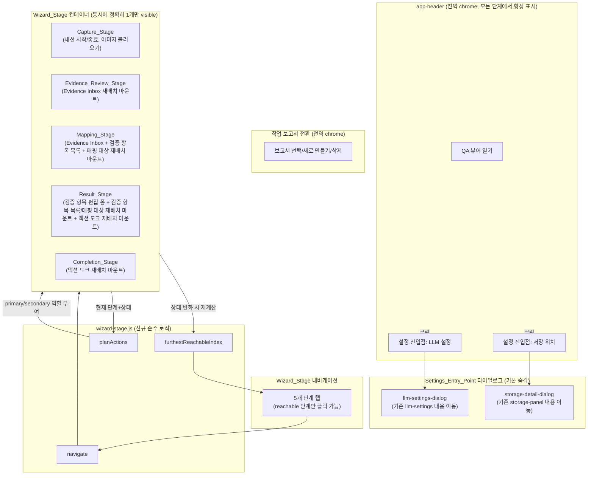
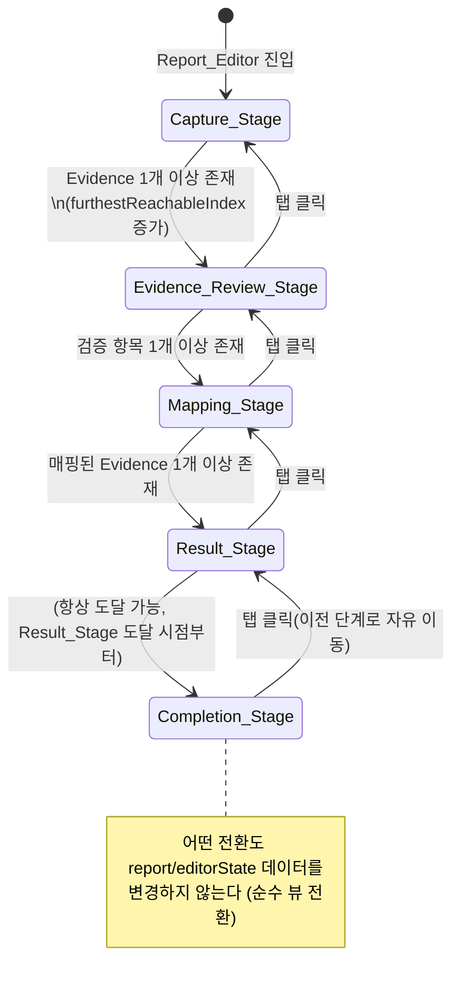

# Design Document

## Overview

이 기능은 CaptureIT Report_Editor의 **시각적 정보 구조**를 재편한다. 현재 `extension/editor.html`은 캡처 컨트롤, 저장 위치, 검증 항목 목록, Evidence Inbox, 검증 결과, LLM 설정, 산출물 생성 버튼이 모두 한 화면에 평면적으로 나열되어 있다. 이 설계는 그 화면을 5개의 순차적 **Wizard_Stage**(Capture_Stage → Evidence_Review_Stage → Mapping_Stage → Result_Stage → Completion_Stage)로 재구성하고, 저장 위치 정보(Storage_Detail_Panel)와 LLM 연동 설정(LLM_Settings_Panel)을 Settings_Entry_Point로 여는 별도 다이얼로그로 옮기고, 영어 라벨과 "기능 명세" 표기를 한국어 업무 용어로 교체하고, 각 단계마다 정확히 하나의 Primary_Action만 강조되도록 만든다.

**범위**: 이 기능은 오직 `extension/editor.html`, `extension/editor.js`, `extension/editor.css`, 그리고 순수 로직을 담을 신규 파일 `extension/shared/wizard-stage.js`만 변경한다. `extension/shared/domain.js`, `extension/shared/report.js`, `extension/shared/storage.js`, `extension/shared/llm.js`, `extension/shared/zip.js`, `extension/shared/content-controller.js`, `extension/content.js`, `extension/background.js`, `extension/manifest.json`, `extension/viewer.*`는 **전혀 수정하지 않는다**. 이 파일들이 정의하는 필드명·이벤트명·스키마·저장 키는 변경 없이 그대로 유지되므로(요구사항 9), 이들에 대한 기존 property/unit 테스트(`tests/domain*.test.cjs`, `tests/report*.test.cjs`, `tests/storage-contract.test.cjs` 등)는 수정 없이 계속 통과해야 한다.

이전 스펙(streamlined-report-authoring)이 확립한 상호작용 모델 — 캡처 우선 진입, Capture_Graph 시각화, Drag_And_Drop_Mapping/Alternative_Mapping_Control/Quick_Mapping_Dialog, Default_Verdict_Selection과 Verdict_Confirmation, LLM 추천과 Report_Draft_Suggestion — 은 그대로 유지한다. 이 설계는 그 상호작용들을 수행하는 기존 DOM 엘리먼트와 이벤트 핸들러 함수를 **삭제·재작성하지 않고, 어느 Wizard_Stage 컨테이너에 마운트되는지만 바꾼다**.

### 핵심 설계 결정: 공유 영역 재배치(Region Re-parenting)

기존 화면에는 여러 단계에서 동시에 필요한 영역이 있다(예: 검증 항목 목록은 매핑할 때도, 결과를 확인할 때도 필요하다). 이 영역들을 단계마다 복제하면 두 개의 DOM이 같은 `id`를 가지게 되어 기존 `byId(...)` 기반 이벤트 바인딩이 깨진다. 대신 이 설계는 **하나의 DOM 노드를 유지한 채, 현재 활성 Wizard_Stage의 컨테이너로 그 노드를 옮겨 붙이는(reparent)** 패턴을 사용한다. `appendChild`로 이미 존재하는 노드를 옮기는 것은 그 노드에 붙어 있던 이벤트 리스너를 그대로 보존하므로, 기존 핸들러를 다시 바인딩할 필요가 없다.

이 패턴을 적용하는 4개의 공유 영역:

| 공유 영역 (기존 id) | 마운트되는 Wizard_Stage |
|---|---|
| `#evidence-drop-zone` (Evidence Inbox: 최근 캡처, 검색, Capture_Graph 그리드) | Evidence_Review_Stage, Mapping_Stage |
| `#feature-panel` (검증 항목 목록 + 추가 버튼) | Mapping_Stage, Result_Stage |
| `#feature-mapping-target` (선택된 검증 항목의 매핑된 증적 그리드 — 기존 `#mapped-evidence`를 감싸는 신규 래퍼) | Mapping_Stage, Result_Stage |
| `.actions` 액션 도크(LLM 추천/미리보기/ZIP 생성/프로젝트 저장 버튼) | Result_Stage, Completion_Stage |

이 표 바깥의 영역(캡처 컨트롤, 검증 항목 편집 폼, 저장 위치, LLM 설정)은 정확히 하나의 위치(하나의 Wizard_Stage 또는 하나의 다이얼로그)에만 존재한다.

## Architecture



### 단계 전환과 재배치 흐름



## Components and Interfaces

### 1. `extension/shared/wizard-stage.js` (신규, 순수 함수 모듈)

`domain.js`와 동일한 IIFE 패턴(`root.CaptureITWizardStage`)으로 작성하는 신규 모듈이다. DOM이나 `chrome.*` API에 의존하지 않으므로 `tests/domain-properties.test.cjs`와 동일한 방식으로 property 테스트가 가능하다.

```js
// 5단계 순서. 배열 인덱스가 "단계 번호"로 취급된다.
const STAGES = ['capture', 'evidence-review', 'mapping', 'result', 'completion'];

// snapshot: {
//   evidenceCount: number,          // editorState.evidence.length
//   featureCount: number,           // editorState.features.length
//   mappedFeatureCount: number,     // result.evidenceIds.length > 0인 feature 수
//   sessionActive: boolean,         // session && session.active
// }
// -> boolean[5], STAGES와 동일 인덱스로 "이 단계에 도달 가능한가"
function computeReachableStages(snapshot)

// -> 0~4, 현재 snapshot에서 도달 가능한 가장 마지막 단계의 인덱스
function furthestReachableIndex(snapshot)

// -> boolean, targetIndex가 현재 snapshot에서 도달 가능한 단계인가
function canNavigateTo(snapshot, targetIndex)

// 순수 전환 함수: targetIndex가 도달 가능하면 targetIndex를, 아니면 currentIndex를 그대로 반환한다.
// snapshot이나 다른 어떤 객체도 변경하지 않는다(부작용 없음).
function navigate(snapshot, currentIndex, targetIndex)

// context: {
//   sessionActive: boolean,
//   currentFeatureHasMappedEvidence: boolean,  // Result_Stage 전용
// }
// -> { primary: string|null, secondary: string[] }
// 반환되는 문자열은 액션 식별자('start-session' | 'end-session' | 'import-images' |
// 'advance-to-mapping' | 'advance-to-result' | 'add-feature' | 'confirm-verdict' |
// 'request-recommendations' | 'preview-report' | 'export-report' | 'open-save-project')
function planActions(stageIndex, context)
```

설계 근거:
- `furthestReachableIndex`는 오직 "개수"와 "boolean 존재 여부"만 입력받으며, Evidence/Feature/매핑을 추가하는 기존 연산들(`mapEvidence`, `mapEvidenceBatch`, `addFeature`, 이미지 불러오기)은 전부 이 값들을 증가시키거나 그대로 두기만 하고 절대 감소시키지 않는다. 따라서 "도달 가능한 가장 먼 단계는 감소하지 않는다"는 요구사항 1.4의 성질이 이 함수 하나의 순수성에서 구조적으로 도출된다.
- `navigate`가 `snapshot`이나 `report`/`editorState`를 전혀 참조·변경하지 않는다는 사실 자체가 요구사항 1.7/8.3("단계 전환이 이전 단계의 데이터를 지우지 않는다")을 코드 수준에서 보장한다 — 데이터를 지울 수 있는 경로가 애초에 존재하지 않는다.
- `planActions`는 `primary`를 `null` 또는 정확히 하나의 문자열로만 반환하고(배열이 아님), `secondary`는 배열로 반환한다. 타입 수준에서 "primary가 여러 개일 수 없다"(요구사항 1.3)를 강제한다.

### 2. `editor.js`에 추가되는 단계 오케스트레이션 함수

기존 `editor.js`의 렌더 함수(`renderFeatures`, `renderFeature`, `renderEvidence`, `renderRecommendations` 등)와 상태 변경 함수(`mapEvidence`, `toggleSession`, `addFeature` 등)는 **시그니처와 내부 로직을 그대로 유지**한다. 새로 추가되는 것은 이 함수들을 감싸는 오케스트레이션 계층뿐이다.

```js
let activeStageIndex = 0; // 신규 UI 상태, 저장소에 저장하지 않음

// editorState/report/session으로부터 wizard-stage.js가 요구하는 snapshot을 만든다.
function currentStageSnapshot() {
  return {
    evidenceCount: editorState.evidence.length,
    featureCount: editorState.features.length,
    mappedFeatureCount: editorState.features.filter((f) => f.result.evidenceIds.length > 0).length,
    sessionActive: Boolean(session && session.active),
  };
}

// 공유 영역 재배치 헬퍼: region이 이미 container의 자식이면 아무 것도 하지 않는다(불필요한 재배치 방지).
function mountRegion(region, container) {
  if (region.parentElement !== container) container.appendChild(region);
}

// 탭 클릭 핸들러가 호출하는 진입점. CaptureITWizardStage.navigate로 계산한 뒤 다시 그린다.
function goToStage(targetIndex) {
  activeStageIndex = CaptureITWizardStage.navigate(currentStageSnapshot(), activeStageIndex, targetIndex);
  renderStage();
}

// 이 함수가 4개의 공유 영역을 현재 activeStageIndex에 맞는 컨테이너로 재배치하고,
// 각 stage 컨테이너의 hidden 속성을 갱신하고, 탭의 disabled 상태와 planActions 결과에
// 따른 button-primary/button-secondary 클래스를 다시 적용한다. 기존 renderAll()의
// 마지막 단계에서 호출된다(데이터가 바뀔 때마다 재배치/재도달성 계산도 함께 갱신하기 위해).
function renderStage() {
  const snapshot = currentStageSnapshot();
  activeStageIndex = CaptureITWizardStage.navigate(snapshot, activeStageIndex, activeStageIndex); // 도달 불가해졌으면 clamp
  const reachable = CaptureITWizardStage.computeReachableStages(snapshot);

  STAGE_CONTAINERS.forEach((container, index) => {
    container.hidden = index !== activeStageIndex;
    elements.stageTabs[index].disabled = !reachable[index];
    elements.stageTabs[index].classList.toggle('active', index === activeStageIndex);
  });

  mountRegion(elements.evidenceDropZone, activeStageIndex === 1 ? elements.stageEvidenceReview : elements.stageMapping);
  mountRegion(elements.featurePanel, activeStageIndex === 3 ? elements.stageResult : elements.stageMapping);
  mountRegion(elements.featureMappingTarget, activeStageIndex === 3 ? elements.stageResult : elements.stageMapping);
  mountRegion(elements.actionsDock, activeStageIndex === 4 ? elements.stageCompletion : elements.stageResult);

  applyActionPlan(snapshot);
}

// planActions의 결과를 실제 button 엘리먼트의 CSS 클래스에 반영한다.
// 버튼 자체(핸들러, disabled 로직)는 기존 코드를 그대로 사용하고, 여기서는 오직
// 'button-primary'/'button-secondary' 클래스만 토글한다.
function applyActionPlan(snapshot) {
  const context = {
    sessionActive: snapshot.sessionActive,
    currentFeatureHasMappedEvidence: Boolean(currentFeature() && currentFeature().result.evidenceIds.length > 0),
  };
  const plan = CaptureITWizardStage.planActions(activeStageIndex, context);
  for (const [actionId, button] of ACTION_ID_TO_BUTTON) {
    button.classList.toggle('button-primary', plan.primary === actionId);
    button.classList.toggle('button-secondary', plan.primary !== actionId && plan.secondary.includes(actionId));
    button.hidden = plan.primary !== actionId && !plan.secondary.includes(actionId);
  }
}
```

`ACTION_ID_TO_BUTTON`은 액션 식별자와 기존 버튼 엘리먼트를 잇는 고정 맵이다: `'start-session'/'end-session' → elements.toggleSession`, `'import-images' → elements.imageImport의 label`, `'advance-to-mapping' → 신규 #advance-to-mapping 버튼`, `'advance-to-result' → 신규 #advance-to-result 버튼`, `'add-feature' → elements.addFeature`, `'confirm-verdict' → elements.verdictConfirm`, `'request-recommendations' → elements.requestRecommendations`, `'preview-report' → elements.previewReport`, `'export-report' → elements.exportReport`, `'open-save-project' → elements.openSaveProject`. `#advance-to-mapping`, `#advance-to-result`는 기존에 없던, 순수하게 단계 전환만 수행하는 두 개의 신규 버튼이다(각각 `goToStage(2)`, `goToStage(3)` 호출) — 이 두 개를 제외한 나머지는 모두 기존 버튼을 재사용한다.

`renderAll()`은 기존 호출 목록 끝에 `renderStage()` 호출을 추가하는 것 외에는 변경되지 않는다. `toggleSession`, `mapEvidence`, `mapEvidenceIds`, `applyQuickMapping` 이후의 저장 경로(`saveReport`) 안에서도 데이터가 바뀌었으므로 각 함수 끝에서 이미 호출하는 `renderEvidence()`/`renderFeature()` 곁에 `renderStage()` 호출을 추가해 도달 가능 단계와 재배치 상태를 항상 최신으로 유지한다.

### 3. `editor.html` 구조 재편

**전역 chrome(모든 단계에서 항상 보임, 어떤 Wizard_Stage의 main content도 아님)**:
- `.app-header`: 기존 그대로 유지하되, 버튼 두 개를 추가한다 — `#open-storage-detail`("저장 위치", Settings_Entry_Point, 요구사항 2.2), `#open-llm-settings`("LLM 설정", Settings_Entry_Point, 요구사항 5.2). 기존 `#open-viewer`("QA 뷰어")는 위치만 유지한다.
- `report-switch-panel`: 기존 그대로 헤더 바로 아래 유지한다(보고서 선택/새로 만들기/삭제는 어떤 요구사항에서도 재배치 대상으로 지정되지 않았으므로 전역 chrome으로 남긴다).
- `#guidance-banner`: 기존 그대로 유지, 위치는 Wizard_Stage 내비게이션 바로 아래.

**Wizard_Stage 내비게이션(신규)**:
```html
<nav id="wizard-stage-nav" aria-label="작성 단계">
  <button class="stage-tab" data-stage-index="0" id="stage-tab-capture">1 · 캡처 시작</button>
  <button class="stage-tab" data-stage-index="1" id="stage-tab-evidence-review">2 · 증적 확인</button>
  <button class="stage-tab" data-stage-index="2" id="stage-tab-mapping">3 · 검증 항목 매핑</button>
  <button class="stage-tab" data-stage-index="3" id="stage-tab-result">4 · 결과 입력</button>
  <button class="stage-tab" data-stage-index="4" id="stage-tab-completion">5 · 완료</button>
</nav>
```
각 탭의 `click` 핸들러는 `goToStage(Number(button.dataset.stageIndex))`를 호출한다. `disabled` 속성은 `renderStage()`가 도달 불가능한 단계에 대해 설정하므로, 사용자는 아직 도달하지 않은 단계로 건너뛸 수 없지만 이미 완료한 이전 단계로는 언제든 돌아갈 수 있다(요구사항 1.7).

**5개 Wizard_Stage 컨테이너**(순서대로 `<main>` 아래 배치, 각각 `hidden` 속성으로 토글됨):

```html
<main class="layout">
  <section id="stage-capture" class="wizard-stage" aria-labelledby="capture-first-heading">
    <!-- 기존 capture-first-panel의 내용을 그대로 이동: 모드 선택, toggle-session, image-import.
         eyebrow "START HERE" -> "1단계 · 캡처 시작" -->
  </section>

  <section id="stage-evidence-review" class="wizard-stage" hidden aria-labelledby="evidence-review-heading">
    <div class="panel-heading">
      <span class="eyebrow">증적 확인</span><h2 id="evidence-review-heading">수집된 증적 확인</h2>
    </div>
    <!-- #evidence-drop-zone이 여기로 재배치 마운트됨 -->
    <button id="advance-to-mapping" class="button" type="button">검증 항목 매핑하러 이동</button>
  </section>

  <section id="stage-mapping" class="wizard-stage" hidden aria-labelledby="mapping-heading">
    <div class="panel-heading">
      <span class="eyebrow">검증 항목 매핑</span><h2 id="mapping-heading">증적을 검증 항목에 매핑</h2>
    </div>
    <!-- #evidence-drop-zone, #feature-panel, #feature-mapping-target이 여기로 재배치 마운트됨 -->
    <button id="advance-to-result" class="button" type="button">결과 입력하러 이동</button>
  </section>

  <section id="stage-result" class="wizard-stage" hidden aria-labelledby="result-heading">
    <div class="panel-heading">
      <span class="eyebrow">검증 항목 결과</span><h2 id="result-heading">검증 항목과 테스트 결과</h2>
    </div>
    <!-- #feature-panel, #feature-mapping-target이 여기로 재배치 마운트됨 -->
    <!-- feature-title/description/verdict/verification/expectedResult/actualResult 입력 폼은 항상 여기에만 존재 -->
    <!-- .actions 액션 도크가 여기로 재배치 마운트됨 -->
  </section>

  <section id="stage-completion" class="wizard-stage" hidden aria-labelledby="completion-heading">
    <div class="panel-heading">
      <span class="eyebrow">완료</span><h2 id="completion-heading">결과 확인과 산출물 생성</h2>
    </div>
    <!-- 검증 안내(경고) 박스가 여기로 이동 -->
    <!-- .actions 액션 도크가 여기로 재배치 마운트됨 -->
  </section>
</main>
```

**Settings_Entry_Point 다이얼로그(신규, 기본 숨김)**:
- `<dialog id="storage-detail-dialog">`: 기존 `storage-panel`의 `<dl class="storage-list">`와 `.storage-actions` 버튼(`#show-last-download`, `#show-download-folder`, `#export-evidence-only`)을 id를 바꾸지 않고 그대로 옮긴다. `#open-storage-detail` 클릭 시 `storageDetailDialog.showModal()`.
- `<dialog id="llm-settings-dialog">`: 기존 `.llm-settings` 섹션 전체(엔드포인트/API Key/Model/Adapter/템플릿 입력, `#test-llm-connection`, `#test-llm-recommendation`, `#llm-diagnostics`)를 id를 바꾸지 않고 그대로 옮긴다. `#recommendation-list`(추천 결과 표시 영역)는 LLM *설정*이 아니라 추천 *결과*이므로 다이얼로그로 옮기지 않고 Result_Stage의 검증 항목 편집 폼 곁에 남긴다(요구사항 5.4 — LLM 추천 요청 자체는 설정 다이얼로그를 열 필요가 없어야 하므로, 추천 트리거 버튼과 결과 표시는 항상 메인 화면에 있어야 한다). `#open-llm-settings` 클릭 시 `llmSettingsDialog.showModal()`.

기존 다이얼로그(`save-project-dialog`, `evidence-detail-dialog`, `preview-dialog`, `quick-mapping-dialog`, `report-draft-suggestion-dialog`)는 변경하지 않는다.

**`#feature-mapping-target`(신규 래퍼)**: 기존 `#feature-editor` 내부의 "선택된 증적" `<h3>` + `#feature-mapping-guidance` + `#mapped-evidence`를 하나의 `<section id="feature-mapping-target">`으로 감싼다. 이렇게 감싸는 이유는 이 세 엘리먼트를 Mapping_Stage/Result_Stage 사이에서 **하나의 단위로** 재배치하기 위함이다(개별적으로 재배치하면 순서가 흐트러질 수 있다).

### 4. 라벨 교체 (요구사항 4, 7)

| 위치 | 기존 표시 텍스트 | 신규 표시 텍스트 |
|---|---|---|
| capture-first-panel eyebrow | `START HERE` | `1단계 · 캡처 시작` |
| storage-panel eyebrow (다이얼로그 제목으로 이동) | `STORAGE` | `저장 위치 정보` |
| feature-panel eyebrow | `FEATURES` | `검증 항목` |
| report-switch-panel eyebrow | `DRAFT / PROJECT` | `작업 보고서 상태` |
| evidence-drop-zone eyebrow | `EVIDENCE` | `증적 수집함` |
| result-panel eyebrow (Result_Stage 제목으로 대체) | `FEATURE RESULT` | `검증 항목 결과` |
| `#session-status` 텍스트 | `ON` / `OFF` | `세션 켜짐` / `세션 꺼짐` (CSS 클래스 `status-on`/`status-off`는 그대로 유지, 스타일링 영향 없음) |
| feature-panel 제목, 빈 목록 문구, 추가 버튼 aria-label, "제목 없는 기능", "먼저 기능 명세를 선택하십시오", "기능 명세를 추가하십시오" 등 "기능"/"기능 명세"를 포함하는 모든 사용자 대상 문자열 | `기능 명세` / `기능` | `검증 항목` (내부 변수명 `feature`, `featureId`, `currentFeatureId`, `CaptureITDomain.addFeature` 등 코드 식별자는 절대 변경하지 않음 — 요구사항 4.3) |

`editor.js`에서 위 표의 마지막 행에 해당하는 문자열 리터럴(예: `'새 기능'`, `` `${index + 1}. ${feature.title || '제목 없는 기능'}` ``, `'먼저 기능 명세를 선택하십시오.'`, `'기능 명세를 추가하십시오'`)을 찾아 "기능"을 "검증 항목"으로 치환한다. 함수명·변수명·HTML id는 손대지 않는다.

## Data Models

### Wizard_Stage_Snapshot (신규, 저장되지 않는 파생 뷰 모델)

```ts
interface WizardStageSnapshot {
  evidenceCount: number;
  featureCount: number;
  mappedFeatureCount: number;
  sessionActive: boolean;
}
```

`editorState`, `report`, `session`으로부터 매 렌더링 시점에 계산되며 어디에도 저장되지 않는다.

### Action_Plan (신규, 저장되지 않는 파생 뷰 모델)

```ts
interface ActionPlan {
  primary: string | null;   // 액션 식별자 하나 또는 없음
  secondary: string[];      // 0개 이상의 액션 식별자
}
```

### Active_Stage_Index (신규, 컴포넌트 로컬 UI 상태)

```ts
// 0(Capture_Stage) ~ 4(Completion_Stage). 새로고침 시 항상 0으로 초기화되며 저장소에 저장하지 않는다.
type ActiveStageIndex = 0 | 1 | 2 | 3 | 4;
```

`QA_Report`, `Evidence`, `Feature_Spec`, `Test_Result_Set`, `manifest.json` 스키마는 이 기능에서 전혀 변경하지 않는다(요구사항 9).

## Correctness Properties

*A property is a characteristic or behavior that should hold true across all valid executions of a system-essentially, a formal statement about what the system should do. Properties serve as the bridge between human-readable specifications and machine-verifiable correctness guarantees.*

이 기능은 대부분 정적 마크업 재배치·라벨 문자열 교체(예시 기반 테스트로 충분)로 구성되지만, 신규 순수 모듈 `wizard-stage.js`(단계 도달성 계산, 액션 계획, 단계 전환)는 입력에 따라 의미 있게 달라지는 순수 함수이므로 property-based testing에 적합하다. 아래 4개 property는 prework 분석에서 식별된 property-testable 항목들(1.1, 1.2, 1.3, 1.4, 1.7, 3.3, 3.4, 8.3)을 중복 없이 통합한 것이다 — 특히 1.1/3.3/3.4는 모두 "동시에 정확히 하나의 단계만 보인다"는 동일한 성질을 서로 다른 조건에서 반복 서술하므로 Property 1로 통합했고, 1.7과 8.3은 모두 "전환이 데이터를 잃지 않는다"는 동일한 성질이므로 Property 4로 통합했다.

### Property 1: 임의의 활성 단계에 대해 정확히 하나의 Wizard_Stage만 visible이다

*For any* active stage index in the range 0 to 4, computing the per-stage visibility vector for that index SHALL yield exactly one `true` entry (at the position equal to that index) and `false` for every other of the five positions.

**Validates: Requirements 1.1, 3.3, 3.4**

### Property 2: Primary_Action은 항상 0개 또는 1개이며 Secondary_Action 집합과 겹치지 않는다

*For any* stage index (0 to 4) and any combination of context boolean flags (`sessionActive`, `currentFeatureHasMappedEvidence`), `planActions` SHALL return a `primary` value that is either `null` or a single action identifier, and whenever `primary` is not `null`, that identifier SHALL NOT appear anywhere in the returned `secondary` array.

**Validates: Requirements 1.2, 1.3**

### Property 3: 도달 가능한 가장 먼 단계는 데이터가 늘어날 때 결코 감소하지 않는다

*For any* Wizard_Stage_Snapshot and any subsequent snapshot obtained by only increasing `evidenceCount`, `featureCount`, or `mappedFeatureCount`, or by only changing `sessionActive` from `false` to `true` (never decreasing any count or turning `sessionActive` from `true` to `false`), `furthestReachableIndex` applied to the later snapshot SHALL be greater than or equal to `furthestReachableIndex` applied to the earlier snapshot.

**Validates: Requirements 1.4**

### Property 4: 단계 전환은 어떤 snapshot 필드도 변경하지 않으며, 도달 불가능한 단계로는 결코 전환되지 않는다

*For any* Wizard_Stage_Snapshot, current stage index, and requested target stage index, calling `navigate` SHALL leave every field of the snapshot object identical to its value before the call, and SHALL return a resulting index that is always between 0 and `furthestReachableIndex(snapshot)` inclusive — equal to the target index when the target is reachable, and equal to the unchanged current index otherwise.

**Validates: Requirements 1.7, 8.3**

## Error Handling

- **아직 도달하지 않은 단계로의 전환 시도**: `#wizard-stage-nav`의 탭은 `computeReachableStages`가 `false`를 반환하는 인덱스에 대해 `disabled` 속성이 설정되므로 클릭 자체가 발생하지 않는다. 방어적으로 `goToStage`가 직접 호출되더라도 `navigate`가 현재 인덱스를 그대로 반환하므로 화면은 아무 변화 없이 그대로 유지된다(예외를 던지지 않음).
- **재배치 대상 컨테이너가 아직 DOM에 없음(초기화 순서 문제)**: `mountRegion`은 `renderStage()`가 처음 호출되기 전에는 실행되지 않도록, `elements` 객체 구성과 `STAGE_CONTAINERS` 배열 구성을 스크립트 최상단에서 동기적으로 완료한 뒤에만 `renderAll()`을 호출한다(기존 초기화 순서와 동일).
- **저장 위치/LLM 설정 다이얼로그가 열린 상태에서 데이터가 갱신됨(예: 백그라운드에서 캡처 완료)**: 다이얼로그 내부 필드는 기존 `renderStorageStatus()`/`saveLlmSettings()`가 그대로 갱신하므로, 다이얼로그가 열려 있어도 이미 존재하는 갱신 로직이 값을 최신으로 유지한다. 다이얼로그를 닫아도 어떤 데이터도 잃지 않는다(다이얼로그는 오직 표시 위치일 뿐, 별도의 상태를 갖지 않는다).
- **LLM 연동 설정이 비어 있는 상태에서 미리보기/ZIP 생성 시도**: 기존 동작을 변경하지 않는다 — `postLlm`은 오직 LLM 추천/초안 제안 요청 시에만 호출되며, `preview-report`/`export-report` 핸들러는 LLM 호출을 거치지 않으므로 LLM 설정 미완료 여부와 무관하게 항상 완료할 수 있다(요구사항 5.5, 기존 로직 변경 없음으로 자동 충족).
- **공유 영역이 재배치되는 동안 진행 중인 드래그 작업**: `mountRegion`은 이미 올바른 부모에 있으면 아무 것도 하지 않으므로, 렌더링이 빈번히 일어나도(예: 매 저장마다) 실제 재배치(및 그로 인한 시각적 끊김)는 활성 단계가 실제로 바뀔 때만 발생한다.

## Testing Strategy

### 단위/예시 기반 테스트 (Unit / Example Tests)

이 기능의 요구사항 대부분(2.1~2.5, 3.1~3.2, 3.5, 4.1~4.2, 5.1~5.5, 6.1, 6.2, 6.3, 6.5, 7.1~7.3, 8.1~8.2)은 prework에서 "예시 기반"으로 분류되었다 — 정적 마크업 위치, 특정 라벨 문자열의 존재/부재, 특정 버튼의 존재를 확인하는 유한한 체크리스트이기 때문이다. 이들은 다음 파일에 추가한다(기존 `tests/editor-shell.test.cjs` 패턴을 그대로 따름 — HTML/JS 소스를 문자열로 읽어 정규식/문자열 검사):

- `tests/editor-shell.test.cjs`에 추가:
  - `storage-panel`의 6개 정보 필드(`storage-location` 등)와 3개 액션 버튼이 `storage-detail-dialog` 내부에 존재하는지(2.3, 2.4, 2.5).
  - `llm-endpoint`/`llm-api-key`/`llm-model`/`llm-adapter`/`llm-template`이 `llm-settings-dialog` 내부에 존재하는지(5.1, 5.3).
  - `open-storage-detail`, `open-llm-settings` 버튼이 존재하는지(2.2, 5.2).
  - 5개 `wizard-stage` 컨테이너(`stage-capture`, `stage-evidence-review`, `stage-mapping`, `stage-result`, `stage-completion`)가 존재하고, `stage-capture`를 제외한 4개가 `hidden` 속성으로 시작하는지(1.1의 초기 상태).
  - `request-recommendations` 버튼이 `llm-settings-dialog` 바깥(메인 화면)에 존재하는지(5.4).
  - "START HERE", "STORAGE", "FEATURES", "DRAFT / PROJECT", "EVIDENCE", "FEATURE RESULT", 정확한 문자열 `>OFF<`/`>ON<`, "기능 명세", "중간 ZIP"이 `editor.html`/`editor.js` 어디에도 나타나지 않는지(4.2, 6.5, 7.1).
  - "검증 항목"이 목록 제목/빈 상태/추가 버튼 라벨에 나타나는지(4.1), 각 6개 English eyebrow 위치에 대응하는 한국어 라벨이 나타나는지(7.2), 세션 상태 텍스트가 "세션 켜짐"/"세션 꺼짐"인지(7.3).
  - 기존 핸들러 함수명(`toggleSession`, `mapEvidence`, `mapEvidenceIds`, `applyQuickMapping`, `saveAsProject` 호출, `CaptureITLlm.*` 호출 등)이 여전히 존재하고 대응하는 버튼에 바인딩되어 있는지(6.4, 8.1, 8.2 — streamlined-report-authoring 스펙에서 이미 확립된 정적 검사 패턴을 재사용).
- 신규 `tests/wizard-stage-shell.test.cjs`: 단계 탭 5개의 존재와 `data-stage-index` 값, `advance-to-mapping`/`advance-to-result` 버튼의 존재, `feature-mapping-target` 래퍼가 `mapped-evidence`와 `feature-mapping-guidance`를 포함하는지에 대한 정적 검사.
- 신규 `tests/wizard-stage-guidance.test.cjs`: 빈 Evidence Inbox + 비활성 세션 조합에서 Capture_Stage의 안내 문구가 나타나는지(1.5), 매핑되지 않은 Test_Result_Set이 있을 때 안내 문구가 나타나는지(1.6), 첫 매핑 직후 안내 문구가 바뀌는지(3.5) — 기존 `renderGuidance`/`renderFeature`의 안내 로직을 그대로 재사용하는 예시 기반 테스트(이 부분은 기존 `tests/editor-guidance.test.cjs` 패턴 확장).

### Property-Based 테스트

신규 순수 모듈 `wizard-stage.js`는 뚜렷한 입력/출력 경계를 가진 순수 함수(스냅샷 → 도달 가능 단계, 단계+컨텍스트 → 액션 계획, 스냅샷+인덱스 → 전환 결과)로 구성되어 PBT에 적합하다. **fast-check**(이미 프로젝트에 설치된 버전 `4.8.0`)를 사용하며, 각 property 테스트는 최소 100회 반복(`numRuns: 100`)으로 설정한다.

- 파일: `tests/wizard-stage-properties.test.cjs` (Property 1~4)
- 각 테스트는 설계 문서의 속성을 참조하는 주석을 포함한다. 태그 형식: `// Feature: capture-wizard-ux-redesign, Property {number}: {property_text}`
- 각 Correctness Property는 정확히 하나의 property-based 테스트로 구현한다.

예시 골격:

```js
const fc = require('fast-check');
const { computeReachableStages, furthestReachableIndex, navigate, planActions } = require('../extension/shared/wizard-stage.js');

const snapshotArbitrary = () => fc.record({
  evidenceCount: fc.nat(50),
  featureCount: fc.nat(20),
  mappedFeatureCount: fc.nat(20),
  sessionActive: fc.boolean(),
});

// Feature: capture-wizard-ux-redesign, Property 1: exactly one Wizard_Stage is visible
// for any active stage index.
test('stage visibility vector has exactly one true entry for any index 0-4', () => {
  fc.assert(
    fc.property(fc.integer({ min: 0, max: 4 }), (activeIndex) => {
      const visibility = [0, 1, 2, 3, 4].map((i) => i === activeIndex);
      assert.equal(visibility.filter(Boolean).length, 1);
    }),
    { numRuns: 100 },
  );
});

// Feature: capture-wizard-ux-redesign, Property 3: furthest reachable stage never
// decreases as snapshot counts only grow.
test('furthestReachableIndex is monotonically non-decreasing under additive snapshot growth', () => {
  fc.assert(
    fc.property(snapshotArbitrary(), fc.record({
      dEvidence: fc.nat(10), dFeature: fc.nat(10), dMapped: fc.nat(10), turnSessionOn: fc.boolean(),
    }), (base, growth) => {
      const grown = {
        evidenceCount: base.evidenceCount + growth.dEvidence,
        featureCount: base.featureCount + growth.dFeature,
        mappedFeatureCount: base.mappedFeatureCount + growth.dMapped,
        sessionActive: base.sessionActive || growth.turnSessionOn,
      };
      assert.ok(furthestReachableIndex(grown) >= furthestReachableIndex(base));
    }),
    { numRuns: 100 },
  );
});
```

### 회귀 보증

- `domain.js`, `report.js`, `storage.js`, `llm.js`, `zip.js`, `content-controller.js`, `content.js`, `background.js`, `manifest.json`을 전혀 수정하지 않으므로, 이 파일들을 대상으로 하는 기존 property/unit 테스트(`tests/domain*.test.cjs`, `tests/report*.test.cjs`, `tests/storage-contract.test.cjs`, `tests/llm*.test.cjs`, `tests/zip.test.cjs`, `tests/content-controller*.test.cjs`, `tests/background-events.test.cjs`, `tests/manifest.test.cjs`)는 수정 없이 그대로 통과해야 한다.
- `tests/editor-shell.test.cjs`, `tests/editor-interactions.test.cjs`, `tests/editor-guidance.test.cjs`는 id가 삭제되지 않고 위치만 이동하므로 대부분의 기존 단언이 그대로 유지된다. 다만 eyebrow 라벨 문자열("START HERE" 등)과 "기능 명세" 문자열을 직접 단언하던 기존 테스트가 있다면 이번 기능에서 **의도적으로** 새 한국어 라벨을 단언하도록 갱신한다(하위 호환성 예외로 명시).
- `npm test`(`node --test tests/*.test.cjs`)에 새 테스트 파일들이 자동으로 포함되도록 기존 글롭 패턴에 맞는 파일명(`tests/wizard-stage-*.test.cjs`)을 사용한다.
- Edge/Chrome smoke 테스트(`tests/edge-smoke.mjs`, `tests/chrome-smoke.mjs`)는 id가 삭제되지 않는 한 영향받지 않을 것으로 예상하되, 재배치로 인해 초기 로드 시 `hidden`이던 엘리먼트를 대상으로 하는 단계가 있다면 해당 단계로 먼저 전환한 뒤 상호작용하도록 실제 실행으로 최종 확인한다.
