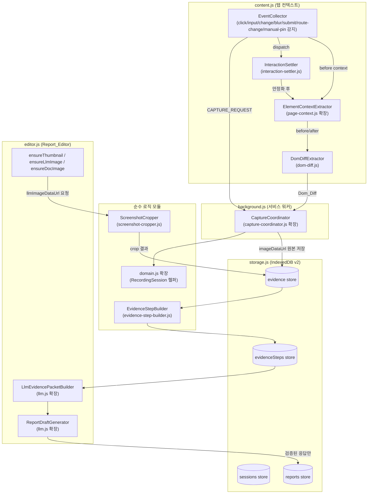
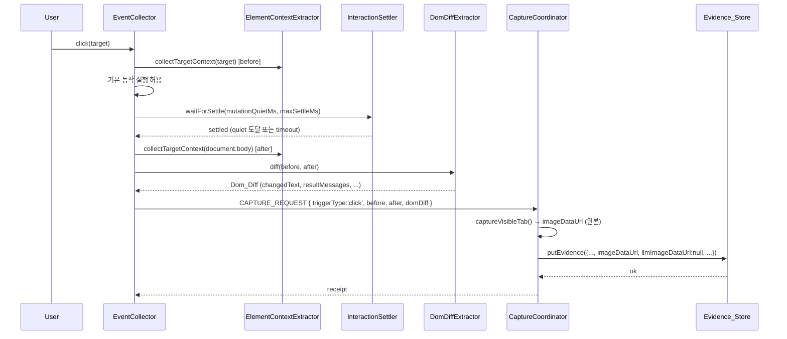
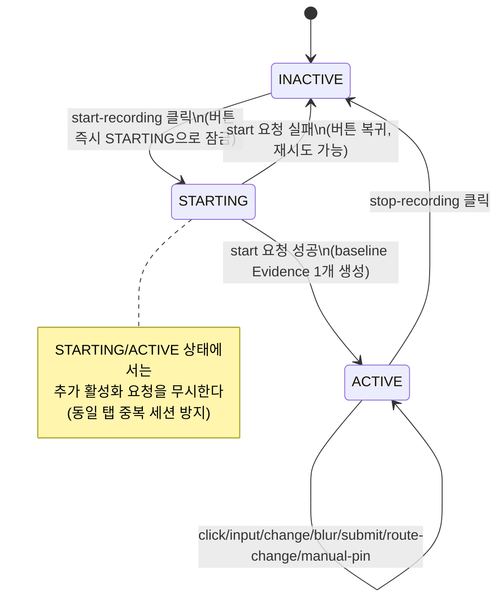

# Design Document

## Overview

이 기능은 CaptureIT의 캡처 파이프라인을 "수동 캡처가 기본, 자동 감지가 보조"인 구조에서 "녹화(RecordingSession)가 기본, Ctrl+Shift+클릭 Manual_Pin이 보조"인 구조로 전환하고, 캡처된 원본 스크린샷을 목적별로(미리보기용/LLM 입력용/문서 삽입용) 분리 가공하며, 이벤트 전/후 DOM 맥락을 비교해 의미 있는 테스트 단계(EvidenceStep) 단위로 재구성한 뒤, 로컬 LLM에 전달할 payload를 최소화된 형태로 구성하는 확장이다.

핵심 흐름은 다음과 같다:

```
녹화 시작 → baseline Evidence 자동 생성
  → (click/input/change/blur/submit/route-change 감지)
  → 이벤트 전 Target_Context/Container_Context 수집
  → 이벤트 기본 동작 실행
  → InteractionSettler로 DOM 안정화 대기
  → 이벤트 후 맥락 수집 + DomDiffExtractor로 Dom_Diff 산출
  → ScreenshotCropper로 crop 이미지 생성 (llmImageDataUrl/docImageDataUrl)
  → Evidence 저장 (imageDataUrl 원본은 그대로 보존)
  → EvidenceStepBuilder로 Evidence 목록을 EvidenceStep으로 그룹화
  → LlmEvidencePacketBuilder로 Feature_Spec + EvidenceStep → 최소 payload 구성
  → ReportDraftGenerator로 로컬 LLM에 테스트케이스 설명 요청 → 응답 스키마 검증 → Report 반영
```

**범위**: 이 기능은 `extension/content.js`, `extension/shared/page-context.js`, `extension/shared/content-controller.js`, `extension/shared/capture-coordinator.js`, `extension/shared/storage.js`, `extension/shared/domain.js`, `extension/shared/llm.js`, `extension/editor.js`를 확장하고, `extension/shared/interaction-settler.js`, `extension/shared/dom-diff.js`, `extension/shared/screenshot-cropper.js`, `extension/shared/evidence-step-builder.js`를 신규로 추가한다. 기존 QA 보고서 작성 흐름(기능 명세·검증 항목·PASS/FAIL 판정·HTML/Markdown/ZIP 생성), `manifest.json`, `background.js`의 기존 메시지 계약, 그리고 기존 IndexedDB v1 레코드는 변경·손상되지 않는다. API/서버 이벤트의 실제 수집 메커니즘(fetch/XHR 훅, 서버 로그 연동)은 범위 밖이며, 데이터 모델 확장 지점(`apiEvents`, `serverEvents`)과 그 요약 로직만 이 기능에서 다룬다.

**설계 원칙**: 신규 컴포넌트는 기존 `domain.js`/`page-context.js`/`event-policy.js`와 동일한 패턴을 따른다 — 순수 함수 중심, DOM 의존이 필요한 부분(`interaction-settler.js`, 일부 `page-context.js` 확장)은 `document`/`window`/`MutationObserver`를 의존성으로 주입받거나 인자로 전달받아 Node.js `node:test` 환경에서도 로직을 검증할 수 있게 한다. `screenshot-cropper.js`는 좌표 계산(순수 함수)과 실제 픽셀 조작(`canvas`/`OffscreenCanvas` 의존, 브라우저 전용)을 분리한다.

## Architecture

### 컴포넌트 관계도



### 이벤트 → Evidence 시퀀스 (click 예시)



### RecordingSession 상태 다이어그램



## Components and Interfaces

### 1. `extension/shared/interaction-settler.js` (신규)

이벤트 발생 직후 DOM이 안정화될 때까지 대기하는 순수 로직. `MutationObserver` 생성은 호출자가 주입한다.

```js
// dependencies: {
//   observe(callback): () => void   // MutationObserver를 구독하고 해제 함수를 반환하는 어댑터
//   now(): number                    // 기본값 Date.now
//   setTimer(fn, ms): handle         // 기본값 setTimeout
//   clearTimer(handle): void         // 기본값 clearTimeout
// }
function createInteractionSettler(dependencies)

// -> Promise<{ settled: boolean, reason: 'quiet' | 'max-settle', waitedMs: number }>
// mutationQuietMs 동안 변형이 없으면 'quiet'로 resolve. 그 전에 maxSettleMs가 지나면
// 'max-settle'로 강제 resolve(REQ 5.2). observe 콜백이 한 번도 오지 않아도(변화 없음)
// mutationQuietMs 경과 시 'quiet'로 resolve해야 한다.
settler.waitForSettle({ mutationQuietMs, maxSettleMs })
```

내부적으로 `observe`가 넘겨주는 콜백이 호출될 때마다 quiet 타이머를 리셋하고, 별도의 상한 타이머(`maxSettleMs`)를 처음부터 걸어 두 타이머 중 먼저 해소되는 쪽으로 resolve한다(둘 다 해제).

### 2. `extension/shared/dom-diff.js` (신규)

이벤트 전/후 맥락(각각 `page-context.js`가 만든 스냅샷)을 비교해 `Dom_Diff`를 산출하는 순수 함수.

```js
// beforeContext, afterContext: page-context.js가 만든 sanitized context 객체
// -> Dom_Diff: {
//   changedText: string[],              // after에서 새로 나타난, before에 없던 visibleText 조각
//   resultMessages: ResultMessageEntry[],   // { text, selector, priority }
//   validationMessages: ValidationMessageEntry[], // { text, selector, priority }
//   candidateResultElements: CandidateResultElement[] // priority 내림차순
// }
function diffContexts(beforeContext, afterContext)

// afterContext.surroundingContext 및 afterContext.resultCandidates(page-context.js가 수집한
// role="alert"/role="status"/.toast/.modal/.dialog/[aria-live] 텍스트 목록)를 스캔해
// 성공/완료 어휘(완료/성공/저장됨/등록되었습니다 등)와 오류/검증 어휘(오류/실패/필수입니다/올바르지 않습니다 등)로
// 분류한다. 정규식 기반 어휘 사전은 dom-diff.js 내부 상수(RESULT_PATTERNS, VALIDATION_PATTERNS)로 관리.
```

`Result_Message`/`Validation_Message` 우선순위: `role="alert"` > `role="status"`/`aria-live` > `.toast`/`.modal`/`.dialog` 클래스 힌트 > 기타. `candidateResultElements`는 이 우선순위로 정렬된 배열이며, `screenshot-cropper.js`가 crop 대상을 고를 때 첫 항목을 사용한다(REQ 4.4, 4.5, 9.1).

### 3. `extension/shared/screenshot-cropper.js` (신규)

원본 전체 뷰포트 스크린샷에서 목적별 crop 이미지를 만든다. 좌표/크기 계산(순수 함수, 테스트 가능)과 실제 픽셀 렌더링(canvas 의존, 브라우저 전용)을 분리한다.

```js
// regionCandidates: 우선순위 순서로 나열된 { type: Crop_Type, bbox: {x,y,width,height} } 배열
//   순서는 항상 [result_context_crop 후보, form_context_crop 후보, target_context_crop 후보,
//               container_context_crop 후보] 중 존재하는 것만 포함 (REQ 9.1)
// viewport: { width, height } — 원본 스크린샷의 실제 픽셀 크기
// -> { cropType: Crop_Type, region: {x,y,width,height} }
//    region은 viewport 경계 안으로 clamp되고, padding(140px, REQ 9.2)이 적용되고,
//    최소 760x480(REQ 9.3)/최대 1280x900이자 최장변 1280 이하(REQ 9.4)로 보정된 사각형이다.
//    regionCandidates가 비어 있으면 cropType은 'full_screenshot_resized'이고
//    region은 전체 viewport(리사이즈만 적용, crop 없음)이다.
function selectCropRegion(regionCandidates, viewport, options = { padding: 140, minWidth: 760, minHeight: 480, maxWidth: 1280, maxHeight: 900 })

// sourceImageDataUrl: 원본 imageDataUrl
// region: selectCropRegion의 출력
// -> Promise<string> dataURL (image/jpeg, quality 0.82)
// 브라우저 환경 전용(Image/canvas 사용). region이 minWidth/minHeight보다 작은 소스 뷰포트에서
// 나온 경우(REQ 9.3의 "적어도 그 크기일 때만" 조건) 이미 selectCropRegion에서 clamp되어 있으므로
// 그대로 렌더링한다.
async function renderCrop(sourceImageDataUrl, region)

// evidence: llmImageDataUrl 또는 docImageDataUrl을 채울 대상
// domDiff, targetContext, containerContext, viewport: crop 후보 산출용 입력
// -> Promise<Evidence> (호출된 필드만 갱신, 다른 이미지 필드는 그대로)
async function ensureLlmImage(evidence, { domDiff, targetContext, containerContext, viewport })
async function ensureDocImage(evidence, { domDiff, targetContext, containerContext, viewport })
```

`ensureLlmImage`/`ensureDocImage`는 `selectCropRegion`이 고른 `cropType`을 `evidence.imageMeta.cropType`에 기록한다(REQ 9.5). Manual_Pin Evidence의 경우 regionCandidates는 target bbox 하나만 갖고 cropType은 항상 `manual_pin_crop`으로 강제된다.

### 4. `extension/shared/evidence-step-builder.js` (신규)

원시 Evidence 목록을 사용자에게 의미 있는 EvidenceStep으로 묶는다.

```js
// evidenceList: sequenceNo 오름차순이 아니어도 되는 Evidence 배열 (내부에서 정렬)
// -> EvidenceStep[] (stepNo 오름차순, REQ 11.4)
// 그룹화 규칙:
//   - triggerType이 'baseline'인 Evidence는 항상 단독 EvidenceStep(stepType:'baseline')
//   - triggerType이 'form-input'인 연속된 Evidence는 같은 form selector일 때 하나의
//     EvidenceStep(stepType:'form-input')으로 묶인다 (REQ 3의 폼 단위 그룹화 결과를 계승)
//   - 'click'/'submit'/'route-change'/'manual-pin' Evidence는 그 자체가 하나의 EvidenceStep이며,
//     stepType은 triggerType과 동일(REQ 11.2)
//   - Dom_Diff.resultMessages/validationMessages가 있는 후속 Evidence가 직전 Evidence와
//     바로 이어지는 경우, 별도의 result-check EvidenceStep으로 분리하지 않고 직전 EvidenceStep에
//     결과로 흡수한다(step의 llmSummary에 반영). 결과 전용 Evidence(사용자 액션 없이 결과만
//     캡처된 경우)만 단독 stepType:'result-check'로 만든다.
function buildEvidenceSteps(evidenceList)

// step: 하나의 EvidenceStep 후보(그룹화 직후, primaryEvidenceId/llmSummary 미확정)
// -> string (evidenceIds 중 하나)
// 우선순위: submit/click/manual-pin 트리거 Evidence > route-change > form-input 그룹의 마지막(blur/submit
// flush) Evidence > baseline (REQ 11.3)
function pickPrimaryEvidenceId(step)

// evidenceList: 이 step에 속하는 원시 Evidence 배열(context 필드 포함)
// -> LlmSummary: { visibleText, targetText, resultMessages, apiSummary, serverSummary, status? }
// 각 Evidence의 context.target.visibleText/containerContext 요약 등 "이미 축약된 필드"만 조합하며,
// 원본 body 전체 텍스트(visibleText 2000자 필드)는 포함하지 않는다(REQ 11.5).
// apiEvents/serverEvents 요약 실패 시 status:'summary-failed'를 세팅한다(REQ 16.3).
function buildLlmSummary(evidenceList)
```

### 5. `extension/shared/page-context.js` (확장)

기존 `collectPageContext(target, documentRef, windowRef)`는 유지하되, 새 함수를 추가한다.

```js
// -> Target_Context: { tagName, type, role, ariaLabel, accessibleName, label, visibleText,
//    value, maskedValue, selector, xpath, stableLocator, bbox } (REQ 4.2)
// accessibleName은 aria-label > aria-labelledby 텍스트 > <label for> > placeholder 순으로 계산.
// stableLocator는 data-testid/id/name 속성이 있으면 그것을, 없으면 selector로 fallback.
// value/maskedValue: 15.1/15.2의 마스킹 규칙을 적용한 뒤 값을 채움(password/hidden/auth류는
// value를 아예 비우고 maskedValue만 채움; 주민번호/전화번호/계좌/OTP 패턴은 maskedValue에
// 마스킹된 문자열, value는 원본 유지하지 않음 — 저장 자체를 막는다).
function collectTargetContext(target, documentRef, windowRef)

// -> Container_Context: { type, selector, heading, visibleText, bbox } (REQ 4.3)
// 우선순위: dialog/[role=dialog] > form > section/article/main > card-like(class/heuristic) >
// 'tr' > body
function collectContainerContext(target, documentRef)

// -> boolean, 필드 마스킹 여부 판단(REQ 15.1/15.2)에 재사용되는 순수 함수
function shouldMaskField(fieldMeta)
function maskSensitiveValue(rawValue, fieldMeta)
```

`sanitizeContext`는 그대로 유지하며, `DENIED_KEYS`에 `authorization`/`cookie`/`token`/`sessiontoken` 외에 새 마스킹 규칙이 추가된다. 기존 `collectPageContext`의 출력 구조는 변경하지 않아 `tests/page-context.test.cjs`가 계속 통과한다.

### 6. `extension/content.js` (확장)

```js
// EventCollector 내부 상태 확장 (모듈 스코프 변수)
let recordingActive = false;         // RecordingSession 활성 여부 (chrome.storage.local 기반)
let dirtyFields = new Map();         // formSelector -> { fields: Map<fieldSelector, meta>, timer }
let manualPinInProgress = false;     // Ctrl+Shift+click 처리 중 플래그 (REQ 2.5의 동시성 보장용)

// input/change 이벤트 핸들러: 필드를 dirty로 마킹하고 inputDebounceMs 타이머를 (재)설정.
// inputDebounceMs === 0이면 타이머 없이 즉시 flush(REQ 3.3).
function markFieldDirty(form, field)

// blur 이벤트 핸들러: 해당 필드가 dirty였다면 즉시 flush(REQ 3.4)
function onFieldBlur(field)

// submit 이벤트 핸들러: 먼저 해당 form의 dirty 필드를 flush한 뒤(REQ 3.5),
// submit 트리거 Evidence 캡처를 진행
async function onFormSubmit(form)

// dirtyFields의 한 form 그룹을 form-level Evidence로 변환해 캡처 요청
async function flushDirtyFields(formSelector)

// route-change 감지: hashchange/popstate/polling(기존 유지) 발생 시 이전 route를 기록해서
// captureEvent에 전달. try/catch로 route 기록이 실패해도 캡처 자체는 계속 진행(REQ 6.3).
function captureRouteChange(previousRoute)
```

`document.addEventListener('input', ...)`, `'change'`, `'blur'`를 새로 등록한다. 기존 click 핸들러의 Ctrl+Shift+click 분기는 유지하되, `manualPinInProgress` 동안에도 다른 이벤트 리스너(click/input/change/blur/submit/route-change)는 계속 활성 상태로 둔다(REQ 2.5) — 이벤트 억제 로직은 오직 `event-policy.js`의 시간 윈도 기반 중복 억제(REQ 2.4)에만 위임한다.

### 7. `extension/shared/content-controller.js` (확장)

```js
// 기존 captureEvent/captureTarget/captureHighlightShortcut/captureContextMenu/setLastContextTarget 유지.

// dependencies에 추가:
//   settler: interaction-settler.js가 만든 인스턴스
//   diffContexts: dom-diff.js의 diffContexts
//   getRecordingPolicy(): Promise<Recording_Policy>

// 신규: 자동 이벤트(click/submit/route-change) 캡처를 InteractionSettler 경유로 처리
// beforeContext는 이벤트 기본 동작 실행 전에 이미 수집되어 있어야 한다(REQ 4.1).
async function captureSettledEvent(triggerType, target, beforeContext)
//   1) policy.getRecordingPolicy() 로 mutationQuietMs/maxSettleMs 조회
//   2) settler.waitForSettle(...) 대기 (REQ 5.1/5.2)
//   3) afterContext = collectContext(document.body 또는 target)
//   4) domDiff = diffContexts(beforeContext, afterContext)
//   5) requestCapture({ triggerType, before: beforeContext, after: afterContext, domDiff })
//   CaptureCoordinator가 실제 스크린샷을 찍는 시점은 이 함수가 resolve된 이후로 보장된다(REQ 5.3).

// 신규: 폼 필드 dirty 상태로부터 form-level Evidence 캡처 요청 구성
async function captureFormEvidence(formSelector, dirtyFieldEntries)

// 신규: baseline Evidence 캡처(녹화 시작 시 1회만 호출되도록 호출자가 보장)
async function captureBaseline()
```

### 8. `extension/shared/capture-coordinator.js` (확장)

```js
// createCaptureCoordinator(dependencies)에 다음 의존성 추가:
//   ensureRecordingLock(tabId): Promise<boolean>  // 동일 탭 중복 RecordingSession 시작 방지(REQ 1.7)
//   buildEvidenceSteps: evidence-step-builder.js의 buildEvidenceSteps (선택적, 세션 종료 시 사용)

// capture(request)는 유지되며 다음이 확장된다:
//   - request.before/after/domDiff가 있으면 evidence.event, evidence.page, evidence.target,
//     evidence.container, evidence.domBefore, evidence.domAfter에 매핑해 저장(REQ 14.3의 신규 필드)
//   - evidence.imageDataUrl에는 항상 원본 전체 스크린샷만 저장(REQ 8.2), thumbnailDataUrl/
//     llmImageDataUrl/docImageDataUrl은 null로 초기화
//   - evidence.stepId는 캡처 시점에는 null (EvidenceStepBuilder가 나중에 채움)

// 신규: RecordingSession 시작. 이미 활성 세션이 있으면 새 세션을 만들지 않고 기존 세션을 반환(REQ 1.7).
// baseline Evidence를 정확히 1개 생성하고 session.baselineEvidenceId를 설정(REQ 1.1, 1.3).
async function startRecordingSession({ tabId, recordingPolicy, captureBaselineContext })

// 신규: RecordingSession 종료. session.active=false, endedAt 설정. Evidence는 삭제하지 않는다.
async function stopRecordingSession(session)
```

### 9. `extension/shared/domain.js` (확장)

```js
// 기존 createSession(mode, now, id)는 유지(하위 호환). 새 헬퍼를 추가:

// -> RecordingSession: 기존 Capture_Session 필드(id, mode, startedAt, endedAt, lastSequenceNo) +
//    recordingPolicy, lastEvidenceId: null, baselineEvidenceId: null (REQ 14.1)
function createRecordingSession(recordingPolicy, now, id)

// -> Recording_Policy 기본값 (REQ 정의된 필드 전부 포함, 병합 시 누락된 필드만 기본값 채움)
function defaultRecordingPolicy(overrides = {})
// { captureBaselineOnStart: true, captureFullViewportPerStep: true, createLlmCrop: true,
//   inputDebounceMs: 800, mutationQuietMs: 300, maxSettleMs: 2000, maxLlmImagesPerFeature: 5 }

// -> EvidenceStep 뼈대 생성(evidence-step-builder.js가 내부적으로 사용할 수 있는 팩토리)
function createEvidenceStep({ stepNo, stepType, evidenceIds, primaryEvidenceId }, id)

// 기존 groupIntoCaptureSessionSets, mapEvidence 등은 변경 없이 유지.
```

### 10. `extension/shared/storage.js` (확장 — IndexedDB v2)

```js
const DATABASE_VERSION = 2; // 기존 1에서 상향(REQ 14.2)

// onupgradeneeded 핸들러 확장:
//   - oldVersion < 2 라도 기존 evidence/reports/sessions 스토어와 그 안의 레코드는 그대로 유지
//     (createObjectStore는 스토어가 없을 때만 실행되므로 기존 데이터는 건드리지 않음)
//   - evidenceSteps 신규 오브젝트 스토어 생성(keyPath: 'stepId'), 인덱스: sessionId, stepNo,
//     primaryEvidenceId, createdAt (REQ 14.4)

// 신규 정규화 함수: v1 시절 레코드(신규 필드가 없는 Evidence)를 읽을 때 기본값을 채운다(REQ 14.3)
function normalizeEvidenceRecord(record)
// 누락 시 기본값: stepId: null, event: null, page: null, target: null, container: null,
// domBefore: null, domAfter: null, apiEvents: [], serverEvents: [], assertions: [],
// thumbnailDataUrl: null, llmImageDataUrl: null, docImageDataUrl: null, imageMeta: {}
// 이미 존재하는 필드 값은 절대 덮어쓰지 않는다(스프레드 후 없는 키만 기본값 대입).

// getEvidence/listEvidence에 normalizeEvidenceRecord를 적용(putReport의 normalizeReportRecord와
// 동일한 "읽기 시점 정규화, 쓰기 시점은 그대로" 패턴, REQ 14.3).

function putEvidenceStep(record, database)
function getEvidenceStep(id, database)
function listEvidenceSteps(filters = { sessionId }, database)
```

기존 `openDatabase()` 시그니처와 반환 Promise<IDBDatabase> 계약은 그대로 유지되어, `tests/storage-contract.test.cjs`의 기존 단언(내보내는 함수 목록에 `putEvidenceStep`/`getEvidenceStep`/`listEvidenceSteps`가 추가된 것 외에는 변경 없음)이 계속 통과한다.

### 11. `extension/shared/llm.js` (확장)

```js
// 기존 buildStageOne/buildStageTwo/buildReportDraftRequest 등은 유지(하위 호환, 기존 테스트 보존).

// Image_Selection_Score 계산 (REQ 10.1)
// evidence: 후보 Evidence(context/domDiff/imageMeta 포함), featureEvidenceList: 같은 Feature_Spec에
// 매핑된 전체 Evidence 목록(중복 화면 판별용)
// -> number (양수/음수 가산점 합)
function computeImageSelectionScore(evidence, featureEvidenceList)
// 가산: resultMessage 존재(+), apiEvents 연결(+), post-submit/click changed-region 존재(+),
//        clicked target 존재(+), form-field 존재(+), route-change 직후 첫 화면 또는 manual-pin(+,
//        Manual_Pin 전용 보너스는 REQ 7.3과 동일 항목)
// 감산: storage/config/debug 화면 키워드매치(-), raw JSON/API-key 화면 패턴(-), 중복 화면(-),
//        visibleText 길이 부족(-)

// LLM 이미지 선별: 최대 maxImages(기본 5)개 선택, 동점 시 sequenceNo 오름차순(REQ 10.2/10.3)
// -> { selected: Evidence[], excluded: Evidence[] }
function selectTopImages(candidateEvidenceList, maxImages = 5)

// excluded Evidence를 텍스트 전용 설명으로 변환(REQ 10.4)
// -> { evidenceId, userAction, targetSummary, containerSummary, resultSummary } (image 필드 없음)
function buildTextOnlyDescriptor(evidence)

// Vision_Payload_Mode에 따라 최종 LLM payload를 구성 (REQ 12.*)
// mode: 'text-only' | 'json-data-url' | 'content-parts' | 'images-array'
// -> LlmEvidencePacket: {
//   feature: {...}, steps: [{ stepNo, stepType, userAction, targetSummary, containerSummary,
//     resultSummary, apiSummary, serverSummary, assertions }],
//   images: 모드별 형태 (아래 참고),
//   textOnlyEvidence: TextOnlyDescriptor[]  // top-5 밖 항목(REQ 10.4)
// }
// mode==='text-only': images 필드 자체를 생략(REQ 12.5)
// mode==='content-parts': images는 [{ type:'image', source: llmImageDataUrl, evidenceId }] 형태의
//   별도 파츠 배열(REQ 12.4, JSON 문자열 필드 안에 base64를 넣지 않음)
// mode==='json-data-url'|'images-array': 기존 buildStageTwo 스타일과 호환되는 형태
// 모든 모드에서 evidence.imageDataUrl(원본)은 참조하지 않고 llmImageDataUrl만 사용(REQ 8.7, 12.2)
function buildLlmEvidencePacket(featureSpec, evidenceSteps, options = { visionPayloadMode: 'content-parts', maxImages: 5 })

// apiEvents/serverEvents 요약 (REQ 16.2/16.3), evidence-step-builder.js가 호출하거나
// llm.js가 재사용할 수 있도록 이 모듈에도 순수 함수로 둔다.
function summarizeApiEvents(apiEvents)
function summarizeServerEvents(serverEvents)
// 처리 실패 시 예외를 던지지 않고 { status: 'summary-failed' } 를 반환한다(REQ 16.3).
// 호출자는 status==='summary-failed'인 요약을 payload에서 제외한다(REQ 16.4).

// Test_Case_Description_Request 구성 (REQ 13.1/13.2)
// -> { task, outputLanguage, writingStyle, feature, evidenceSteps, constraints, responseSchema }
function buildTestCaseDescriptionRequest(featureSpec, evidenceSteps, options = {})
// constraints는 항상 4개 고정 지침 문자열을 포함(제공된 증적만 사용/추론 금지/판정은 assertions
// 기반/마스킹 유지, REQ 13.2)

// 응답 검증 (REQ 13.3/13.4/13.5)
// -> TestCaseDescription (검증 통과 시) 또는 throw
function validateTestCaseDescriptionResponse(response)
// 필수 필드: testPurpose, preconditions, testProcedure, expectedResult, actualResult,
// judgementBasis, finalStatus. finalStatus는 PASS|FAIL|INCOMPLETE|NOT_JUDGED만 허용.
// 검증 실패 시 예외를 던질 뿐 Report에 어떤 값도 쓰지 않는다 — 호출자(editor.js)가 이 예외를
// catch해서 Report에 반영하지 않는 책임을 진다(REQ 13.5).
```

### 12. `extension/editor.js` (확장)

```js
// 기존 toggleSession()을 RecordingSession 전용 흐름으로 교체(REQ 1.4~1.7):
//   1) 클릭 즉시 버튼을 STARTING 상태로 전환하고 disable (REQ 1.4)
//   2) 이미 STARTING이거나 active면 클릭을 무시(REQ 1.5) — 핸들러 최상단에서 상태 체크
//   3) start 요청(백그라운드에 세션 시작 위임) 실패 시 버튼을 원래 상태로 복구(REQ 1.6)
async function toggleRecordingSession()

// 기존 ensureThumbnail(evidence)는 유지하되 실패 시 명시적으로 throw하고
// thumbnailDataUrl을 세팅하지 않은 채 종료하도록 보장(REQ 8.4, 기존 동작과 동일 — 이미
// try 없이 throw하는 구조이므로 로직 변경 없음, 계약을 명시적으로 문서화).
async function ensureThumbnail(evidence)

// 신규: llmImageDataUrl 보장 (REQ 8.5) — screenshot-cropper.js에 위임, 실패 시 throw
async function ensureLlmImage(evidence)

// 신규: docImageDataUrl 보장 (REQ 8.6) — screenshot-cropper.js에 위임, 실패 시 throw
async function ensureDocImage(evidence)

// 신규: Feature_Spec 단위로 EvidenceStepBuilder + LlmEvidencePacketBuilder를 호출해
// 테스트케이스 설명을 요청하고, 검증 통과 시에만 feature.description/result 필드에 반영
async function requestTestCaseDescription(feature)
//   실패(네트워크 오류 또는 validateTestCaseDescriptionResponse의 throw) 시 Report는 그대로
//   두고 사용자에게 재시도/수동 편집을 안내하는 메시지만 표시(REQ 13.5)

// Report_Editor UI: RecordingSession 시작/종료를 Primary_Action으로 배치하고,
// Ctrl+Shift+클릭 안내는 보조 힌트 텍스트로만 노출(REQ 7.4) — DOM/CSS 변경, 로직 없음
```

## Data Models

### RecordingSession (기존 Capture_Session 확장)

```
RecordingSession {
  id: string
  mode: string                      // 기존 필드, 변경 없음
  startedAt: string (ISO 8601)      // 기존 필드
  endedAt: string | null            // 기존 필드
  lastSequenceNo: number            // 기존 필드
  active: boolean                   // 기존 필드(editor.js에서 사용)

  // 신규 (REQ 14.1)
  recordingPolicy: Recording_Policy
  lastEvidenceId: string | null
  baselineEvidenceId: string | null
}

Recording_Policy {
  captureBaselineOnStart: boolean   // 기본 true
  captureFullViewportPerStep: boolean // 기본 true
  createLlmCrop: boolean            // 기본 true
  inputDebounceMs: number           // 기본 800, 0 허용(REQ 3.3)
  mutationQuietMs: number           // 기본 300
  maxSettleMs: number               // 기본 2000
  maxLlmImagesPerFeature: number    // 기본 5
}
```

### Evidence (확장)

```
Evidence {
  // 기존 필드 (변경 없음)
  id: string
  sessionId: string
  sequenceNo: number
  capturedAt: string (ISO 8601)
  triggerType: 'baseline' | 'click' | 'submit' | 'route-change' | 'form-input' | 'manual-pin'
             | 'navigation' | 'context-menu' | 'shortcut-context' | 'file-import' | ... (기존 값 유지)
  source: string
  featureSpecId: string | null
  previousCaptureId: string | null
  nextCaptureId: string | null
  context: object                   // 기존 page-context.js 출력 구조, 변경 없음

  // 이미지 필드 분리 (REQ 8.1)
  imageDataUrl: string               // 원본 전체 뷰포트 스크린샷(가공 없음)
  thumbnailDataUrl: string | null    // UI 미리보기용 (ensureThumbnail)
  llmImageDataUrl: string | null     // LLM 입력용 crop/resize (ensureLlmImage)
  docImageDataUrl: string | null     // 문서 삽입용 crop/resize (ensureDocImage)

  // Step 연동 (REQ 11)
  stepId: string | null

  // 이벤트 전/후 맥락 (REQ 4, 14.3)
  event: { type: string, previousRoute?: string, newRoute?: string } | null
  page: { pageUrl, pageTitle, route, viewportSize, scrollPosition } | null
  target: Target_Context | null
  container: Container_Context | null
  domBefore: object | null           // 이벤트 전 sanitized context 스냅샷
  domAfter: object | null            // 이벤트 후 sanitized context 스냅샷 + Dom_Diff

  // 확장 지점 (REQ 16.1)
  apiEvents: ApiEventEntry[]         // 기본 []
  serverEvents: ServerEventEntry[]   // 기본 []
  assertions: AssertionEntry[]       // 기본 []

  // crop 메타데이터 (REQ 9.5)
  imageMeta: {
    cropType: 'target_context_crop' | 'form_context_crop' | 'result_context_crop'
             | 'container_context_crop' | 'full_screenshot_resized' | 'manual_pin_crop' | null
    cropRegion: { x, y, width, height } | null
  }

  // 폼 단위 그룹화 (REQ 3.6)
  dirtyFields?: Array<{ selector, label, accessibleName, maskedValue }>
}

Target_Context {
  tagName: string
  type: string
  role: string
  ariaLabel: string
  accessibleName: string
  label: string
  visibleText: string
  value: string
  maskedValue: string
  selector: string
  xpath: string
  stableLocator: string
  bbox: { x, y, width, height }
}

Container_Context {
  type: 'dialog' | 'form' | 'section' | 'card' | 'row' | 'body'
  selector: string
  heading: string
  visibleText: string
  bbox: { x, y, width, height }
}

Dom_Diff {
  changedText: string[]
  resultMessages: Array<{ text, selector, priority }>
  validationMessages: Array<{ text, selector, priority }>
  candidateResultElements: Array<{ selector, priority, bbox }>
}
```

### EvidenceStep (신규)

```
EvidenceStep {
  stepId: string
  sessionId: string
  stepNo: number                    // 오름차순(REQ 11.4)
  stepType: 'baseline' | 'form-input' | 'click' | 'submit' | 'route-change'
          | 'manual-pin' | 'result-check'
  title: string
  userAction: string                 // 사람이 읽을 수 있는 한 줄 설명
  evidenceIds: string[]              // 이 step에 속한 원시 Evidence id들
  primaryEvidenceId: string          // evidenceIds 중 정확히 1개(REQ 11.3)
  llmSummary: {
    visibleText: string
    targetText: string
    resultMessages: string[]
    apiSummary: string | { status: 'summary-failed' }
    serverSummary: string | { status: 'summary-failed' }
  }
  createdAt: string (ISO 8601)
}
```

### Test_Case_Description_Request / Response (REQ 13)

```
Test_Case_Description_Request {
  task: string
  outputLanguage: string             // 예: 'ko'
  writingStyle: string
  feature: { featureSpecId, title, description, verification, expectedResult }
  evidenceSteps: Array<{ stepNo, stepType, userAction, targetSummary, containerSummary,
                         resultSummary, apiSummary?, serverSummary?, assertions }>
  constraints: string[]              // 항상 4개 고정 지침 포함(REQ 13.2)
  responseSchema: {
    testPurpose: 'string', preconditions: 'string', testProcedure: 'string',
    expectedResult: 'string', actualResult: 'string', judgementBasis: 'string',
    finalStatus: 'PASS|FAIL|INCOMPLETE|NOT_JUDGED'
  }
}

TestCaseDescriptionResponse {
  testPurpose: string
  preconditions: string
  testProcedure: string
  expectedResult: string
  actualResult: string
  judgementBasis: string
  finalStatus: 'PASS' | 'FAIL' | 'INCOMPLETE' | 'NOT_JUDGED'
}
```

### IndexedDB v2 스키마

```
Database: captureit, version: 2 (기존 version 1에서 상향)

Object Store: evidence (keyPath: 'id')            // 기존 유지, 필드만 확장(위 Evidence 참고)
  Indexes: sessionId, sequenceNo, featureSpecId, capturedAt   // 기존 유지

Object Store: reports (keyPath: 'id')              // 기존 유지, 변경 없음
  Indexes: updatedAt                                // 기존 유지

Object Store: sessions (keyPath: 'id')             // 기존 유지, 필드만 확장(RecordingSession)
  Indexes: startedAt                                // 기존 유지

Object Store: evidenceSteps (keyPath: 'stepId')    // 신규 (REQ 14.4)
  Indexes: sessionId, stepNo, primaryEvidenceId, createdAt
```

**마이그레이션 전략**: `onupgradeneeded`는 `database.objectStoreNames.contains(...)` 가드로 이미 존재하는 스토어를 다시 만들지 않는다(기존 `evidence`/`reports`/`sessions` 코드가 이미 이 패턴을 사용 중). v1→v2 업그레이드에서는 `evidenceSteps` 스토어만 신규로 `createObjectStore`되고, 기존 3개 스토어에는 어떤 `clear()`/`delete()`/레코드 재작성도 수행하지 않는다(REQ 14.5). 필드 정규화는 스키마 마이그레이션이 아니라 **읽기 시점 정규화**(`normalizeEvidenceRecord`, 기존 `normalizeReportRecord`와 동일한 패턴)로 처리되므로, v1 시절에 만들어진 레코드가 실제로 다시 쓰여지기 전까지는 저장소상 형태가 그대로 유지된다(REQ 14.3).

## Correctness Properties

*A property is a characteristic or behavior that should hold true across all valid executions of a system-essentially, a formal statement about what the system should do. Properties serve as the bridge between human-readable specifications and machine-verifiable correctness guarantees.*

이 기능의 대부분 컴포넌트(순수 로직 모듈: `interaction-settler.js`, `dom-diff.js`, `screenshot-cropper.js`의 좌표 계산부, `evidence-step-builder.js`, `llm.js` 확장, `domain.js` 확장, `storage.js`의 정규화 함수, `page-context.js`의 마스킹/우선순위 로직)는 입력에 따라 의미 있게 달라지는 순수 함수이므로 PBT가 적합하다. 아래 프로퍼티는 prework 분석에서 PROPERTY로 분류된 항목을 정리·중복 제거한 것이다. EXAMPLE/SMOKE/INTEGRATION으로 분류된 항목(예: 1.2 baseline 필드 존재, 2.1 리스너 등록, 6.1 세 가지 브라우저 신호 배선, 7.4 UI 우선순위 표기, 14.2/14.4/14.5 IndexedDB 마이그레이션 구조, 16.1 필드 예약)은 Testing Strategy에서 단위/정적 소스 테스트로 다룬다.

### Property 1: Baseline Evidence는 정확히 하나이며 항상 가장 먼저 온다

*For any* RecordingSession 시작과 그 뒤에 이어지는 임의 개수·순서의 자동/수동 캡처 트리거 시퀀스에 대해, 해당 세션에 속한 Evidence 중 `triggerType==='baseline'`인 것은 정확히 하나이며, 그 Evidence의 `sequenceNo`는 같은 세션의 다른 모든 Evidence의 `sequenceNo`보다 작다. 그리고 `session.baselineEvidenceId`는 그 baseline Evidence의 `id`와 항상 일치한다.

**Validates: Requirements 1.1, 1.3**

### Property 2: STARTING 상태는 시작 요청 완료 전에 잠기고, 오직 하나의 시작 요청만 발생한다

*For any* start-recording 컨트롤에 대한 임의 횟수의 연속 활성화(시작 요청이 아직 resolve/reject되기 전에 발생)에 대해, 실제 시작 요청은 정확히 1회만 발생한다. *For any* 시작 요청의 성공/실패 결과에 대해, 실패 시 컨트롤은 반드시 비활성 상태로 복귀해 재시도가 가능해지고, 성공 시 컨트롤은 활성 상태를 유지한다.

**Validates: Requirements 1.4, 1.5, 1.6**

### Property 3: 동일 탭에서 RecordingSession은 항상 최대 하나만 활성 상태다

*For any* 동일 탭에 대한 임의 횟수·타이밍의 중첩 시작 시도 시퀀스에 대해, 그 결과로 생성되거나 재사용되는 활성 세션은 항상 하나뿐이며, 두 번째 이후의 시도는 새 세션을 만들지 않고 기존 활성 세션을 반환한다.

**Validates: Requirements 1.7**

### Property 4: 비활성 상태에서는 어떤 자동 이벤트도 Evidence를 만들지 않는다

*For any* click/input/change/blur/submit/route-change 트리거의 임의 시퀀스에 대해, RecordingSession이 활성화되어 있지 않은 동안에는 그 시퀀스로부터 캡처 요청이 한 건도 발생하지 않는다.

**Validates: Requirements 2.3**

### Property 5: 중복 트리거는 억제 윈도 내에서만 억제된다

*For any* 동일 트리거 타입·동일 라우트로 연속 발생하는 두 이벤트와 그 사이의 임의 시간 간격 delta에 대해, delta가 억제 윈도(windowMs)보다 작으면 두 번째 이벤트는 억제되고, delta가 윈도 이상이면 두 번째 이벤트도 정상적으로 수락된다.

**Validates: Requirements 2.4**

### Property 6: Manual_Pin 처리 중에도 다른 이벤트 감지는 억제되지 않는다

*For any* Manual_Pin(Ctrl+Shift+클릭) 이벤트와 click/input/change/blur/submit 이벤트가 임의로 섞인 인터리빙 시퀀스에 대해, Manual_Pin 처리가 진행 중인 동안에도 다른 트리거 타입의 이벤트는 정상적으로 감지·처리된다(Manual_Pin 처리 상태가 다른 이벤트 감지를 억제하지 않는다).

**Validates: Requirements 2.5**

### Property 7: 폼 필드 디바운스 flush는 누적된 dirty 필드 집합과 정확히 일치하는 단일 Evidence를 만든다

*For any* 임의 개수의 폼 필드에 대한 input/change 이벤트 시퀀스(각 필드의 selector/label/accessibleName/value가 임의로 주어짐)와 임의의 `inputDebounceMs`(0을 포함)에 대해, 마지막 이벤트로부터 `inputDebounceMs`가 경과할 때까지 추가 이벤트가 없으면 정확히 하나의 form-level Evidence가 생성되고, 그 `dirtyFields` 배열은 누적된 필드 집합과 정확히 일치하며 각 항목은 selector/label/accessibleName/maskedValue를 모두 포함한다. `inputDebounceMs===0`일 때는 대기 없이 첫 input/change 이벤트에서 즉시 flush된다.

**Validates: Requirements 3.1, 3.2, 3.3, 3.6**

### Property 8: blur는 inputDebounceMs와 무관하게 즉시 flush한다

*For any* dirty 상태인 폼 필드와 임의의(0 포함, 매우 큰 값 포함) `inputDebounceMs`에 대해, 그 필드에 blur 이벤트가 발생하면 `inputDebounceMs` 경과를 기다리지 않고 즉시 form-level Evidence가 생성된다.

**Validates: Requirements 3.4**

### Property 9: submit은 대기 중인 dirty 필드를 submit Evidence보다 먼저 flush한다

*For any* 임의의 dirty 필드 집합과 그 폼에 대한 submit 이벤트에 대해, 생성되는 form-level Evidence의 `sequenceNo`는 항상 그 뒤에 생성되는 submit 트리거 Evidence의 `sequenceNo`보다 작다(순서가 보장된다).

**Validates: Requirements 3.5**

### Property 10: Target_Context는 이벤트 기본 동작이 상태를 변경하기 전 스냅샷을 반영한다

*For any* 대상 요소의 이벤트 전/후 상태 쌍(임의로 다른 값)에 대해, 이벤트 전에 수집된 Target_Context는 항상 "이전" 상태를 반영하며, 기본 동작이 동기/비동기로 언제 상태를 변경하든 그 변경이 반영되지 않는다.

**Validates: Requirements 4.1**

### Property 11: Target_Context는 입력 완전성과 무관하게 항상 고정된 키 전체를 포함한다

*For any* 임의로 일부 속성이 누락된 요소 디스크립터에 대해, `collectTargetContext`의 출력은 항상 tagName, type, role, ariaLabel, accessibleName, label, visibleText, value, maskedValue, selector, xpath, stableLocator, bbox 키를 모두 포함한다(누락된 입력은 문서화된 기본값으로 채워진다).

**Validates: Requirements 4.2**

### Property 12: Container_Context는 항상 우선순위가 가장 높은 존재하는 조상 타입을 선택한다

*For any* dialog/form/section·article·main/card/table-row/body 타입이 임의 조합·임의 순서로 존재하는 조상 체인에 대해, 선택되는 Container_Context의 `type`은 항상 우선순위(dialog > form > section/article/main > card > row > body)상 가장 높은 것으로 실제 존재하는 타입과 일치한다. 아무 것도 없으면 body로 귀결된다.

**Validates: Requirements 4.3**

### Property 13: Dom_Diff의 분류는 이전/이후 텍스트 집합과 어휘 사전에 의해 결정적으로 계산된다

*For any* 이전/이후 visible-text 배열 쌍(성공 어휘·오류 어휘·중립 텍스트가 임의로 섞여 있음)에 대해, `changedText`는 항상 이후 배열에서 이전 배열에 없는 항목들의 집합과 일치하고, `resultMessages`에는 성공/완료 어휘와 매칭되는 항목만, `validationMessages`에는 오류/검증 어휘와 매칭되는 항목만 포함된다(중립 텍스트는 어느 쪽에도 포함되지 않는다).

**Validates: Requirements 4.4**

### Property 14: 결과/검증 메시지가 있으면 crop은 항상 최우선 후보를 대상으로 한다

*For any* 하나 이상의 `candidateResultElements`(우선순위가 임의로 부여됨)를 포함하는 Dom_Diff와, result/form-container/target 후보가 임의로 존재/부재하는 조합에 대해, ScreenshotCropper가 선택하는 crop 영역은 항상 result 우선순위 > form/container 우선순위 > target 우선순위 > 전체화면 순서에서 실제 존재하는 가장 높은 우선순위의 후보를 기반으로 하며, 결과 메시지가 존재할 때는 `cropType`이 `result_context_crop`이고 영역이 최우선 후보의 bbox를 기반으로 한다.

**Validates: Requirements 4.5, 9.1**

### Property 15: InteractionSettler는 조용한 구간이 mutationQuietMs에 도달하는 즉시 resolve한다

*For any* 임의의 mutation 발생 타임스탬프 시퀀스와 `mutationQuietMs`(마지막 mutation 이후 충분한 조용한 구간이 `maxSettleMs` 이전에 발생하는 경우)에 대해, `waitForSettle`은 정확히 (마지막 mutation 시각 + `mutationQuietMs`)에 `reason:'quiet'`로 resolve된다.

**Validates: Requirements 5.1**

### Property 16: 충분한 조용한 구간이 없으면 InteractionSettler는 항상 maxSettleMs에 강제 resolve된다

*For any* `maxSettleMs`가 끝나기 전까지 간격이 항상 `mutationQuietMs`보다 짧게 촘촘히 발생하는 mutation 시퀀스에 대해, `waitForSettle`은 정확히 `maxSettleMs` 경과 시점에 `reason:'max-settle'`로 resolve되며, 그보다 늦게 resolve되지 않는다.

**Validates: Requirements 5.2**

### Property 17: 전체 화면 캡처는 항상 InteractionSettler resolve 이후에만 발생한다

*For any* InteractionSettler의 임의 resolve 지연 시간에 대해, `captureVisible` 호출은 항상 settler의 promise가 resolve된 시각 이후에만 발생한다(그 이전에는 결코 호출되지 않는다).

**Validates: Requirements 5.3**

### Property 18: route-change Evidence는 주어진 이전/새 라우트 쌍을 정확히 기록한다

*For any* 임의의 (이전 라우트, 새 라우트) 문자열 쌍에 대해, 생성되는 route-change Evidence의 `event.previousRoute`/`event.newRoute`는 정확히 그 입력 쌍과 일치한다.

**Validates: Requirements 6.2**

### Property 19: 라우트 기록 실패는 Evidence 생성이나 이후 캡처를 절대 막지 않는다

*For any* 라우트 정보를 읽는 과정에서 발생하는 임의의 예외에 대해, route-change Evidence 생성은 여전히 성공하며(라우트 필드만 비어 있음) 예외가 상위로 전파되지 않고, 그 뒤에 이어지는 무관한 캡처 요청도 정상적으로 계속 처리된다.

**Validates: Requirements 6.3**

### Property 20: Manual_Pin 경로와 자동 click 경로는 상호 배타적이며 정확히 modifier 조합에 의해 결정된다

*For any* 클릭 이벤트의 임의 modifier 키 조합(ctrlKey, shiftKey, altKey, metaKey)에 대해, `ctrlKey && shiftKey`가 참일 때는 항상 Manual_Pin 경로만 실행되고 자동 click 캡처 경로는 실행되지 않으며, 그 외의 모든 조합에서는 항상 자동 click 경로만 실행되고 Manual_Pin 경로는 실행되지 않는다.

**Validates: Requirements 7.1**

### Property 21: Manual_Pin 이미지는 항상 양의 고정 보너스만큼 더 높은 점수를 받는다

*For any* 다른 조건이 동일하고 `triggerType`만 다른 두 Evidence 후보(하나는 manual-pin, 하나는 아님)에 대해, `computeImageSelectionScore(manual-pin 후보) - computeImageSelectionScore(다른 후보)`는 항상 고정된 양의 보너스 값과 정확히 일치한다.

**Validates: Requirements 7.3**

### Property 22: 캡처는 항상 imageDataUrl만 채우고 나머지 세 이미지 필드는 비운다

*For any* 임의의 캡처 요청·컨텍스트 페이로드에 대해, `capture()`가 만든 Evidence는 `imageDataUrl`이 항상 mock 스크린샷 결과와 일치하고, `thumbnailDataUrl`/`llmImageDataUrl`/`docImageDataUrl`은 항상 null/미설정 상태다.

**Validates: Requirements 8.2**

### Property 23: ensureThumbnail/ensureLlmImage/ensureDocImage는 각각 자신의 목표 필드만 변경한다

*For any* {ensureThumbnail→thumbnailDataUrl, ensureLlmImage→llmImageDataUrl, ensureDocImage→docImageDataUrl} 중 하나의 (함수, 목표 필드) 조합과, 임의의 사전 설정된 다른 세 이미지 필드 값에 대해, 해당 함수를 호출하면 목표 필드만 변경되고 나머지 세 필드는 호출 전후로 완전히 동일하게 유지된다.

**Validates: Requirements 8.3, 8.5, 8.6**

### Property 24: 이미지 생성 실패는 목표 필드를 절대 부분적으로 채우지 않는다

*For any* {ensureThumbnail, ensureLlmImage, ensureDocImage} 중 하나의 내부 이미지 로딩/렌더링 단계에서 발생하는 임의의 실패 원인에 대해, 함수는 항상 예외를 던지고 목표 이미지 필드는 호출 전 값(비어있었다면 비어있는 상태) 그대로 유지된다.

**Validates: Requirements 8.4**

### Property 25: LLM payload의 이미지 데이터는 항상 llmImageDataUrl에서만 오며 imageDataUrl은 결코 참조되지 않는다

*For any* `imageDataUrl`과 `llmImageDataUrl`이 서로 다른 값을 갖는 임의의 Evidence 집합과 임의의 Vision_Payload_Mode에 대해, 빌드된 LLM payload에 등장하는 이미지 데이터는 항상 각 Evidence의 `llmImageDataUrl`과 일치하며, 어떤 Evidence의 `imageDataUrl` 값도 결과 payload의 직렬화 문자열 어디에도 나타나지 않는다.

**Validates: Requirements 8.7, 12.2**

### Property 26: crop 패딩은 클램핑 전에 항상 정확히 140px다

*For any* 클램핑이 발생하지 않을 만큼 충분히 큰 viewport 안의 임의 bbox에 대해, 선택된 crop 영역은 그 bbox를 사방으로 정확히 140px 확장한 사각형과 일치한다.

**Validates: Requirements 9.2**

### Property 27: crop 영역은 viewport가 허용하는 한 항상 최소 크기 이상이다

*For any* viewport가 최소 760x480 이상인 임의의 bbox/viewport 조합에 대해, 결과 crop 영역의 너비는 항상 760 이상이고 높이는 항상 480 이상이다.

**Validates: Requirements 9.3**

### Property 28: crop 영역은 항상 최대 크기와 최장변 제한을 지킨다

*For any* 임의로 큰 bbox/viewport 조합에 대해, 결과 crop 영역의 너비는 1280을 넘지 않고 높이는 900을 넘지 않으며 최장변은 항상 1280 이하다.

**Validates: Requirements 9.4**

### Property 29: crop 영역은 항상 viewport 경계 안에 있다

*For any* viewport 경계 안팎에 임의로 걸쳐 있는 bbox와 임의의 viewport 크기에 대해, 결과 crop 영역은 항상 `0 ≤ x`, `0 ≤ y`, `x+width ≤ viewport.width`, `y+height ≤ viewport.height`를 만족한다.

**Validates: Requirements 9.6**

### Property 30: cropType은 항상 6개의 열거값 중 하나다

*For any* 후보 존재/부재의 임의 조합과 manual-pin 플래그에 대해, 결과의 `cropType`은 항상 `target_context_crop`, `form_context_crop`, `result_context_crop`, `container_context_crop`, `full_screenshot_resized`, `manual_pin_crop` 중 정확히 하나다.

**Validates: Requirements 9.5**

### Property 31: Image_Selection_Score는 가산 요인에 대해 단조 비감소, 감산 요인에 대해 단조 비증가한다

*For any* Image_Selection_Score의 가산/감산 요인들의 임의 조합에 대해, 다른 요인을 고정한 채 임의의 가산 요인 하나를 false→true로 바꾸면 점수는 결코 감소하지 않으며, 임의의 감산 요인 하나를 false→true로 바꾸면 점수는 결코 증가하지 않는다.

**Validates: Requirements 10.1**

### Property 32: 상위 5개 이미지 선택은 점수 내림차순이며 동점은 sequenceNo 오름차순으로 해소된다

*For any* 임의 개수(0개 이상)의 후보 이미지 목록(점수·sequenceNo가 임의로 부여되고 동점이 포함될 수 있음)에 대해, 선택되는 이미지는 최대 5개이며 항상 점수 내림차순으로 정렬되고, 동일 점수를 가진 후보들 사이의 상대 순서 및 컷오프 경계에서의 선택 여부는 항상 sequenceNo 오름차순 규칙으로 결정된다.

**Validates: Requirements 10.2, 10.3**

### Property 33: 선택되지 않은 후보는 버려지지 않고 이미지 없는 텍스트 설명으로 정확히 보존된다

*For any* 5개를 초과하는 임의 개수의 후보 이미지 목록에 대해, 선택된 5개와 제외된 나머지는 전체 후보 집합을 정확히 분할하며(합집합이 전체와 같고 교집합이 없음), 제외된 각 후보는 이미지 데이터가 없는 텍스트 전용 설명(userAction/대상·컨테이너 요약/결과 요약)으로 정확히 1회씩 payload에 나타난다.

**Validates: Requirements 10.4**

### Property 34: EvidenceStep 그룹화는 원시 이벤트 수보다 결코 많은 step을 만들지 않으며 같은 폼의 연속 입력을 항상 하나로 합친다

*For any* baseline/click/submit/route-change/manual-pin과 같은 폼에 대한 연속된 form-input Evidence가 임의로 섞인 원시 Evidence 시퀀스에 대해, 생성되는 EvidenceStep의 개수는 항상 입력 Evidence 개수 이하이며, 같은 폼에 대한 모든 연속 form-input Evidence 구간은 항상 정확히 하나의 EvidenceStep으로 합쳐진다.

**Validates: Requirements 11.1**

### Property 35: 모든 EvidenceStep의 stepType은 7개 열거값 중 하나이고, primaryEvidenceId는 항상 자신의 evidenceIds의 원소다

*For any* 임의의 원시 Evidence 목록에 대해, 산출되는 모든 EvidenceStep의 `stepType`은 baseline/form-input/click/submit/route-change/manual-pin/result-check 중 하나이며, 각 EvidenceStep의 `primaryEvidenceId`는 항상 그 EvidenceStep 자신의 `evidenceIds` 배열에 포함된 값이다.

**Validates: Requirements 11.2, 11.3**

### Property 36: EvidenceStep은 항상 stepNo 오름차순이며 이는 기저 Evidence의 sequenceNo 순서와 일치한다

*For any* 순서가 임의로 섞인(sequenceNo가 오름차순이 아닌) 원시 Evidence 목록에 대해, `buildEvidenceSteps`의 출력은 항상 `stepNo` 오름차순으로 정렬되어 있으며, 인접한 두 EvidenceStep에서 앞선 step에 속한 Evidence의 최소 sequenceNo는 항상 다음 step에 속한 Evidence의 최소 sequenceNo보다 작다.

**Validates: Requirements 11.4**

### Property 37: llmSummary와 최종 LLM payload는 원본 raw 텍스트를 그대로 포함하지 않는다

*For any* 매우 긴 임의의 원본 텍스트(예: 2000자 body 덤프)가 담긴 `context.visibleText`/`domAfter.visibleText`를 가진 Evidence에 대해, 그로부터 파생된 EvidenceStep의 `llmSummary`와, 그 EvidenceStep들로 빌드된 최종 LLM payload(어떤 Vision_Payload_Mode에서든)의 직렬화 결과 모두, 그 원본 긴 텍스트 문자열을 그대로(verbatim) 포함하지 않는다.

**Validates: Requirements 11.5, 12.1, 12.3**

### Property 38: content-parts 모드는 각 선택된 이미지를 llmImageDataUrl을 참조하는 별도의 구조적 파츠로 인코딩한다

*For any* 5개 이하의 서로 다른 `llmImageDataUrl` 값을 가진 임의의 선택된 Evidence 집합에 대해, `visionPayloadMode==='content-parts'`로 빌드하면 결과 payload의 이미지 파츠 배열 길이는 선택된 개수와 정확히 같고, 각 파츠는 대응하는 Evidence의 `llmImageDataUrl`을 그대로 참조하며, 이미지 데이터가 JSON 문자열 필드 내부에 문자열로 인코딩되어 있지 않다.

**Validates: Requirements 12.4**

### Property 39: text-only 모드는 이미지가 존재하더라도 항상 이미지 데이터를 완전히 생략한다

*For any* 이미지가 존재하는 임의의 Evidence/Step 집합에 대해, `visionPayloadMode==='text-only'`로 빌드한 payload는 이미지 관련 키를 전혀 포함하지 않으며 직렬화 결과에 데이터 URL 형태의 문자열이 전혀 나타나지 않는다.

**Validates: Requirements 12.5**

### Property 40: Test_Case_Description_Request는 항상 7개 필수 최상위 키와 4개 고정 제약 지침을 포함한다

*For any* 임의의 feature/evidenceSteps/options 조합에 대해, `buildTestCaseDescriptionRequest`의 출력은 항상 task, outputLanguage, writingStyle, feature, evidenceSteps, constraints, responseSchema 7개 키를 모두 포함하며, `constraints` 배열은 항상 4개의 고정 지침 문자열(제공된 증적만 사용, 부재한 사실 추론 금지, 판정은 제공된 assertions 기반, 마스킹된 개인정보는 마스킹 유지)을 모두 포함한다.

**Validates: Requirements 13.1, 13.2**

### Property 41: 응답 검증은 7개 필수 필드가 모두 있고 finalStatus가 4개 허용값 중 하나일 때만 통과한다

*For any* 7개 필수 필드(testPurpose, preconditions, testProcedure, expectedResult, actualResult, judgementBasis, finalStatus) 중 임의의 부분집합만 존재하는 응답 객체와 임의의 `finalStatus` 문자열 값에 대해, `validateTestCaseDescriptionResponse`는 7개 필드가 모두 존재하고 `finalStatus`가 PASS/FAIL/INCOMPLETE/NOT_JUDGED 중 하나일 때만 성공하고, 그 외의 모든 경우(하나라도 필드 누락 또는 finalStatus가 허용값 밖)에는 항상 예외를 던진다.

**Validates: Requirements 13.3, 13.4**

### Property 42: 검증에 실패한 응답은 Report/Feature의 어떤 필드도 변경하지 않는다

*For any* 검증에 실패하는 임의의 응답과 임의의 사전 Report/Feature 필드 값에 대해, 검증 실패를 처리하는 흐름을 거친 뒤에도 Report/Feature 객체는 호출 전과 완전히 동일하게 유지된다(예외가 상위로 전파되지 않고 흡수되더라도 어떤 필드도 기록되지 않는다).

**Validates: Requirements 13.5**

### Property 43: createRecordingSession의 출력은 항상 createSession의 출력을 완전히 포함하는 상위집합이다

*For any* 임의의 (mode, now, id) 조합에 대해, `createRecordingSession(...)`의 결과 객체는 `createSession(...)`이 만든 모든 키와 값을 정확히 동일하게 포함하며, 그 위에 `recordingPolicy`/`lastEvidenceId`/`baselineEvidenceId` 3개 필드가 추가로 존재한다.

**Validates: Requirements 14.1**

### Property 44: normalizeEvidenceRecord는 누락된 필드만 기본값으로 채우고 기존 값은 절대 덮어쓰지 않는다

*For any* 신규 필드 중 임의의 부분집합만 존재하고 나머지는 부재하며, 기존(v1) 필드는 임의의 값으로 채워진 레코드에 대해, `normalizeEvidenceRecord`를 적용한 결과는 이미 존재하던 모든 필드의 값을 정확히 그대로 보존하고, 부재했던 신규 필드에는 문서화된 기본값을 채우며, 문서화되지 않은 새로운 키를 추가하지 않는다.

**Validates: Requirements 14.3**

### Property 45: 지정된 민감 필드 범주는 항상 마스킹/제외되고, 그 외 필드는 항상 그대로 통과한다

*For any* 임의의 필드 타입·이름 조합(password/hidden/authorization/cookie/token/session 키워드와 매칭되는 것과 매칭되지 않는 것이 섞여 있음)에 대해, 값이 마스킹되거나 제외되는 것은 그 필드가 이 민감 범주 중 하나와 매칭될 때뿐이며, 매칭되지 않는 필드의 값은 항상 그대로 전달된다.

**Validates: Requirements 15.1**

### Property 46: 민감 숫자 패턴은 정의된 정규식과 매칭될 때만 마스킹된다

*For any* 임의의 숫자 위주 문자열(주민번호형/전화번호형/계좌번호형/OTP형 패턴과 매칭되는 것과 매칭되지 않는 무작위 숫자열이 섞여 있음)에 대해, `maskSensitiveValue`는 그 문자열이 문서화된 패턴 중 하나와 매칭될 때만 마스킹된 값을 반환하고, 매칭되지 않으면 원본 문자열을 그대로 반환한다.

**Validates: Requirements 15.2**

### Property 47: 정제된 컨텍스트는 원본 HTML 소스를 그대로 포함하지 않는다

*For any* 페이지의 원본 HTML로 가정한 임의의 긴 마크업 문자열에 대해, `collectTargetContext`/`sanitizeContext`가 만든 어떤 문자열 필드도 그 원본 마크업 문자열을 그대로(부분 문자열로도) 포함하지 않는다.

**Validates: Requirements 15.3**

### Property 48: apiEvents/serverEvents 요약과 최종 payload는 원본 로그 내용을 그대로 노출하지 않으며, 요약 실패는 항상 안전하게 처리된다

*For any* 정상적인 임의의 apiEvents/serverEvents 배열에 대해, `summarizeApiEvents`/`summarizeServerEvents`의 출력과 그로부터 빌드된 최종 LLM payload는 원본 배열의 항목을 그대로(verbatim) 포함하지 않는다. *For any* 요약을 실패시키는 임의의 손상된 입력(잘못된 타입, 예외를 던지는 getter 등)에 대해, 두 함수는 절대 예외를 던지지 않고 항상 정확히 `{ status: 'summary-failed' }`를 반환하며, 원본 손상 입력의 어떤 조각도 결과에 포함되지 않는다.

**Validates: Requirements 16.2, 16.3, 16.5**

### Property 49: summary-failed로 표시된 항목은 최종 LLM payload에서 항상 제외된다

*For any* 일부는 `summary-failed` 상태이고 일부는 정상 요약을 가진 EvidenceStep들이 임의로 섞인 집합에 대해, 빌드된 LLM payload는 `summary-failed`로 표시된 항목의 `apiSummary`/`serverSummary`를 항상 생략하고, 정상 요약을 가진 항목의 내용은 항상 그대로 유지한다.

**Validates: Requirements 16.4**

## Error Handling

이 절은 요구사항에서 이미 확정된 실패 모드 결정을 각 컴포넌트의 구체적인 예외 처리 코드 경로로 정리한다.

### STARTING 상태 잠금과 시작 실패 복구 (REQ 1.4~1.6)

`editor.js`의 `toggleRecordingSession()`은 핸들러 최상단에서 현재 버튼 상태를 확인한다. `STARTING` 또는 이미 활성 상태이면 즉시 반환하며 어떤 요청도 보내지 않는다(REQ 1.5). 그렇지 않으면 버튼을 동기적으로 `STARTING`으로 바꾸고 `disabled=true`를 설정한 **뒤에** 비동기 시작 요청을 보낸다(REQ 1.4 — 상태 전환이 요청 완료를 기다리지 않음). 요청이 `reject`되면 `catch` 블록에서 버튼을 비활성 상태로 되돌리고 `disabled=false`로 복구해 재시도를 허용한다(REQ 1.6). 요청이 성공하면 버튼은 활성(ACTIVE) 표시로 전환된다. 이 상태 기계는 `wizard-stage.js`처럼 별도 모듈로 분리하지 않고 `editor.js` 내부의 지역 상태(`let sessionButtonState = 'INACTIVE' | 'STARTING' | 'ACTIVE'`)로 관리한다.

### 동일 탭 중복 RecordingSession 방지 (REQ 1.7)

`capture-coordinator.js`의 `startRecordingSession`은 `ensureRecordingLock(tabId)` 의존성을 통해 `background.js`가 관리하는 탭별 잠금(예: `chrome.storage.session` 또는 메모리 맵)을 확인한다. 잠금이 이미 걸려 있으면 새 세션을 생성하지 않고 **기존 활성 세션 객체를 그대로 반환**한다. 잠금 획득과 세션 생성은 단일 함수 내에서 순차적으로 수행되어(async 함수 내 await 지점이 잠금 확인 이후에만 있음) 두 번째 호출이 첫 번째 호출의 잠금 해제 이전에 끼어들 수 없게 한다.

### 폼 그룹화 flush 경합 (REQ 3)

`content.js`는 폼마다 하나의 디바운스 타이머를 유지한다. blur 또는 submit이 발생하면 즉시 `clearTimeout`으로 대기 중인 디바운스 타이머를 취소하고 동기적으로 flush 로직을 호출한다(경쟁 상태 방지). flush 자체가 실패(예: `requestCapture`가 reject)하면 해당 dirty 필드 집합은 폐기하지 않고 유지한 채 예외를 삼켜(`.catch(() => {})`) 다음 이벤트에서 다시 flush를 시도할 수 있게 한다 — 이는 기존 `content.js`의 `captureEvent`가 이미 사용하는 `.catch(() => {})` 패턴과 동일하다.

### 라우트 기록 실패는 계속 진행 (REQ 6.3)

`captureRouteChange`는 이전/새 라우트를 읽는 코드를 `try/catch`로 감싼다. 실패 시 `event.previousRoute`/`event.newRoute`를 아예 채우지 않은 채(`undefined`로 두거나 키 자체를 생략) Evidence 생성 요청을 계속 진행한다. 이 실패는 이벤트 수집 루프 전체를 중단시키지 않으며, 다음 트리거는 독립적으로 정상 처리된다. 이는 개별 route 값 하나의 실패가 전체 EventCollector를 멈추지 않도록 하는 "국소적 실패 격리" 원칙을 따른다.

### 썸네일/LLM/문서 이미지 생성 실패 (REQ 8.4, 확장 적용)

`ensureThumbnail`, `ensureLlmImage`, `ensureDocImage`는 모두 동일한 계약을 따른다: 내부 이미지 로딩(`loadImage`) 또는 렌더링(canvas 조작) 단계에서 예외가 발생하면 **그 예외를 그대로 호출자에게 던지고**, 목표 이미지 필드(`thumbnailDataUrl`/`llmImageDataUrl`/`docImageDataUrl`)에는 아무것도 쓰지 않는다. 부분적으로 렌더링된 canvas 결과를 `toDataURL()`하기 전에 예외가 발생하도록, `evidence.<field> = ...` 대입은 항상 렌더링이 완전히 끝난 마지막 줄에서만 수행한다(중간에 실패하면 대입문 자체가 실행되지 않음). 호출자(`editor.js`의 UI 코드)는 이 예외를 catch해 사용자에게 실패를 알리고, 재시도 시 다시 원본 `imageDataUrl`부터 처리를 시작한다(원본은 항상 보존되어 있으므로 재시도가 항상 가능).

### 요약 실패는 raw fallback 대신 summary-failed 상태 (REQ 16.3, 16.4)

`summarizeApiEvents`/`summarizeServerEvents`는 내부에서 발생하는 모든 예외(잘못된 타입, 순환 참조, 직렬화 실패 등)를 `try/catch`로 잡아 **항상** `{ status: 'summary-failed' }`를 반환한다(예외를 다시 던지지 않음 — 호출자가 매번 try/catch를 반복하지 않아도 되게 하기 위함). `evidence-step-builder.js`의 `buildLlmSummary`는 이 상태를 그대로 `llmSummary.apiSummary`/`llmSummary.serverSummary`에 저장한다. `llm.js`의 `buildLlmEvidencePacket`은 payload를 구성할 때 각 필드의 값이 `{ status: 'summary-failed' }` 형태인지 확인하고, 그렇다면 해당 키를 payload에서 완전히 생략한다(빈 문자열이나 placeholder로 대체하지 않음 — LLM이 "정보 없음"과 "요약 실패"를 혼동하지 않도록).

### LLM 응답 거부는 Report에 절대 반영되지 않음 (REQ 13.5)

`validateTestCaseDescriptionResponse`는 검증에 실패하면 예외를 던진다(값을 반환하지 않음). `editor.js`의 `requestTestCaseDescription(feature)`는 이 호출을 `try/catch`로 감싸며, catch 블록에서는 **오직 사용자 메시지 표시만** 수행하고 `feature`/`report`의 어떤 필드도 대입하지 않는다. 이는 `llm-properties.test.cjs`의 기존 Property 15(`requestDraftSuggestionSafely`)와 동일한 "실패는 흡수하되 상태는 절대 변경하지 않는다" 패턴이며, 신규 `requestTestCaseDescription`도 이 패턴을 그대로 재사용한다.

### 이미지 선별 상한과 초과분의 비파괴적 처리 (REQ 10.4)

`selectTopImages`는 후보를 버리지 않는다 — 항상 `{ selected, excluded }` 두 배열로 전체 후보를 분할해 반환하며, `excluded`는 `buildTextOnlyDescriptor`를 통해 이미지 없는 텍스트 설명으로 변환되어 payload의 `textOnlyEvidence`에 포함된다. 이 경로에는 "실패"가 없다 — 5개 초과는 정상적인 입력이며 예외 상황이 아니다.

### IndexedDB v1→v2 마이그레이션의 안전성 (REQ 14.2, 14.5)

`openDatabase`의 `onupgradeneeded`는 각 오브젝트 스토어 생성 전에 `database.objectStoreNames.contains(...)` 가드를 사용한다(기존 코드 패턴 유지). 이 가드 때문에 v1에서 이미 생성된 `evidence`/`reports`/`sessions` 스토어는 v2 업그레이드에서 **재생성되지 않으며, 어떤 레코드도 삭제·재작성되지 않는다**. 신규 `evidenceSteps` 스토어만 새로 생성된다. 업그레이드 트랜잭션 자체가 실패(`request.onerror`/`transaction.onabort`)하면 `openDatabase`가 반환하는 Promise가 reject되며, 이 경우 호출자는 기존 `putEvidence`/`getEvidence` 등의 개별 함수 호출에서 자연스럽게 실패를 인지한다 — 별도의 폴백 스토리지 경로는 두지 않는다(기존 저장소 계약과 동일).


## Testing Strategy

### 이중 테스트 접근

- **Unit tests (`tests/*.test.cjs`)**: 구체적인 예시, 경계·에러 조건, 정적 소스 패턴 검증(기존 `storage-contract.test.cjs` 스타일). 새 파일: `tests/interaction-settler.test.cjs`, `tests/dom-diff.test.cjs`, `tests/screenshot-cropper.test.cjs`, `tests/evidence-step-builder.test.cjs`, `tests/page-context.test.cjs`(확장), `tests/storage-contract.test.cjs`(확장), `tests/llm.test.cjs`(확장), `tests/capture-coordinator.test.cjs`(확장), `tests/content-controller.test.cjs`(확장), `tests/domain.test.cjs`(확장).
- **Property tests (`tests/*-properties.test.cjs`)**: 위 49개 Correctness Properties 전부를 `fast-check`(이미 devDependency로 존재, v4.8.0)로 구현한다. 새 파일: `tests/interaction-settler-properties.test.cjs`, `tests/dom-diff-properties.test.cjs`, `tests/screenshot-cropper-properties.test.cjs`, `tests/evidence-step-builder-properties.test.cjs`, `tests/page-context-properties.test.cjs`, `tests/domain-properties.test.cjs`(확장), `tests/llm-properties.test.cjs`(확장), `tests/capture-coordinator-properties.test.cjs`, `tests/content-controller-properties.test.cjs`(확장).

각 property 테스트는 기존 저장소 관례를 따른다: 파일 상단에 `Feature: local-llm-evidence-packet, Property {번호}: {제목}` 주석과 요구사항 검증 대상(`Validates: Requirements X.Y`)을 명시하고, `fc.assert(..., { numRuns: 100 })`(최소 100회 반복)로 실행한다.

### PBT가 적용되지 않는 항목과 대안 (prework EXAMPLE/SMOKE/INTEGRATION 분류)

| 항목 | 분류 | 대안 |
|---|---|---|
| 1.2 Baseline_Evidence 필드 구성 | EXAMPLE | 고정 fixture로 baseline context 생성 후 필드 존재 단정 |
| 2.1 리스너 등록 | SMOKE | `content.js` 정적 소스에서 `addEventListener('input'/'change'/'blur', ...)` 존재 확인 |
| 2.2 click 후보 큐잉 | EXAMPLE | 활성 세션에서 click 1회 → 캡처 요청 1회 발생하는 구체적 예시 |
| 6.1 hashchange/popstate/polling 배선 | EXAMPLE | 세 가지 신호를 각각 개별 발생시켜 route-change 캡처가 호출되는지 3개의 예시 테스트 |
| 7.4 Primary_Action/보조 표기 | SMOKE | `editor.html`/`editor.js` 정적 소스에서 라벨/힌트 텍스트 존재 확인(기존 `wizard-stage-guidance.test.cjs` 스타일) |
| 8.1 4개 이미지 필드 존재 | SMOKE | `normalizeEvidenceRecord` 기본값 객체에 4개 키 모두 존재하는지 정적 확인 |
| 14.2 DB v2 업그레이드 | INTEGRATION(정적) | `DATABASE_VERSION===2` 및 `objectStoreNames.contains(...)` 가드 소스 패턴 확인(기존 `storage-contract.test.cjs`와 동일 기법) |
| 14.4 evidenceSteps 인덱스 4종 | SMOKE | `createIndexes` 호출부에 4개 인덱스명이 정확히 전달되는지 소스 패턴 확인 |
| 14.5 기존 레코드 무손상 | INTEGRATION(정적) | `onupgradeneeded` 본문에 `evidence`/`reports`/`sessions`에 대한 `.clear(`/`.delete(` 호출이 없음을 정적 확인 |
| 16.1 apiEvents/serverEvents 필드 예약 | SMOKE | 기본값 객체에 `apiEvents: []`, `serverEvents: []` 존재 확인 |

이 항목들은 노드 환경에서 실제 IndexedDB/브라우저 DOM 없이 정적 소스 패턴 매칭 또는 최소 fixture 기반 단위 테스트로 검증한다 — 이는 기존 `storage-contract.test.cjs`, `manifest.test.cjs`가 이미 사용하는 기법과 동일하다.

### 브라우저 전용 코드의 테스트 전략

`screenshot-cropper.js`의 `renderCrop`(canvas/Image 사용)과 `editor.js`의 `ensureThumbnail`/`ensureLlmImage`/`ensureDocImage`는 실제 브라우저 API에 의존한다. 이 부분은:
- 좌표/크기 계산 순수 함수(`selectCropRegion`)는 Property 26~30으로 node:test에서 완전히 검증한다.
- 픽셀 렌더링 자체는 `loadImage`/canvas 컨텍스트를 의존성으로 주입 가능하게 만들어(`renderCrop(sourceImageDataUrl, region, { loadImage, createCanvas })`), 테스트에서는 mock 구현(가짜 `naturalWidth`/`naturalHeight`를 가진 객체, `getContext().drawImage`를 기록만 하는 stub, `toDataURL`이 고정 문자열을 반환)을 주입해 Property 23/24(필드 격리, 실패 시 무변경)를 검증한다.
- 실제 렌더링 품질(시각적으로 올바른 crop인지)은 이 스펙의 자동화 테스트 범위 밖이며, 기존 `chrome-smoke.mjs`/`edge-smoke.mjs` 수동 스모크 절차에서 다뤄질 수 있다.

### Property Test Configuration

- 각 property test는 최소 100회 반복(`numRuns: 100`)으로 실행한다.
- 각 테스트는 이 설계 문서의 property 번호를 참조하는 주석을 파일에 포함한다: `// Feature: local-llm-evidence-packet, Property {number}: {property_text}`.
- 각 Correctness Property는 정확히 하나의 property-based test로 구현한다(1:1 매핑).
- 기존 property 테스트(`domain-properties.test.cjs`, `llm-properties.test.cjs`, `content-controller-properties.test.cjs`)에 새 property를 추가할 때는 기존 테스트 함수를 수정하지 않고 새 `test(...)` 블록을 추가한다 — 기존 스펙(streamlined-report-authoring)의 property 번호와 충돌하지 않도록 이 스펙의 property는 1부터 새로 번호를 매기되, 파일 내 주석에 `Feature: local-llm-evidence-packet`을 명시해 스펙 간 구분을 명확히 한다.

### 단위 테스트가 다뤄야 할 구체 사례

- 폼 필드 selector가 없는(익명) 요소의 마스킹 처리
- Manual_Pin이 세션 비활성 상태에서 시도된 경우(문서화되지 않은 경계 — 아무 동작도 하지 않아야 함)
- `computeImageSelectionScore`에서 모든 가산/감산 요인이 동시에 존재하는 최악의 경우 조합
- `buildLlmEvidencePacket`에 evidenceSteps가 빈 배열로 전달된 경우(빈 feature)
- v1 스키마의 실제 레거시 fixture 레코드(모든 신규 필드가 없는 순수 v1 Evidence 객체) 하나를 상수로 두고 정규화 결과를 스냅샷처럼 검증
- `validateTestCaseDescriptionResponse`가 허용하는 4개 finalStatus 값 각각에 대한 성공 케이스
