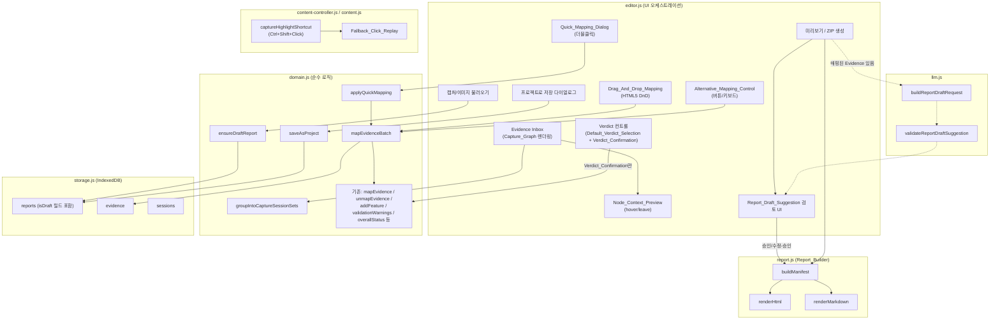
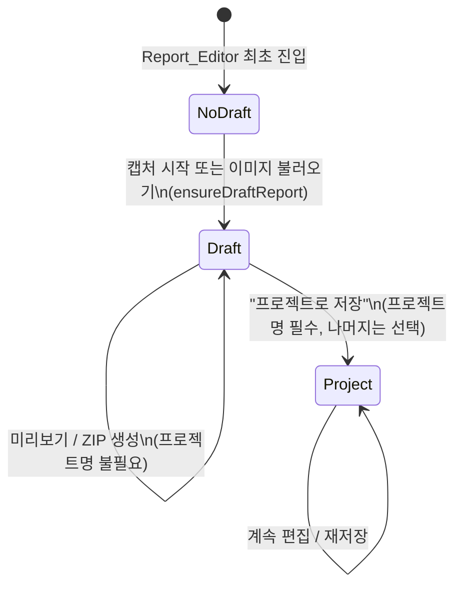

# Design Document

## Overview

이 기능은 CaptureIT Report_Editor의 상호작용 모델을 "식별 정보 선입력 → 매핑 → 저장" 순서에서 "캡처 우선 → 드래그앤드롭 매핑 → 결과 확인 → 선택적 저장" 순서로 재편한다. 이번 확장판(Requirement 2/3/6/9/10)은 이 위에 그래프 시각화, 더블클릭 즉시 매핑, 단축키 캡처 방식 전환, LLM 초안 제안, Verdict 기본값 구분을 추가한다. 변경은 전부 기존 확장(Extension) 내부에 국한되며, 다음 영역에 걸쳐 있다.

1. **도메인 로직 (`extension/shared/domain.js`)**: `Draft_Report` 개념, `Capture_Session_Set` 그룹화 함수(`groupIntoCaptureSessionSets`, Capture_Graph 시각화의 데이터 소스), 배치 매핑 함수(`mapEvidenceBatch`), Quick_Mapping_Dialog가 사용하는 원자적 매핑+필드적용 함수(`applyQuickMapping`, 내부적으로 `mapEvidenceBatch`를 그대로 호출), 프로젝트 저장 함수(`saveAsProject`)를 순수 함수로 추가한다. 기존 `createReport`, `mapEvidence`, `unmapEvidence`, `validationWarnings`, `overallStatus` 등은 시그니처와 동작을 그대로 유지한다. Verdict 기본값(Default_Verdict_Selection)은 순수 UI 상태이므로 domain.js는 변경하지 않는다(하단 "Verdict 기본값과 확정의 분리" 참조).
2. **저장소 (`extension/shared/storage.js`)**: 기존 `reports` 스토어를 그대로 사용하되, 레코드에 `isDraft: boolean` 필드를 추가해 "아직 Project로 저장되지 않은 QA_Report"를 구분한다. 스키마 마이그레이션이나 새 객체 스토어는 필요하지 않다.
3. **UI (`extension/editor.html`, `extension/editor.js`, `extension/editor.css`)**: 레이아웃 순서를 재배치하고, HTML5 Drag and Drop API 기반의 매핑 상호작용과 이를 대체하는 키보드/버튼 기반 `Alternative_Mapping_Control`을 추가하며, 단계별 안내(empty state) 메시지를 렌더링한다. 추가로 Evidence_Inbox를 Capture_Graph로 시각화하고, Node_Context_Preview(hover), Quick_Mapping_Dialog(더블클릭), Verdict Default_Selection/Confirmation 컨트롤, Report_Draft_Suggestion 검토 UI를 추가한다.
4. **콘텐츠 스크립트 (`extension/shared/content-controller.js`, `extension/content.js`, `extension/manifest.json`, `extension/background.js`)**: Requirement 9에 따라 기존 2단계 선택모드(`enterSelectionMode`/`isSelecting`/`captureSelection`, `Ctrl+Shift+E` 커맨드)를 완전히 제거하고, `Ctrl+Shift+Click` 즉시 캡처(`captureHighlightShortcut`) + `Fallback_Click_Replay`로 대체한다.
5. **LLM 연동 (`extension/shared/llm.js`)**: Requirement 10에 따라 Report_Draft_Suggestion 생성을 위한 새 요청 빌더(`buildReportDraftRequest`)와 응답 검증기(`validateReportDraftSuggestion`)를 추가한다.

`extension/shared/report.js`(Report_Builder)는 프로젝트 식별 정보가 비어 있는 경우의 기본값·생략 처리를 보강하되, `buildManifest`/`renderHtml`/`renderMarkdown`의 시그니처와 기존 필드는 전부 유지한다. `zip.js`, `viewer.js`, `capture-coordinator.js`, `page-context.js`, `event-policy.js`, `storage.js`는 이번 확장에서도 변경하지 않는다.

> **범위 재검토**: 최초 design.md는 "`llm.js`, `content-controller.js`는 이번 스펙에서 변경하지 않는다"고 명시했으나, Requirement 9(단축키 캡처 방식 전환)와 Requirement 10(LLM 초안 제안)이 추가되면서 이 결정을 재검토했다. 두 파일 모두 이번 확장의 필수 변경 대상에 포함한다. `content.js`와 `manifest.json`도 Ctrl+Shift+E 2단계 흐름 제거에 따라 함께 변경한다.

### 하위 호환성 원칙

- `manifest.json`의 스키마 버전(`schemaVersion: 1`)과 필드 집합은 변경하지 않는다. 값이 비었을 때도 필드 자체는 항상 존재한다(요구사항 7).
- 기존 40개 unit/contract 테스트(`tests/*.test.cjs`)와 Edge/Chrome smoke 테스트는 대부분 수정 없이 계속 통과해야 한다. 이는 다음을 의미한다:
  - `domain.js`의 기존 export(`addFeature`, `createEditorState`, `createFeature`, `createReport`, `createSession`, `deleteFeature`, `mapEvidence`, `moveFeature`, `nextSequence`, `overallStatus`, `unmapEvidence`, `validationWarnings`)는 그대로 남기고, 새 함수만 추가한다.
  - `report.js`의 기존 export(`buildManifest`, `renderHtml`, `renderMarkdown`)는 시그니처를 유지하고 내부 로직만 보강한다.
  - `editor.html`의 기존 id를 가진 요소는 삭제하지 않고 배치만 이동한다(`tests/editor-shell.test.cjs`가 id 존재 여부만 검사하므로 이동은 안전하다).
  - `storage.js`의 기존 객체 스토어(`evidence`, `reports`, `sessions`)와 인덱스는 그대로 유지한다.
- **예외(의도된 회귀 변경)**: Requirement 9는 기존 PRD FR-04-3의 2단계 선택모드를 명시적으로 대체(override)하도록 요구하므로, 다음 두 개의 기존 테스트는 이번 확장에서 **의도적으로 수정**된다(하위 호환성 예외로 명시):
  - `tests/manifest.test.cjs`의 `manifest.commands['select-context'].suggested_key.default === 'Ctrl+Shift+E'` 단언은 `commands.select-context` 자체가 제거되므로 삭제하고, 새 커맨드가 없음(또는 `commands` 필드가 정의되지 않거나 빈 객체임)을 확인하는 단언으로 교체한다.
  - `tests/content-controller.test.cjs`의 `enterSelectionMode`/`captureSelection`/`isSelecting`을 사용하는 테스트는 삭제하고, 새 `captureHighlightShortcut` 동작을 검증하는 테스트로 교체한다.
  - 이 두 파일 외의 38개 기존 테스트는 수정 없이 통과해야 한다.

## Architecture



### 작업 흐름과 상태 전환



## Components and Interfaces

### 1. `domain.js` 추가 함수

```js
// Draft_Report 생성/보장
function ensureDraftReport(existingReport, title = '') // -> QA_Report (isDraft: true)

// Capture_Session_Set 그룹화 (순수 함수, evidence 배열 -> 그룹 배열)
// Capture_Graph 시각화(요구사항 2.6/2.7)는 이 함수의 출력을 그대로 데이터 소스로 사용한다:
// 같은 그룹 안의 evidenceIds 배열에서 인접한 두 id를 연결선으로 그리면 되고,
// 서로 다른 그룹은 이 함수가 이미 별도 그룹으로 분리해 두었으므로 UI가 그룹 간 연결을
// 그리지 않기만 하면 요구사항 2.7이 구조적으로 성립한다. 그래프 표시를 위한 별도
// 데이터 구조나 domain.js 함수는 추가하지 않는다.
function groupIntoCaptureSessionSets(evidenceList)
// -> [{ sessionId, evidenceIds: string[], count: number }, ...]
// 정렬: 각 세트 내부는 sequenceNo 오름차순, 세트 간은 세트의 최소 sequenceNo 오름차순

// 세트 또는 개별 Evidence를 한 번에 매핑 (Drag_And_Drop_Mapping, Alternative_Mapping_Control,
// Quick_Mapping_Dialog가 모두 공유하는 단일 진입점)
function mapEvidenceBatch(state, evidenceIds, featureId)
// 내부적으로 evidenceIds를 순서대로 기존 mapEvidence(state, id, featureId)에 위임하여
// "이전 Test_Result_Set에서 자동 이동" 규칙을 재사용한다.

// Quick_Mapping_Dialog 전용 진입점: 매핑과 Test_Result_Set 필드 적용을 한 번에 수행한다.
// mapEvidenceBatch를 그대로 호출하므로 Drag_And_Drop_Mapping과 항상 동일한 매핑 결과를 만든다(요구사항 3.11).
function applyQuickMapping(state, evidenceIds, featureId, fields)
// fields: { verification (필수, trim 후 비면 Error), expectedResult?, actualResult? }
// 1. verification.trim()이 비면 Error('검증 내용을 입력하십시오.')를 던지고 state를 변경하지 않는다(요구사항 3.8/3.10).
// 2. mapEvidenceBatch(state, evidenceIds, featureId)를 호출한다.
// 3. 대상 feature.result.verification/expectedResult/actualResult를 입력값(선택 필드는 기본값 '')으로 설정한다.
// Verdict(result.status)는 이 함수가 절대 건드리지 않는다(Verdict_Confirmation과 독립적으로 유지, 요구사항 6.9).

// Draft_Report를 Project로 저장할 때 선택 필드 기본값 처리
function saveAsProject(draftReport, projectDetails)
// projectDetails: { projectName (필수), title?, author?, changePurpose?, changeSummary?, configurationOverview? }
// -> { ...draftReport, projectName, title: title ?? '', author: author ?? '', ..., isDraft: false }
// projectName이 비거나 공백이면 Error를 던진다 (유일한 필수 값).
```

설계 근거:
- `mapEvidenceBatch`를 새로 만드는 대신 `mapEvidence`를 순회 호출하게 만들어 기존에 검증된 "이전 Feature_Spec에서 자동 이동" 동작(`removeFromFeatures`)을 재사용한다. 이렇게 하면 Drag_And_Drop_Mapping, Alternative_Mapping_Control, Capture_Session_Set 일괄 드롭, Quick_Mapping_Dialog가 모두 동일한 최종 상태에 도달한다는 요구사항 3.6/3.11을 구조적으로 보장한다.
- `applyQuickMapping`은 새로운 매핑 로직을 만들지 않고 오직 (a) 필수 필드 검증, (b) `mapEvidenceBatch` 호출, (c) 필드 대입을 순서대로 감싸는 얇은 래퍼다. 이렇게 하면 "Quick_Mapping_Dialog도 같은 `mapEvidenceBatch`를 사용해야 한다"는 사용자 요구사항이 코드 레벨에서 강제된다.
- `groupIntoCaptureSessionSets`는 `state.inbox`(이미 매핑된 Evidence가 제외된 배열)를 입력으로 받도록 UI에서 호출한다. 그룹화 함수 자체는 "매핑 여부"를 모른다 — 매핑 제외는 기존 `refreshInbox`가 이미 책임진다. 이 분리로 그룹화 로직이 순수하고 테스트하기 쉬워진다. 이 출력이 Capture_Graph 렌더링의 유일한 데이터 소스다(아래 "3. Capture_Graph 시각화" 참조).
- `ensureDraftReport`는 `editor.js`가 캡처/이미지 불러오기 핸들러 진입 시 호출한다. 이미 report가 있으면 그대로 반환하고, 없으면 `createReport('')`를 호출해 `isDraft: true`를 얹은 새 보고서를 만든다. 스토리지 저장(`putReport`) 실패 시에도 캡처/불러오기 자체는 계속 진행되도록, 이 호출은 캡처 파이프라인을 막지 않는 `try/catch`로 감싼다(요구사항 1.5).

### Verdict 기본값과 확정의 분리 (요구사항 6.6~6.9)

Default_Verdict_Selection(PASS 사전선택)은 **순수한 UI 컨트롤의 초기 표시 상태**이며 `domain.js`의 데이터 모델을 변경하지 않는다(요구사항에서 권장한 "후자" 방식 채택 — 데이터 모델 변경 최소화):

- `feature.result.status`는 여전히 `null | 'PASS' | 'FAIL'`이며, Verdict_Confirmation 액션이 일어나기 전까지 항상 `null`로 유지된다. `overallStatus`와 `validationWarnings`는 전혀 변경하지 않는다 — 이 둘은 이미 `status === null`을 미판정으로 처리하고 있으므로, Default_Verdict_Selection이 UI에 PASS를 보여주더라도 두 함수의 계산 결과는 그대로 미판정으로 집계된다.
- `editor.js`는 Verdict `<select>` 옆에 별도의 "확인" 버튼(`#verdict-confirm`)을 추가한다. `<select>`의 `change` 이벤트는 (기존과 달리) **더 이상 즉시 `feature.result.status`를 설정하지 않는다** — 대신 "확정되지 않은 선택값"을 로컬 UI 상태(`pendingVerdictByFeatureId` 같은 컴포넌트 내부 변수, 저장되지 않음)에만 보관한다. `<select>`의 초기값은 `feature.result.status ?? 'PASS'`로 렌더링되어 Default_Verdict_Selection을 만든다.
- 사용자가 "확인" 버튼(Verdict_Confirmation)을 누르면 그 시점의 `<select>` 값을 `feature.result.status`에 대입하고 저장한다. 이는 값이 기본 표시값(PASS)에서 전혀 바뀌지 않은 상태로 확인을 눌러도 동일하게 동작한다(요구사항 6.8 — 기본값을 그대로 확인해도 "직접 선택"으로 취급).
- Evidence 매핑(`mapEvidence`/`mapEvidenceBatch`/`applyQuickMapping`)이나 LLM Report_Draft_Suggestion 적용 경로는 `feature.result.status`를 절대 읽거나 쓰지 않는다 — 코드 검토로 이를 보장하고, Property로 회귀를 방지한다(요구사항 6.9, 10.7).

### 2. `storage.js` 변경

- `reports` 스토어 레코드에 `isDraft` 필드를 추가한다(기존 레코드에는 없을 수 있으므로 읽을 때 `Boolean(record.isDraft)`로 안전하게 취급).
- 새 인덱스나 스토어는 추가하지 않는다. `listReports`, `getReport`, `putReport`, `deleteReport` 시그니처는 변경하지 않는다.

### 3. `editor.html` / `editor.js` 레이아웃 재배치

- **제거하지 않고 이동**: 현재 최상단 `report-panel`(보고서명/프로젝트명/작성자/변경 목적 등)을 `<dialog id="save-project-dialog">`로 이동한다. 기존 input id(`report-title`, `project-name`, `report-author`, `change-purpose`, `change-summary`, `configuration-overview`)는 그대로 유지해 `tests/editor-shell.test.cjs`의 id 검사와 `bindInputs()`의 이벤트 바인딩 코드를 재사용한다.
- 화면 최상단은 캡처 시작 버튼 + 이미지 불러오기 버튼을 배치한 `capture-first-panel`이 된다.
- Evidence_Inbox는 `groupIntoCaptureSessionSets` 결과를 Capture_Graph 카드로 렌더링한다(상세는 "3-1. Capture_Graph 시각화" 참조). 각 그래프 카드는:
  - `draggable="true"`이며 `dragstart`에서 `event.dataTransfer.setData('application/x-captureit-evidence-ids', JSON.stringify(evidenceIds))`로 세트 전체 id 목록을 싣는다.
  - "펼치기" 토글이 있고, 펼치면 세트 내부의 개별 Capture_Node가 각각 `draggable="true"`로 렌더링되어 단일 id 배열을 싣는다(요구사항 3.3).
  - 그래프 헤더에 `count`(증적 수)를 표시한다(요구사항 2.3).
  - `dblclick` 리스너를 등록해 Quick_Mapping_Dialog를 연다(그래프 카드 전체에 걸면 세트 전체, 개별 Capture_Node 엘리먼트에 걸면 해당 노드만 대상이 된다).
- Feature_Spec의 Test_Result_Set 영역(`#mapped-evidence`를 포함하는 컨테이너)은 `dragover`/`drop` 리스너를 가진 드롭 타겟이 되어, drop 시 `mapEvidenceBatch(editorState, evidenceIds, feature.id)`를 호출한다.
- **Alternative_Mapping_Control**: 각 Capture_Session_Set/개별 Evidence 카드에 "이 기능에 매핑" 버튼과, 포커스 상태에서 동작하는 키보드 단축(Enter/Space로 "선택", 이후 대상 Feature_Spec 카드에서 Enter/Space로 "여기로 매핑")을 제공한다. 버튼 클릭 핸들러도 동일하게 `mapEvidenceBatch`를 호출하므로 로직 중복이 없다.
- **"프로젝트로 저장" 버튼**은 미리보기/ZIP 생성 버튼 다음(레이아웃 순서상 아래)에 배치되고, 클릭 시 `save-project-dialog`를 열어 프로젝트명(필수, `required`)과 나머지 선택 필드(모두 `required` 없음)를 입력받은 뒤 `saveAsProject`를 호출한다.
- **단계별 안내**: `renderGuidance()` 함수가 다음 조건을 확인해 안내 문구를 표시한다.
  - inbox가 비어 있음 → "캡처를 시작하거나 이미지를 불러오세요"
  - Feature_Spec이 0개 → "기능 명세를 추가하세요"
  - 매핑된 Evidence가 없는 Feature_Spec 존재 → 해당 카드에 "여기로 세트를 드래그하거나 매핑 버튼을 누르세요"
  - Test_Result_Set에 첫 매핑이 막 발생 → "검증 내용/기대 결과/실제 결과를 입력하거나 판정을 선택하세요" (1회성 토스트/메시지)
  - Draft 상태(`report.isDraft === true`) → "저장은 선택사항입니다. 미리보기나 ZIP 생성 후에 해도 됩니다"
  - Report_Draft_Suggestion이 제시된 상태 → "제안된 보고서명/형상·체크아웃 개요는 승인 또는 수정 후 저장됩니다"(요구사항 8.7)

### 3-1. Capture_Graph 시각화와 Node_Context_Preview (요구사항 2.6~2.9)

이 부분은 순수 프론트엔드 렌더링이며 `domain.js`에 새 함수를 추가하지 않는다 — `groupIntoCaptureSessionSets`가 이미 반환하는 `{ sessionId, evidenceIds, count }` 배열을 그대로 시각화 데이터로 사용한다.

- **그래프 렌더링**: 각 그룹을 `<div class="capture-graph">` 컨테이너로 렌더링하고, `evidenceIds` 순서대로 `<div class="capture-node">` 엘리먼트를 배치한 뒤 CSS(`::after` 커넥터 또는 flex 배치 사이의 구분선)로 연속된 두 노드를 선으로 잇는다. 그룹 자체가 이미 서로 분리되어 있으므로(요구사항 2.7), 그래프 컨테이너 사이에는 커넥터를 그리지 않는 것만으로 "인접 배치되어도 연결선 없음"이 자동으로 만족된다.
- **Node_Context_Preview (hover)**: 각 `capture-node` 엘리먼트에 `mouseenter`/`mouseleave` 리스너를 등록한다. `mouseenter` 시 해당 evidence의 `context.target`과 `context.surroundingContext`(기존 `page-context.js`가 이미 수집해 evidence에 저장해 둔 필드, 신규 수집 로직 불필요)를 툴팁 엘리먼트에 채워 넣고 노드 근처에 절대 위치로 표시한다. `mouseleave` 시 `setTimeout` 등의 지연 없이 즉시 `hidden = true` 또는 엘리먼트 제거로 숨긴다(요구사항 2.9 — 지연 금지를 코드 레벨에서 지키기 위해 debounce/타이머를 사용하지 않는다).
- 이 부분은 새로운 도메인 함수나 데이터 변환이 필요하지 않으므로 Correctness Property로 다루지 않고, 예시 기반 단위 테스트로 검증한다(아래 Testing Strategy 참조).

### 3-2. Quick_Mapping_Dialog (요구사항 3.7~3.11)

- `<dialog id="quick-mapping-dialog">`를 신설한다. 내부에 대상 Feature_Spec을 고르는 `<select>`, 필수 `검증 내용` 텍스트영역(`required`), 선택 `기대 결과`/`실제 결과` 텍스트영역을 배치한다.
- Capture_Graph 카드 또는 개별 Capture_Node의 `dblclick` 핸들러가 이 다이얼로그를 열고, 대상 evidenceIds(세트 전체 또는 단일 노드)를 다이얼로그 상태에 보관한다.
- 제출 핸들러는 `CaptureITDomain.applyQuickMapping(editorState, evidenceIds, featureId, { verification, expectedResult, actualResult })`를 호출한다. `verification`이 공백뿐이면 이 함수가 던지는 에러를 캐치해 폼 제출을 막고 검증 내용 입력란에 `아이템 필수` 표시를 한다(요구사항 3.10). 성공하면 다이얼로그를 닫고 `renderEvidence()`/`renderFeature()`/`renderWarnings()`를 다시 그린다.
- `applyQuickMapping`이 내부적으로 `mapEvidenceBatch`를 호출하므로, Drag_And_Drop_Mapping과 동일한 최종 매핑 상태가 보장된다(요구사항 3.11, Correctness Property 10 참조).

### 4. `report.js` 보강

- `buildManifest`: 기존처럼 `report.title || 'CaptureIT QA 보고서'`가 아니라, 요구사항 7.7에 맞춰 명시적 상수 `DEFAULT_REPORT_TITLE = 'CaptureIT QA 보고서'`(기존 값 유지, 하위 호환)로 명명해 재사용하고, `author`는 폴백 없이 원본 값(빈 문자열 포함)을 그대로 통과시킨다(요구사항 7.8 — 플레이스홀더 금지).
- `renderHtml`/`renderMarkdown`: `changePurpose`/`changeSummary`/`configurationOverview`가 모두 빈 문자열일 때 "변경 개요" 섹션 전체(HTML의 `<section class="overview">`, Markdown의 `## 변경 개요` 블록)를 생략한다. 하나라도 값이 있으면 섹션을 렌더링하되, 값이 있는 항목만 표시한다(빈 항목의 `<div><dt>...` 자체를 생략).
- author 표시 영역(`<p>${projectName} · ${author}</p>` 부분, Markdown의 `- 작성자:` 줄)은 author가 비었을 때 구분자나 플레이스홀더 없이 빈 값으로 렌더링한다. 구체적으로 HTML hero 영역은 `author`가 비면 " · " 구분자 없이 `projectName`만 표시하고, Markdown은 `- 작성자: ` 뒤가 빈 문자열이 되도록 한다(플레이스홀더 문자열을 삽입하지 않음).

### 5. `content-controller.js` / `content.js` / `manifest.json` 재작성 (요구사항 9)

기존 2단계 방식(`enterSelectionMode` → 다음 클릭에서 `captureSelection`이 `preventDefault`+`stopImmediatePropagation` 호출)을 완전히 제거하고 다음으로 교체한다.

**`content-controller.js` 변경**:
- `enterSelectionMode`, `isSelecting`, `captureSelection` 함수를 **삭제**한다(요구사항 9.5 — 이전 2단계 흐름을 제공하지 않아야 함).
- 새 함수 `captureHighlightShortcut(target)`를 추가한다:
  ```js
  async function captureHighlightShortcut(target) {
    const state = await getState();
    if (!state.active) return false;
    if (!target || !target.isConnected) return false; // 이미 무효화된 대상은 즉시 취소
    showOverlay(target); // 기존 하이라이트 오버레이 렌더링 재사용 (요구사항 9.3)
    try {
      await scheduleAfterPaint();
      if (!target.isConnected) return false; // 캡처 준비 중 제거된 경우 취소, replay 없음 (요구사항 9.6)
      const context = collectContext(target);
      const receipt = await requestCapture({ triggerType: 'shortcut-context', context }); // 요구사항 9.4
      notifyCapture({ ...receipt, triggerType: 'shortcut-context', context });
    } finally {
      hideOverlay();
    }
    if (!target.isConnected) return false; // 캡처 완료 시점에도 재검사, replay 없음
    return true; // 호출자가 이 반환값을 보고 Fallback_Click_Replay 여부를 결정
  }
  ```
  이 함수는 기존 `captureTarget`과 거의 동일한 흐름을 재사용하되(요구사항 9.3), 각 `await` 지점 전후로 `target.isConnected`를 재확인해 "캡처 완료 전 제거/무효화 시 취소, replay 미수행"(요구사항 9.6)을 보장한다. 캡처 자체가 실패(state 비활성, 대상 무효화)해도 예외를 던지지 않고 `false`를 반환해 호출자가 안전하게 분기하도록 한다.
- 반환값(성공: `true`)에 따라 `content.js`가 `Fallback_Click_Replay`를 수행할지 결정한다.

**`content.js` 변경**:
- 기존 `document.addEventListener('click', ...)` 캡처 리스너 내부에서 `controller.isSelecting()` 분기를 제거한다.
- 새 리스너를 `document.addEventListener('click', handler, true)`(capture 단계)에 추가해 `event.ctrlKey && event.shiftKey`인 클릭을 감지한다. 이 핸들러는 **`preventDefault`나 `stopImmediatePropagation`을 호출하지 않는다**(요구사항 9.5) — 대신 원래 클릭이 정상적으로 계속 진행되도록 그대로 두고, `captureHighlightShortcut(event.target)`를 비동기로 실행한다. 원래 클릭 이벤트 자체는 막지 않으므로, 브라우저의 기본 클릭 동작은 이미 즉시 실행된다.

  > 설계 결정: "Fallback_Click_Replay로 원래 클릭 이벤트를 재발생시킨다"는 요구사항 9.2를 만족시키는 방법으로, 클릭을 캡처(capture) 단계에서 가로채 캡처가 끝난 뒤 합성 이벤트로 재발생시키는 방식을 채택한다. 원클릭을 먼저 그대로 실행해버리면 요구사항 9.6("대상이 캡처 완료 전 무효화되면 캡처를 취소하고 replay를 하지 않는다")을 만족시킬 수 없기 때문이다 — 캡처 완료 여부가 원래 동작 실행 여부를 결정해야 하므로, 원래 클릭은 캡처가 성공적으로 끝난 뒤에만 실행되어야 한다.
  - 구체적으로: 최상위 리스너가 `ctrlKey && shiftKey`인 원본(비-재생) 클릭을 감지하면 `event.preventDefault(); event.stopImmediatePropagation();`을 호출해 이번 디스패치 사이클의 원래 동작만 일시 보류시키고, `captureHighlightShortcut(target)`가 완료된 뒤 `true`를 반환한 경우에만 동일한 속성(버튼, 좌표, ctrlKey 등)을 가진 새 `MouseEvent('click', { bubbles: true, cancelable: true, ...originalProps })`를 `target`에 다시 `dispatchEvent`한다(Fallback_Click_Replay). `false`를 반환하면(취소됨) 아무것도 재발생시키지 않는다. 재발생된 이벤트에는 내부 플래그(`WeakSet`으로 마킹)를 붙여, 리스너가 이를 다시 가로채 무한 루프에 빠지지 않도록 한다.
  - 이 `preventDefault`/`stopImmediatePropagation` 호출은 요구사항 9.5가 금지하는 "영구적인 원클릭 차단 규칙"과는 다르다 — 이전 방식은 사용자가 별도로 선택 모드에 진입한 뒤 다음 클릭을 **항상, 예외 없이** 차단하고 강조 캡처만 수행했지만(원래 동작은 결코 실행되지 않음), 새 방식은 캡처가 완료되는 즉시 반드시 동일한 클릭을 재현하므로 최종 사용자 관점에서 원래 업무 동작은 항상 실행된다(캡처가 취소된 예외적 경우에만 실행되지 않고, 이 경우 요구사항 9.6이 재시도를 안내하도록 명시하고 있다).

**`manifest.json` 변경**:
- `commands.select-context`(`Ctrl+Shift+E`)를 **삭제**한다. `Ctrl+Shift+Click`은 OS/브라우저 커맨드가 아니라 콘텐츠 스크립트의 일반 `click` 리스너에서 감지하므로 `commands` 매니페스트 항목이 필요 없다.

**`background.js` 변경**:
- `chrome.commands.onCommand` 리스너에서 `select-context` 분기를 제거한다(커맨드 자체가 삭제되므로).

### 6. `llm.js` 추가 함수 (요구사항 10)

Report_Draft_Suggestion은 기존 `buildStageOne`/`buildStageTwo`(Evidence 추천용)와 다른 목적(제목/개요 생성)을 가지므로 새 함수를 추가한다.

```js
// 매핑된 Evidence의 이미지 시퀀스 + 컨텍스트로 보고서명/형상·체크아웃 개요 초안을 요청하는 payload 생성
function buildReportDraftRequest(report, mappedEvidenceByFeature)
// mappedEvidenceByFeature: [{ feature: featureContext(...), evidence: [...] }] (기존 featureContext/evidenceContext 재사용)
// -> {
//      task: 'Draft a report title and a configuration/checkout overview in Korean from the mapped evidence image sequence and context. Do not judge PASS or FAIL.',
//      features: [...],
//      responseSchema: { title: 'string', configurationOverview: 'string' },
//    }
// 이미지가 필요한 evidence는 buildStageTwo와 동일하게 thumbnailDataUrl을 포함한다(누락 시 동일하게 에러).

// LLM 응답을 검증해 신뢰할 수 있는 초안 값만 통과시킨다 (요구사항 10.7 방어)
function validateReportDraftSuggestion(response)
// - response.title, response.configurationOverview가 둘 다 string이 아니면 Error
// - response에 status/verdict/pass/fail 등 판정류 키가 존재하면 무시(그 키들을 제거)하고 나머지만 통과시킨다 —
//   즉 이 함수의 반환값은 항상 { title: string, configurationOverview: string } 두 필드만 가지며,
//   호출자가 다른 필드를 결과에 반영할 수 있는 여지 자체를 구조적으로 차단한다.
```

설계 근거:
- `validateReportDraftSuggestion`의 반환 타입을 `{ title, configurationOverview }`로 **고정**함으로써(다른 필드를 절대 포함하지 않음), 이 값을 적용하는 `editor.js` 코드가 애초에 `result.status`를 건드릴 수 있는 데이터를 받을 수 없게 만든다. 이는 "LLM이 Verdict를 설정하지 않는다"(요구사항 10.7)를 타입 수준에서 강제하는 설계다.
- `editor.js`는 미리보기/ZIP 생성 트리거 시 매핑된 Evidence가 있는 Feature_Spec이 하나 이상 있으면 `buildReportDraftRequest` → 기존 `buildAdapterRequest`/`postLlm`(변경 없음) → `validateReportDraftSuggestion` 순서로 호출한다. 성공하면 제안값을 `report-draft-suggestion-dialog`에 표시하고 사용자의 승인/수정-후-승인/무시 중 하나를 기다린다. 실패(네트워크 오류, 스키마 오류)하면 이 다이얼로그를 띄우지 않고 기존 필드 값을 그대로 두며, 미리보기/ZIP 생성 자체는 계속 진행한다(요구사항 10.6 — 비차단).
- 승인 시에만 `report.title`/`report.configurationOverview`를 갱신하고 `queueSave()`를 호출한다. 무시하면 아무 것도 변경하지 않는다.

## Data Models

### QA_Report (기존 필드 유지 + 1개 추가)

```ts
interface QAReport {
  id: string;
  title: string;              // Optional_Identification_Field, 기본값 ''
  projectName: string;        // Draft_Report일 때 ''일 수 있음; Project 저장 시 필수
  author: string;              // Optional_Identification_Field, 기본값 ''
  changePurpose: string;       // Optional_Project_Detail_Field, 기본값 ''
  changeSummary: string;       // Optional_Project_Detail_Field, 기본값 ''
  configurationOverview: string; // Optional_Project_Detail_Field, 기본값 ''
  isDraft: boolean;             // 신규: true면 Draft_Report, false면 Project
  features: FeatureSpec[];
  createdAt: string;
  updatedAt: string;
}
```

`isDraft`는 순수하게 UI 안내/저장 흐름 판단용이며 `report.js`의 manifest 출력에는 포함하지 않는다(manifest 스키마 변경 없음, 요구사항 7.1/7.2).

### Capture_Session_Set (신규, 저장되지 않는 파생 뷰 모델)

```ts
interface CaptureSessionSet {
  sessionId: string;
  evidenceIds: string[]; // sequenceNo 오름차순
  count: number;
}
```

`Evidence`, `FeatureSpec`, `TestResultSet`, `manifest.json` 스키마는 변경하지 않는다.

### Capture_Graph / Capture_Node (신규, 순수 시각화 표현)

Capture_Graph와 Capture_Node는 별도의 데이터 구조가 아니라 Capture_Session_Set을 그리는 방식이다:

```ts
// Capture_Graph는 CaptureSessionSet과 동일한 객체를 시각화 관점에서 부르는 이름
type CaptureGraph = CaptureSessionSet;
// Capture_Node는 evidenceIds 배열의 한 원소(evidence.id)에 대응하는 시각적 단위
```

### Node_Context_Preview (신규, 저장되지 않는 파생 뷰)

```ts
interface NodeContextPreview {
  target: Record<string, unknown>;           // evidence.context.target 그대로
  surroundingContext: Record<string, unknown>; // evidence.context.surroundingContext 그대로
}
```

### Report_Draft_Suggestion (신규, 저장되지 않는 임시 UI 상태)

```ts
interface ReportDraftSuggestion {
  title: string;
  configurationOverview: string;
  status: 'pending' | 'approved' | 'dismissed'; // 편집기 세션 내 UI 상태에만 존재, storage.js에 저장하지 않음
}
```

승인(`approved`) 상태로 전환될 때만 `report.title`/`report.configurationOverview`에 값이 대입된다(요구사항 7.9 — QA_Report 스키마 변경 없이, plain string으로 해소된 뒤에만 기록).

### Verdict UI 상태 (신규, 저장되지 않는 컴포넌트 로컬 상태)

```ts
// featureId -> 아직 확정되지 않은 <select> 표시값 ('PASS' | 'FAIL')
// 초기값은 항상 'PASS'(Default_Verdict_Selection). Verdict_Confirmation 전까지 feature.result.status에 영향 없음.
type PendingVerdictByFeatureId = Map<string, 'PASS' | 'FAIL'>;
```

## Correctness Properties

*A property is a characteristic or behavior that should hold true across all valid executions of a system-essentially, a formal statement about what the system should do. Properties serve as the bridge between human-readable specifications and machine-verifiable correctness guarantees.*

### Property 1: Capture_Session_Set 그룹화는 sessionId 파티션과 동치

*For any* array of unmapped Evidence items (each with a `sessionId` and `sequenceNo`), grouping them into Capture_Session_Sets SHALL produce groups such that every Evidence id appears in exactly one group, each group's `evidenceIds` set equals exactly the Evidence ids sharing that group's `sessionId`, each group's reported `count` equals the length of its `evidenceIds`, and no Evidence id present in a separately-provided "already mapped" set appears in any group.

**Validates: Requirements 2.1, 2.2, 2.3, 2.5**

### Property 2: 배치 매핑은 이전 연결을 대체하며 원자적으로 적용된다

*For any* set of Evidence ids (a Capture_Session_Set or a single Evidence id) and any target Feature_Spec id, and for any prior mapping state in which some of those Evidence ids were already mapped to a different Feature_Spec, mapping that set to the target SHALL result in every Evidence id in the set having `featureSpecId` equal to the target, the target Feature_Spec's `evidenceIds` containing exactly those ids (no duplicates, no omissions), and none of those ids remaining in any other Feature_Spec's `evidenceIds`.

**Validates: Requirements 3.2, 3.4**

### Property 3: 드래그앤드롭과 Alternative_Mapping_Control은 항상 동일한 결과를 만든다

*For any* set of Evidence ids and any target Feature_Spec id, invoking the mapping through the Drag_And_Drop_Mapping code path and invoking it through the Alternative_Mapping_Control code path, starting from the same prior state, SHALL produce identical resulting editor state (identical `featureSpecId` assignments and identical per-feature `evidenceIds` ordering).

**Validates: Requirements 3.5, 3.6**

### Property 4: 프로젝트 저장 시 선택 필드는 항상 빈 문자열로 기본값 처리되고 저장은 실패하지 않는다

*For any* Draft_Report and any combination of provided/omitted values for 보고서명, 작성자, changePurpose, changeSummary, and configurationOverview (with a always-provided non-empty 프로젝트명), saving as a Project SHALL never throw a validation error, SHALL set each omitted optional field to the empty string, and SHALL preserve each provided field's value verbatim.

**Validates: Requirements 5.3, 5.5, 5.7**

### Property 5: manifest 생성은 식별 정보의 존재 여부와 무관하게 항상 성공하고 6개 필드를 모두 포함한다

*For any* QA_Report with any combination of empty-string and non-empty values for title, projectName, author, changePurpose, changeSummary, and configurationOverview, `buildManifest` SHALL complete without throwing and its `report` object SHALL contain all six fields with defined (non-undefined) values, and `renderHtml`/`renderMarkdown` applied to that manifest SHALL also complete without throwing.

**Validates: Requirements 7.1, 7.2, 4.1, 4.2**

### Property 6: 변경 개요 섹션의 존재와 내용은 HTML과 Markdown 사이에 항상 일치한다

*For any* combination of empty-string or non-empty values for changePurpose, changeSummary, and configurationOverview, the 변경 개요 섹션 SHALL appear in the rendered HTML if and only if it appears in the rendered Markdown, if and only if at least one of the three fields is non-empty; and when present, both outputs SHALL contain exactly the non-empty fields' labels and values and none of the empty fields.

**Validates: Requirements 7.3, 7.4, 7.5**

### Property 7: Evidence 필드는 매핑 경로와 무관하게 manifest에서 항상 보존된다

*For any* array of Evidence items with any combination of present/absent optional sub-fields (description, source, previousCaptureId, nextCaptureId, and context sub-fields), regardless of whether their `featureSpecId` was set via single mapping, batch mapping, or Capture_Session_Set-level mapping, `buildManifest`'s per-evidence output SHALL always include the id, sessionId, sequenceNo, triggerType, capturedAt, source, description, previousCaptureId, nextCaptureId, file, and context sub-fields, defaulting any missing optional value rather than omitting the key.

**Validates: Requirements 7.6**

### Property 8: 보고서명이 비면 세 산출물 모두 동일한 기본 보고서명을 일관되게 표시한다

*For any* QA_Report where title is either the empty string or a random non-empty string, the manifest.json title field, the rendered HTML title/heading, and the rendered Markdown H1 SHALL all display the same fixed 기본 보고서명 string when title is empty, and SHALL all display the exact provided title when it is non-empty.

**Validates: Requirements 7.7**

### Property 9: 작성자가 비면 플레이스홀더 없이 항상 빈 값으로 렌더링된다

*For any* QA_Report where author is either the empty string or a random non-empty string, the rendered HTML and Markdown author display areas SHALL contain exactly the raw author value with no placeholder text substituted when it is empty, for every generated case.

**Validates: Requirements 7.8**

### 신규 Property (Requirement 2/3/6/9/10 확장분)

아래 8개는 이번 확장에서 추가된 acceptance criteria에 대한 prework 분석과 중복 제거(reflection)를 거쳐 도출한 property다. Property 3(드래그앤드롭과 Alternative_Mapping_Control의 동치성)은 Quick_Mapping_Dialog까지 포괄하도록 이미 일반화되어 있으므로 그대로 유지하고, Property 10은 그 위에 "필드 적용까지 포함한 원자성"을 추가로 검증한다.

### Property 10: Quick_Mapping_Dialog는 mapEvidenceBatch와 동일한 매핑 결과를 만들며 검증 내용 필수 게이팅을 지킨다

*For any* set of Evidence ids, target Feature_Spec id, and (verification, expectedResult, actualResult) string triple, submitting the Quick_Mapping_Dialog SHALL throw and leave state unchanged whenever `verification.trim()` is empty; whenever `verification.trim()` is non-empty, it SHALL succeed, SHALL result in every Evidence id having `featureSpecId` equal to the target feature with the same per-feature `evidenceIds` as an equivalent direct `mapEvidenceBatch` call on the same starting state, and SHALL set the target feature's `verification`/`expectedResult`/`actualResult` to exactly the provided values (defaulting omitted optional fields to the empty string) without modifying `result.status`.

**Validates: Requirements 3.8, 3.9, 3.10, 3.11**

### Property 11: Default_Verdict_Selection의 UI 표시와 무관하게 미확인 Test_Result_Set은 항상 미판정으로 집계된다

*For any* array of Feature_Spec results where each `result.status` is `null`, `'PASS'`, or `'FAIL'` (representing any mix of confirmed and not-yet-confirmed Verdicts), `overallStatus` SHALL return `'PASS'` only when every result's `status` is exactly `'PASS'`, and `validationWarnings` SHALL include an `UNSET_VERDICT` warning for every feature whose `status` is `null`, regardless of what value a Default_Verdict_Selection control might currently be displaying for that feature.

**Validates: Requirements 6.6**

### Property 12: Verdict는 오직 Verdict_Confirmation을 통해서만, 그리고 확인 시점의 선택값과 정확히 같은 값으로만 확정된다

*For any* feature and any sequence of Evidence-mapping operations (`mapEvidence`, `mapEvidenceBatch`, `applyQuickMapping`) or Report_Draft_Suggestion approvals applied to it before a Verdict_Confirmation occurs, `result.status` SHALL remain `null` throughout; when a Verdict_Confirmation is then performed with a given selected value (`'PASS'` or `'FAIL'`, including the case where the value is the untouched Default_Verdict_Selection), `result.status` SHALL become exactly that selected value and no other function SHALL alter it afterward without another explicit Verdict_Confirmation.

**Validates: Requirements 6.7, 6.8, 6.9**

### Property 13: Highlight_Shortcut_Capture의 결과는 대상 요소의 연결 상태 궤적에 의해 결정된다

*For any* target element and any timeline of connection/disconnection events relative to the capture pipeline's await points, invoking `captureHighlightShortcut` SHALL request a capture with `triggerType` exactly `'shortcut-context'` and SHALL signal success (enabling a subsequent Fallback_Click_Replay) if and only if the target remained connected through every check point in the pipeline; if the target became disconnected before any check point, the function SHALL return a falsy result, SHALL NOT request a capture past that point, and the caller SHALL NOT perform a Fallback_Click_Replay.

**Validates: Requirements 9.2, 9.4, 9.6**

### Property 14: Report_Draft_Suggestion은 승인 또는 수정-후-승인을 거쳤을 때만, 그리고 정확히 그 값으로 QA_Report에 반영된다

*For any* Report_Draft_Suggestion (title, configurationOverview), any pre-existing QA_Report field values, and any user action among {무시, 즉시 승인, 수정 후 승인 with arbitrary edited strings}, applying that action SHALL leave the QA_Report's title and configurationOverview fields exactly unchanged when the action is 무시, SHALL set them to exactly the suggested values when the action is 즉시 승인, and SHALL set them to exactly the user-edited values when the action is 수정 후 승인 — in no case SHALL the QA_Report be modified before the suggestion has been presented and one of these actions performed.

**Validates: Requirements 10.2, 10.3, 10.4, 10.5**

### Property 15: LLM 요청 실패 시 필드는 항상 불변이며 리포트 생성 흐름을 막지 않는다

*For any* pre-existing (title, configurationOverview) values and any Report_Draft_Suggestion request failure (network error, non-2xx response, malformed response body), attempting to generate a Report_Draft_Suggestion SHALL leave the QA_Report's title and configurationOverview fields exactly unchanged and SHALL NOT propagate the failure as an exception that blocks the caller's 미리보기 or ZIP 산출물 생성 flow.

**Validates: Requirements 10.6**

### Property 16: Report_Draft_Suggestion 검증기는 판정 관련 필드를 절대 통과시키지 않는다

*For any* raw LLM response object containing arbitrary additional keys (including keys named like `status`, `verdict`, `pass`, `fail`, or nested objects mimicking a Feature_Spec result), `validateReportDraftSuggestion` SHALL either throw when `title` or `configurationOverview` are not both strings, or otherwise return an object containing exactly the `title` and `configurationOverview` keys with no other key from the input present, ensuring no verdict-shaped data can reach the approval step.

**Validates: Requirements 10.7**

### Property 17: Capture_Session_Set 그룹화는 인접 Capture_Node 연결 관계를 세션 내부로 한정한다

*For any* array of unmapped Evidence items spanning two or more distinct `sessionId` values, the adjacent-pair connections implied by rendering each group's `evidenceIds` array as a Capture_Graph SHALL only ever connect two Evidence ids that share the same `sessionId`, and no adjacent pair spanning two different groups SHALL be produced, even when the groups are listed consecutively in the grouping function's output.

**Validates: Requirements 2.6, 2.7**

## Error Handling

- **Draft_Report 생성 실패 (요구사항 1.5)**: `ensureDraftReport`를 호출하는 캡처/이미지 불러오기 경로는 `putReport` 실패를 캡처 자체의 실패로 전파하지 않는다. Evidence는 `session`에만 연결되고(기존처럼 `sessionId`/`sequenceNo`로 식별 가능), report가 없으면 Evidence Inbox는 "미저장 세션"으로 동작을 계속하며, 다음 저장 가능 시점에 재시도한다.
- **`mapEvidenceBatch` 중 일부 id가 존재하지 않는 Evidence를 참조**: 기존 `mapEvidence`가 던지는 `Unknown evidence: <id>` 에러를 그대로 전파한다. UI는 이 에러를 캐치해 "매핑할 수 없는 항목이 있습니다" 메시지로 표시하고, 이미 처리된 앞선 id들의 매핑은 유지한다(부분 실패를 되돌리지 않음 — 사용자가 재시도 가능하도록 단순하게 유지).
- **`saveAsProject`에 프로젝트명이 비어 있음**: `Error('프로젝트명을 입력하십시오.')`를 던진다. 다이얼로그는 이 경우 폼 제출을 막고 프로젝트명 입력란에 포커스한다(브라우저 네이티브 `required` 속성으로 대부분 선제 차단됨).
- **드래그 중 유효하지 않은 드롭(파일이 아닌 다른 드래그, 또는 데이터 없는 드롭)**: 기존 이미지 파일 드롭 처리와 Evidence 드롭 처리는 `dataTransfer.types`를 확인해 분기하며, 인식하지 못하는 드롭은 무시하고 어떤 상태도 변경하지 않는다.
- **판정/검증 필드 누락, Evidence 미매핑**: 기존 `validationWarnings`가 그대로 비차단 경고를 생성한다(변경 없음). Default_Verdict_Selection이 UI에 PASS로 보이는 것은 이 경고 계산에 영향을 주지 않는다.
- **Quick_Mapping_Dialog에서 검증 내용 누락**: `applyQuickMapping`이 던지는 `Error('검증 내용을 입력하십시오.')`를 캐치해 다이얼로그를 닫지 않고 입력란에 필수 표시를 한다. 매핑/필드 적용 모두 수행되지 않는다(부분 적용 없음).
- **Highlight_Shortcut_Capture 중 대상 요소 제거/무효화**: `captureHighlightShortcut`은 예외를 던지지 않고 `false`를 반환한다. 호출자(`content.js`)는 이 경우 오버레이를 반드시 정리(`hideOverlay`, 이미 `finally`로 보장)하고, 사용자에게 "다시 시도하십시오" 안내를 표시하며 Fallback_Click_Replay를 수행하지 않는다. 원래 클릭은 이 경로에서는 재현되지 않는다(요구사항 9.6의 명시된 예외).
- **Report_Draft_Suggestion 요청 실패(LLM 연결 불가/오류 응답/스키마 불일치)**: 기존 `postLlm`/`parseAdapterResponse`가 던지는 에러 또는 `validateReportDraftSuggestion`이 던지는 스키마 에러를 캐치해 다이얼로그를 띄우지 않고 조용히 무시한다. `report.title`/`report.configurationOverview`는 변경되지 않으며, 이 실패는 미리보기/ZIP 생성 흐름 자체를 막지 않는다(비차단, 요구사항 10.6). 사용자에게는 "제안을 가져오지 못했습니다. 직접 입력하십시오" 같은 비차단 메시지만 표시한다.
- **Report_Draft_Suggestion이 판정류 필드를 포함한 비정상 응답을 반환**: `validateReportDraftSuggestion`이 `title`/`configurationOverview` 두 필드만 남기고 나머지를 모두 제거하므로, 이후 적용 코드는 애초에 판정 관련 데이터를 받을 수 없다(방어적 화이트리스트 방식).

## Testing Strategy

### 단위 테스트 (Unit Tests)

- `tests/domain.test.cjs`에 추가: `ensureDraftReport`가 report 없을 때 `isDraft: true`인 보고서를 만들고, 이미 있을 때는 그대로 반환하는지(예시 기반), `saveAsProject`가 프로젝트명 누락 시 에러를 던지는지(예시 기반 에지 케이스), `applyQuickMapping`이 verification 공백 시 에러를 던지고 state를 변경하지 않는지(예시 기반).
- `tests/editor-shell.test.cjs`에 추가: 캡처/이미지 불러오기 컨트롤이 최상단에 위치하고 식별 정보 입력란이 `save-project-dialog` 내부로 이동했는지, "프로젝트로 저장" 버튼이 미리보기/생성 버튼보다 마크업 순서상 뒤에 있는지, 드롭 타겟과 `draggable` 속성 및 Alternative_Mapping_Control 버튼이 존재하는지, `quick-mapping-dialog`/`verdict-confirm`/`report-draft-suggestion-dialog`의 필수 엘리먼트가 존재하는지에 대한 정적 검사.
- 신규 `tests/editor-guidance.test.cjs`(또는 기존 파일 확장): 8.1~8.5, 8.7의 각 empty-state/제안 대기 조건별로 안내 문구가 나타나는지/사라지는지에 대한 예시 기반 테스트.
- 예시 테스트: Capture_Session_Set 펼치기 시 개별 Evidence가 독립적으로 드래그 가능한지(3.3), 첫 매핑 시 1회성 안내가 뜨는지(8.3).
- 신규 `tests/capture-graph.test.cjs`: Node_Context_Preview가 hover 시 target/surroundingContext 텍스트를 포함해 나타나고, mouseleave 시 `setTimeout` 없이 즉시 사라지는지(가짜 타이머로 지연 호출 부재 확인)에 대한 예시 기반 테스트(요구사항 2.8, 2.9 — 값의 변형에 따라 달라지는 로직이 없으므로 property가 아닌 example로 처리).
- 신규 `tests/content-controller.test.cjs` 갱신(기존 파일 내 selection-mode 테스트를 교체): `captureHighlightShortcut`이 `showOverlay`/`hideOverlay`를 호출하는지(요구사항 9.3), `enterSelectionMode`/`isSelecting`/`captureSelection`이 모듈 export에 더 이상 존재하지 않는지(요구사항 9.5) 확인.
- `tests/manifest.test.cjs` 갱신: `commands` 필드에 `select-context`가 없는지(또는 `commands` 필드 자체가 없는지) 확인하도록 기존 단언을 교체.

### Property-Based 테스트

이 기능은 도메인 로직(그룹화, 배치 매핑, 저장 시 기본값 처리, Quick_Mapping, Verdict 확정, Report_Draft_Suggestion 적용/검증)과 Report_Builder(직렬화·렌더링), 그리고 캡처 파이프라인(연결 상태 궤적에 따른 분기)에 뚜렷한 순수 함수 경계가 있어 PBT가 적합하다. **fast-check** (Node.js 표준 PBT 라이브러리)를 사용하며, 각 속성 테스트는 최소 100회 반복(`numRuns: 100`)으로 설정한다.

- 라이브러리: `fast-check` (`npm install --save-dev fast-check`, 정확한 버전 고정: `4.8.0`)
- 파일:
  - `tests/domain-properties.test.cjs` (Property 1~4, 10, 11, 12, 17)
  - `tests/report-properties.test.cjs` (Property 5~9)
  - `tests/content-controller-properties.test.cjs` (Property 13 — `captureHighlightShortcut`을 mock 의존성으로 감싸 target의 연결 상태 궤적을 임의로 생성)
  - `tests/llm-properties.test.cjs` (Property 14, 15, 16 — `validateReportDraftSuggestion`과 승인 적용 로직을 순수 함수로 분리해 테스트, 네트워크 호출은 mock)
- 각 테스트는 설계 문서의 속성을 참조하는 주석을 포함한다. 태그 형식: `// Feature: streamlined-report-authoring, Property {number}: {property_text}`
- 각 Correctness Property는 정확히 하나의 property-based 테스트로 구현한다.

예시 골격:

```js
const fc = require('fast-check');

// Feature: streamlined-report-authoring, Property 1: Capture_Session_Set grouping
// is equivalent to a sessionId partition over unmapped evidence.
test('grouping partitions unmapped evidence by sessionId', () => {
  fc.assert(
    fc.property(evidenceArrayArbitrary(), (evidenceList) => {
      const groups = domain.groupIntoCaptureSessionSets(evidenceList);
      // ...assertions comparing groups against a reference Map-based partition
    }),
    { numRuns: 100 },
  );
});

// Feature: streamlined-report-authoring, Property 13: Highlight_Shortcut_Capture result
// is determined by the target's connectivity trajectory.
test('capture/replay outcome matches target connectivity trajectory', () => {
  fc.assert(
    fc.property(connectivityTrajectoryArbitrary(), (trajectory) => {
      const target = fakeTargetWithTrajectory(trajectory);
      const result = captureHighlightShortcut(target);
      // ...assert result truthiness and requestCapture call count match trajectory
    }),
    { numRuns: 100 },
  );
});
```

### Property 13 테스트 설계 노트

`captureHighlightShortcut`은 실제 DOM/Chrome API에 의존하므로, property 테스트에서는 `getState`/`showOverlay`/`hideOverlay`/`scheduleAfterPaint`/`requestCapture`를 모두 mock으로 주입하고, `target.isConnected`를 각 await 지점 사이에 미리 정해진 임의의 시점에 `false`로 바꾸는 fake target을 생성해 검증한다(기존 `tests/content-controller.test.cjs`의 의존성 주입 패턴을 그대로 재사용).

### 회귀 보증

- 기존 `tests/*.test.cjs` 40여 개 테스트 중 `tests/manifest.test.cjs`와 `tests/content-controller.test.cjs`의 selection-mode 관련 단언만 의도적으로 교체하고(위 "하위 호환성 원칙"의 예외 항목 참조), 나머지 38개는 수정 없이 그대로 통과해야 한다. `domain.js`/`report.js`/`storage.js`의 기존 export와 동작을 변경하지 않는 것이 이를 보장하는 핵심 전략이다.
- `npm test`(node:test 기반)에 새 property 테스트 파일들이 자동으로 포함되도록 기존 글롭 패턴(`tests/*.test.cjs`)에 맞는 파일명을 사용한다.
- Edge/Chrome smoke 테스트(`tests/edge-smoke.mjs`, `tests/chrome-smoke.mjs`)는 UI 레이아웃 재배치 후에도 기존에 검사하는 id/버튼이 존재하는 한 영향받지 않는다. id를 삭제하지 않고 이동만 하므로 별도 수정이 필요하지 않을 것으로 예상하되, `Ctrl+Shift+E` 관련 smoke 시나리오가 있다면 `Ctrl+Shift+Click` 흐름으로 교체하고, 실제 실행으로 최종 확인한다.
