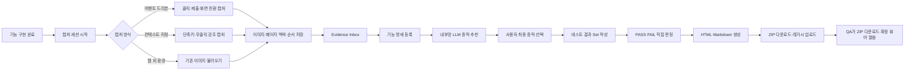
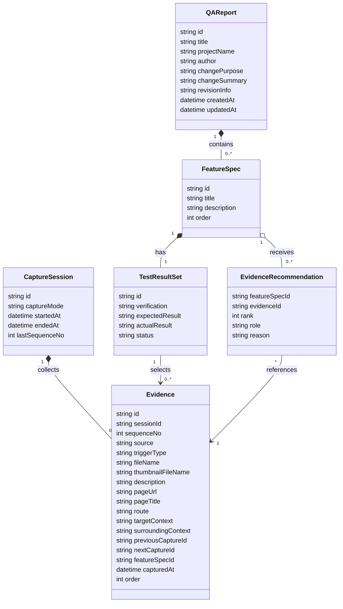
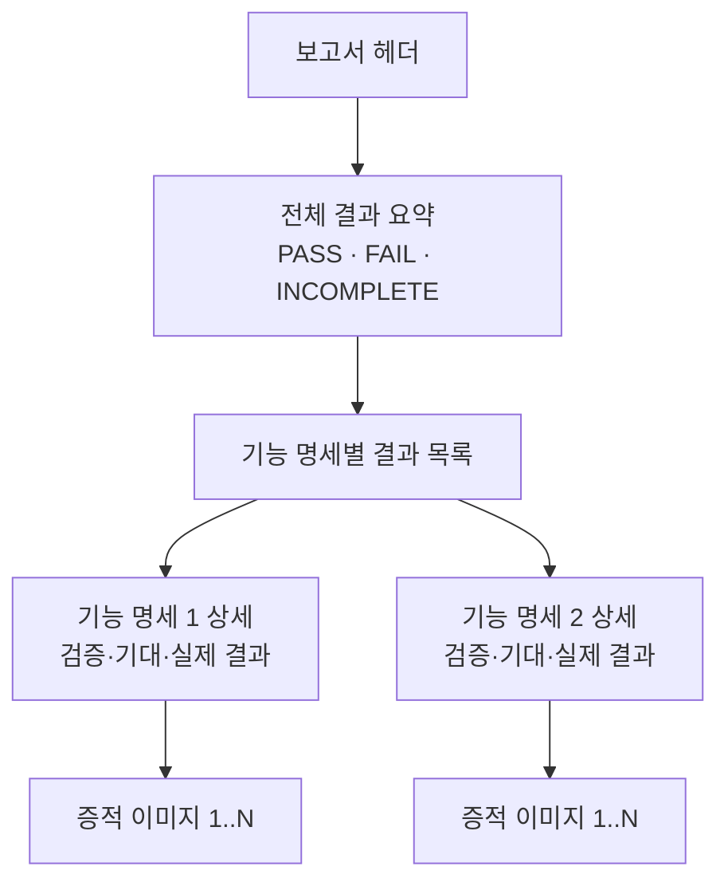
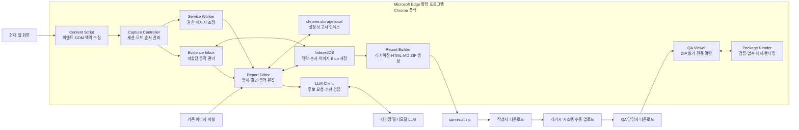
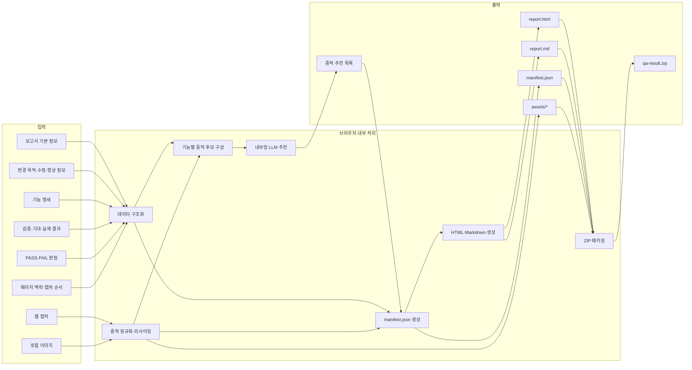

# CaptureIT 제품 요구사항 정의서(PRD)

- 문서 버전: 1.1
- 문서 상태: 확정
- 작성일: 2026-07-06
- 대상 제품: Microsoft Edge 우선 Chromium 확장 프로그램
- 주 산출물: HTML·Markdown·JSON·증적 이미지로 구성된 ZIP 파일

## 1. 제품 개요

CaptureIT은 구현 완료 후 수행하는 최종 QA 검증과 증적 보고서 작성을 지원하는 Microsoft Edge 우선 브라우저 확장 프로그램이다. 사용자는 이벤트 드리븐 또는 컨텍스트 지정 모드로 웹 화면을 수집하거나 웹 외부 환경에서 저장한 이미지를 불러온다. 확장 프로그램은 캡처 이미지와 당시 페이지 맥락 및 캡처 순서를 함께 저장한다. 문서 작성 시 내부망 멀티모달 LLM은 기능 명세와 관련된 증적 후보를 추천하고, 사용자가 최종 증적과 PASS·FAIL을 직접 확정한다.

생성된 ZIP은 사용자가 별도 레거시 시스템에 직접 업로드한다. QA 담당자는 레거시 시스템에서 ZIP을 내려받은 뒤 같은 확장 프로그램의 읽기 전용 뷰어 모드로 보고서를 열람한다.

## 2. 문제 정의

현재 QA 증적자료 작성은 다음 작업을 수작업으로 수행한다.

- 웹·앱·레거시 빌더 등 서로 다른 환경에서 증적 이미지 수집
- 이미지 크기 조정과 파일명 정리
- 기능 명세와 테스트 결과 및 이미지 연결
- Excel 등의 문서에 결과와 이미지를 반복 배치
- 완성된 자료를 별도 시스템에 업로드

이 과정은 반복 작업 비중이 높고, 기능 명세와 증적 간 누락 및 연결 오류가 발생하기 쉽다.

## 3. 제품 목표

1. 기능 명세별 QA 결과와 증적 이미지를 한 화면에서 작성한다.
2. 웹 캡처 이미지와 기존 로컬 이미지를 동일한 방식으로 관리한다.
3. 사용자가 직접 선택한 PASS·FAIL 결과를 명확하게 보여준다.
4. 자동화 테스트 리포트와 유사한 구조의 HTML 보고서를 생성한다.
5. 동일한 데이터에서 HTML과 Markdown 보고서를 함께 생성한다.
6. 작성·저장·보고서 생성은 사용자 브라우저 내부에서 수행하고, 증적 추천만 허용된 내부망 LLM을 선택적으로 사용한다.
7. 레거시 시스템에 제출할 ZIP 패키지를 생성한다.
8. QA 담당자가 ZIP을 확장 프로그램에서 HTML 또는 Markdown 형태로 열람하게 한다.
9. 백엔드 서버 없이 모든 작성 데이터와 이미지를 브라우저 내부에 저장한다.
10. 사내 폐쇄망에서 인터넷 의존성 없이 동작한다.
11. 사용자가 지정한 화면 요소를 강조하면서 주변 화면 맥락이 포함된 증적 이미지를 생성한다.
12. 이벤트 발생을 업무 기능 완료 여부와 무관하게 캡처 트리거로 사용한다.
13. 캡처 이미지와 페이지 맥락 및 순서를 Evidence Inbox에 저장한다.
14. 내부망 멀티모달 LLM이 기능 명세별 관련 증적을 추천하게 한다.

## 4. 비목표

초기 버전은 다음 기능을 구현하지 않는다.

- 테스트 실행 자동화
- 기대 결과와 실제 결과의 자동 비교
- AI·LLM 기반 PASS·FAIL 자동 판정
- 판정 이후 편집 잠금 또는 조작 차단
- 승인 결재, 전자서명, 변경 이력 감사 기능
- 레거시 시스템 자동 업로드
- HWPX, Excel, PDF 산출물 생성
- 앱 또는 레거시 빌더 화면의 직접 캡처
- 스크롤을 포함한 웹 전체 페이지 자동 캡처
- 특정 로컬 폴더의 자동 감시
- 외부 서버 저장 및 사용자 간 공동 편집
- 레거시 시스템 내부 HTML·Markdown 렌더러 개발
- Spring Viewer JAR 또는 별도 Viewer 서버 제공
- 작성 데이터 동기화, 서버 백업 및 다중 PC 간 초안 공유
- 캡처 시점의 LLM 호출 및 실시간 업무 기능 판정
- LLM 추천 결과의 자동 확정 또는 자동 보고서 제출

## 5. 사용자 및 사용 시점

작성 사용자는 기능 구현을 완료한 뒤 최종 검증 결과를 정리해 제출하는 개발자 또는 QA 담당자다. 열람 사용자는 레거시 시스템에서 ZIP을 내려받아 결과를 검토하는 QA 담당자와 QA 매니저다.

이 제품은 구현 중 테스트를 관리하는 도구가 아니라, 구현 완료 후 QA 결과를 작성하고 제출된 결과를 검토하는 도구다.

## 6. 용어

| 용어 | 정의 |
|---|---|
| QA 보고서 | 하나의 제출 단위가 되는 최종 보고서 |
| 기능 명세 | 검증 대상이 되는 하나의 기능 요구사항 |
| 테스트 결과 Set | 기능 명세 하나에 정확히 하나씩 대응하는 검증 결과 묶음 |
| 증적(Evidence) | 웹 캡처 또는 로컬 파일에서 가져온 검증 이미지 |
| 캡처 세션 | 사용자가 캡처를 시작하고 종료할 때까지 순서가 유지되는 증적 수집 단위 |
| 이벤트 드리븐 캡처 | 클릭·폼 제출·URL 또는 화면 전환 등 일반 이벤트를 트리거로 수행하는 캡처 |
| 컨텍스트 지정 캡처 | 사용자가 단축키 또는 우클릭 메뉴로 특정 DOM 요소를 지정하는 강조 캡처 |
| Evidence Inbox | 아직 기능 명세에 연결되지 않은 증적과 맥락을 시간순으로 보관하는 영역 |
| 증적 추천 | 내부망 LLM이 기능 명세와 관련된 Evidence ID, 순위, 역할, 추천 이유를 제안하는 결과 |
| 판정 | 사용자가 직접 선택하는 PASS 또는 FAIL 상태 |
| 미판정 | 사용자가 아직 PASS 또는 FAIL을 선택하지 않은 상태 |

## 7. 업무 흐름



## 8. 로컬 데이터 모델

이 모델은 서버 데이터베이스 ERD가 아니라 확장 프로그램 내부 객체의 논리 관계를 정의한다. 데이터는 Microsoft Edge 프로필의 확장 프로그램 전용 저장소에만 보존한다.



관계 규칙은 다음과 같다.

- QA 보고서 하나는 기능 명세를 0개 이상 포함한다.
- 기능 명세 하나는 테스트 결과 Set 하나만 가진다.
- 캡처 세션 하나는 시간순 Evidence를 0개 이상 포함한다.
- Evidence는 기능 명세에 연결되기 전 Evidence Inbox에 존재할 수 있다.
- 테스트 결과 Set 하나는 사용자가 확정한 증적을 0개 이상 참조한다.
- 증적 출처는 `web-capture` 또는 `file-import`다.
- LLM 추천은 Evidence를 복제하지 않고 Evidence ID만 참조한다.

저장소별 책임은 다음과 같다.

| 저장소 | 저장 대상 |
|---|---|
| `chrome.storage.local` | 사용자 설정, 보고서 인덱스, 마지막 작업 위치 등 소형 JSON 데이터 |
| IndexedDB | 캡처 세션, Evidence 맥락·순서, 보고서 본문, 기능 명세, 테스트 결과, 이미지 Blob, LLM 추천 결과, ZIP 생성 중간 상태 |
| 메모리 | 현재 처리 중인 이미지와 ZIP 조각 등 일시 데이터 |
| ZIP 파일 | 최종 제출본, QA 열람본, 사용자 백업본 |

CaptureIT 전용 백엔드 서버와 서버 데이터베이스는 사용하지 않는다. 내부망 LLM은 문서 작성 시 사용자가 요청한 증적 추천에만 사용한다.

## 9. 기능 요구사항

### FR-01. QA 보고서 관리

- 사용자는 새 QA 보고서를 생성할 수 있어야 한다.
- 보고서명, 프로젝트명, 작성자 정보를 입력하고 수정할 수 있어야 한다.
- 변경 목적, 수정 내용 요약, 형상·체크아웃 개요를 보고서 메타데이터로 입력하고 수정할 수 있어야 한다.
- 작성 중인 보고서 메타데이터는 `chrome.storage.local`, 본문과 이미지 Blob은 IndexedDB에 보존되어야 한다.
- 브라우저 확장 프로그램을 다시 열어도 기존 보고서를 이어서 작성할 수 있어야 한다.
- 사용자는 보고서를 삭제할 수 있어야 한다.

### FR-02. 기능 명세 관리

- 사용자는 보고서에 기능 명세를 추가·수정·삭제할 수 있어야 한다.
- 사용자는 기능 명세의 표시 순서를 변경할 수 있어야 한다.
- 기능 명세 하나를 추가하면 대응하는 테스트 결과 Set 하나가 함께 생성되어야 한다.
- 한 기능 명세에 테스트 결과 Set을 둘 이상 만들 수 없어야 한다.

### FR-03. 테스트 결과 Set 작성

각 테스트 결과 Set은 다음 정보를 가져야 한다.

- 검증 내용
- 기대 결과
- 실제 결과
- 판정: PASS, FAIL 또는 미판정
- 증적 이미지 목록

판정은 사용자가 직접 선택한다. 확장 프로그램은 이미지나 텍스트를 분석해 판정을 추론하지 않는다.

### FR-04. 웹 화면 캡처

- 사용자는 현재 활성 탭에서 보이는 영역을 캡처할 수 있어야 한다.
- 캡처된 이미지는 기능 명세 연결 여부와 무관하게 Evidence Inbox에 먼저 저장되어야 한다.
- 캡처 시점과 원본 페이지 정보를 증적 메타데이터로 기록해야 한다.
- 캡처 실패 시 원인을 안내하고 기존 작성 데이터를 유지해야 한다.

### FR-04-1. 캡처 세션과 모드

- 사용자는 캡처 세션을 시작하고 종료할 수 있어야 한다.
- 세션 시작 시 이벤트 드리븐 또는 컨텍스트 지정 모드를 선택할 수 있어야 한다.
- 세션 안의 모든 Evidence에 중복되지 않는 `sequenceNo`를 1부터 증가시켜 부여해야 한다.
- Evidence를 삭제해도 기존 `sequenceNo`를 재사용하지 않아야 한다.
- 이벤트 드리븐과 컨텍스트 지정 캡처를 같은 시간순 목록에 저장해야 한다.
- 캡처 모드가 OFF이면 자동 캡처를 수행하지 않아야 한다.

### FR-04-2. 이벤트 드리븐 캡처

- 이벤트 드리븐 모드는 클릭, 폼 제출, URL 변경, SPA 라우트 변경 및 페이지 전환 완료를 캡처 트리거로 지원해야 한다.
- 캡처 트리거는 특정 업무 기능의 성공·실패 또는 완료 여부와 무관해야 한다.
- 업무 API 응답, 특정 성공 셀렉터 또는 DOM 완료 조건을 기다리거나 polling하지 않아야 한다.
- 클릭과 제출은 이벤트 발생 후 다음 렌더링 프레임의 현재 뷰포트를 캡처해야 한다.
- 문서 또는 SPA 전환은 새 화면이 표시된 시점의 현재 뷰포트를 캡처해야 한다.
- 짧은 시간 안에 같은 이벤트가 반복되면 동일 화면의 중복 저장을 억제해야 한다.
- 각 Evidence에 `click`, `submit`, `navigation`, `route-change` 중 해당하는 `triggerType`을 기록해야 한다.

### FR-04-3. 컨텍스트 지정 강조 캡처

- 사용자가 웹페이지 요소 위에서 우클릭하면 Edge 컨텍스트 메뉴에 `CaptureIT 강조 캡처` 항목을 표시해야 한다.
- Content Script는 마지막으로 우클릭한 DOM 요소를 캡처 대상 요소로 식별해야 한다.
- 사용자는 `Ctrl+Shift+E`로 요소 선택 모드에 진입하고 다음 클릭으로 캡처 대상을 지정할 수 있어야 한다.
- 요소 선택 모드의 대상 클릭은 `preventDefault`와 이벤트 전파 차단을 적용해 원래 업무 동작을 실행하지 않아야 한다.
- 대상 요소가 화면 밖이거나 가장자리에 있으면 가능한 범위에서 화면 중앙으로 스크롤해야 한다.
- 강조 표시는 대상 요소를 둘러싼 빨간색 테두리와 반투명 노란색 배경을 기본으로 사용해야 한다.
- 강조 표시는 대상 요소의 원래 스타일을 변경하지 않는 별도 Overlay로 구현해야 한다.
- 캡처 이미지는 대상 요소만 잘라내지 않고 현재 브라우저 뷰포트 전체를 포함해야 한다.
- 주변 UI, 입력값, 목록, 제목 등 대상 요소의 의미를 이해할 수 있는 화면 맥락을 보존해야 한다.
- Overlay가 화면에 반영된 뒤 캡처하고, 캡처 직후 Overlay를 제거해야 한다.
- 자동 스크롤이 발생한 경우 캡처 후 원래 스크롤 위치로 복원해야 한다.
- 캡처된 이미지에는 강조 표시가 픽셀로 포함되어야 하며 별도 렌더링에 의존하지 않아야 한다.
- 한 번의 강조 캡처는 DOM 요소 하나만 대상으로 해야 한다.
- 대상 요소가 제거되었거나 더 이상 유효하지 않으면 캡처하지 않고 다시 우클릭하도록 안내해야 한다.
- 교차 출처 iframe 내부 요소처럼 접근 권한이 없는 대상은 강조 캡처할 수 없음을 안내해야 한다.
- 단축키 캡처는 `shortcut-context`, 우클릭 메뉴 캡처는 `context-menu`를 `triggerType`으로 기록해야 한다.

### FR-04-4. 캡처 맥락 저장

각 Evidence에는 이미지 외에 다음 맥락을 저장해야 한다.

- `captureId`, `sessionId`, `sequenceNo`, `capturedAt`, `triggerType`
- 페이지 URL, 제목, 현재 route
- 뷰포트 크기와 스크롤 위치
- 대상 요소의 tagName, role, aria-label, 화면 표시 텍스트
- 가장 가까운 제목, 폼·영역 이름, 테이블 행·열, 주변 버튼·라벨
- 제한된 길이의 현재 화면 표시 텍스트
- `previousCaptureId`, `nextCaptureId`
- 연결된 `featureSpecId`; 연결 전에는 null

맥락 수집 시 다음 데이터는 저장하지 않아야 한다.

- password 입력값
- 쿠키, 인증 토큰, Authorization 헤더
- hidden input과 비표시 DOM 전체
- 페이지 전체 HTML 원문

### FR-05. 로컬 이미지 불러오기

- 사용자는 파일 선택 또는 드래그 앤 드롭으로 기존 이미지를 추가할 수 있어야 한다.
- 여러 이미지를 한 번에 추가할 수 있어야 한다.
- PNG, JPEG, WebP 이미지를 지원해야 한다.
- 불러온 이미지는 Evidence Inbox에 저장한 뒤 사용자가 기능 명세에 연결할 수 있어야 한다.
- 손상되었거나 지원하지 않는 파일은 제외하고 해당 파일명을 안내해야 한다.

### FR-06. 증적 관리

- 웹 캡처와 로컬 이미지는 동일한 증적 목록에서 관리해야 한다.
- 사용자는 증적 설명을 입력·수정할 수 있어야 한다.
- 사용자는 증적 순서를 변경하거나 증적을 삭제할 수 있어야 한다.
- 보고서용 이미지는 원본 비율을 유지하며 축소해야 하고 작은 이미지를 확대하지 않아야 한다.
- 증적 출처를 메타데이터에 기록하되, 보고서 본문에는 기본적으로 노출하지 않는다.

### FR-06-1. Evidence Inbox

- Evidence Inbox는 기능 명세에 연결되지 않은 Evidence를 캡처 순서대로 표시해야 한다.
- 사용자는 캡처 이미지, 트리거 유형, 페이지 제목, 캡처 시각과 주변 맥락을 확인할 수 있어야 한다.
- 사용자는 Evidence를 하나 이상의 기능 명세 후보로 검토한 뒤 최종적으로 하나의 테스트 결과 Set에 연결할 수 있어야 한다.
- 사용자는 LLM 추천과 무관하게 Evidence를 직접 검색·선택·연결할 수 있어야 한다.
- 사용자는 기능 명세에 연결된 Evidence를 다시 Inbox로 되돌리거나 다른 Set으로 이동할 수 있어야 한다.

### FR-06-2. 내부망 LLM 증적 추천

- LLM 추천은 캡처 시점에 실행하지 않아야 한다.
- 문서 작성 단계에서 사용자가 기능 명세를 선택하고 추천을 요청할 때만 내부망 LLM을 호출해야 한다.
- LLM 입력에는 기능 명세, 검증 내용, 기대 결과, 변경 목적, Evidence 맥락, 캡처 순서와 축소 이미지를 포함해야 한다.
- 후보가 많으면 전체 Evidence의 텍스트 맥락으로 1차 후보를 좁힌 뒤, 상위 후보 이미지와 각 후보의 이전·다음 이미지를 사용해 2차 순위를 계산해야 한다.
- LLM 응답은 `featureSpecId`, `captureId`, `rank`, `role`, `reason`을 가진 구조화 데이터여야 한다.
- `role`은 `before`, `action`, `after` 중 하나여야 한다.
- LLM은 Evidence ID를 추천할 뿐 이미지 원본을 수정·복제·생성하지 않아야 한다.
- LLM은 PASS·FAIL을 판정하거나 추천 증적을 자동 확정하지 않아야 한다.
- 사용자는 추천을 수락·제외·재정렬하고 최종 증적을 직접 확정해야 한다.
- LLM 추천 순위와 이유는 로컬 작성 보조 정보이며 최종 보고서에는 기본적으로 포함하지 않아야 한다.
- 내부망 LLM 연결이 없거나 실패해도 수동 증적 선택과 보고서 작성이 가능해야 한다.

### FR-07. 판정과 편집

- 사용자는 테스트 결과 Set의 판정을 PASS 또는 FAIL로 선택할 수 있어야 한다.
- 사용자는 선택한 판정을 다시 변경하거나 미판정 상태로 되돌릴 수 있어야 한다.
- 판정 후에도 기능 명세, 결과 내용, 증적을 계속 수정할 수 있어야 한다.
- 어떠한 판정 상태도 편집·삭제·내보내기를 차단하지 않아야 한다.

### FR-08. 검증 안내

다음 상태는 오류가 아니라 경고로 처리한다.

- 미판정 테스트 결과 Set 존재
- 증적이 없는 테스트 결과 Set 존재
- 검증 내용, 기대 결과 또는 실제 결과 누락
- FAIL 판정인데 실제 결과가 비어 있음

경고가 있어도 사용자는 미리보기와 ZIP 내보내기를 계속할 수 있어야 한다.

### FR-09. 전체 결과 계산

전체 결과는 화면과 보고서 요약에 다음 규칙으로 표시한다.

1. 하나 이상의 FAIL이 있으면 전체 결과는 FAIL이다.
2. FAIL이 없고 모든 테스트 결과 Set이 PASS이면 전체 결과는 PASS다.
3. 기능 명세가 없거나 미판정 Set이 하나라도 있으면 전체 결과는 INCOMPLETE다.

이 계산 결과는 사용자 입력을 제한하지 않으며 보고 목적에만 사용한다.

### FR-10. HTML 보고서

HTML 보고서는 자동화 테스트 리포트의 정보 구조를 참고해 다음 영역을 제공해야 한다.

1. 보고서 헤더: 보고서명, 프로젝트명, 작성자, 작성일
2. 변경 개요: 변경 목적, 수정 내용 요약, 형상·체크아웃 개요
3. 전체 요약: 전체 결과, 총 기능 수, PASS·FAIL·미판정 수
4. 결과 목록: 기능명, 판정, 증적 개수
5. 기능 상세: 기능 설명, 검증 내용, 기대 결과, 실제 결과, 증적 이미지

HTML은 다음 조건을 만족해야 한다.

- JavaScript가 없는 정적 단일 HTML 문서여야 한다.
- ZIP 내부 `assets/` 폴더의 이미지를 상대경로로 참조해야 한다.
- 사용자 입력값을 HTML 이스케이프해 스크립트 삽입을 방지해야 한다.
- 화면 열람과 인쇄 모두에서 판정과 이미지가 식별되어야 한다.
- PASS, FAIL, INCOMPLETE를 색상뿐 아니라 텍스트로 구분해야 한다.

### FR-11. Markdown 보고서

- HTML 보고서와 동일한 기능 명세 및 판정 정보를 포함해야 한다.
- 증적 이미지는 ZIP 내부 상대경로로 참조해야 한다.
- HTML 전용 표현이 없어도 내용의 의미가 유지되어야 한다.
- 생성 순서와 항목 순서는 HTML 보고서와 같아야 한다.

### FR-12. 원본 데이터와 보고서 생성

- `manifest.json`을 보고서 생성의 기준 데이터로 사용해야 한다.
- HTML과 Markdown 중 하나를 다른 하나로 변환하지 않아야 한다.
- HTML과 Markdown을 동일한 `manifest.json`에서 각각 생성해야 한다.
- 내보내기 직전의 데이터 상태를 `manifest.json`에 기록해야 한다.
- 최종 선택된 Evidence의 캡처 세션, 순서, 트리거와 페이지 맥락을 `manifest.json`에 기록해야 한다.

### FR-13. ZIP 내보내기

확장 프로그램은 다음 구조의 ZIP을 생성해야 한다.

```text
qa-result.zip
├── report.html
├── report.md
├── manifest.json
└── assets/
    ├── FS-001-001.png
    ├── FS-001-002.jpg
    └── FS-002-001.webp
```

- 파일명은 기능 명세와 증적 순서를 기반으로 충돌 없이 생성해야 한다.
- ZIP을 푼 뒤 `report.html`과 `report.md`의 이미지 경로가 정상 동작해야 한다.
- 사용자는 생성된 ZIP을 로컬 PC에 다운로드할 수 있어야 한다.
- 확장 프로그램은 레거시 시스템으로 파일을 전송하지 않아야 한다.

### FR-14. 미리보기

- 사용자는 ZIP 생성 전에 HTML 보고서를 미리 볼 수 있어야 한다.
- 미리보기는 실제 생성되는 HTML과 같은 데이터 및 템플릿을 사용해야 한다.
- 미리보기에서 기능별 판정과 증적 이미지 배치를 확인할 수 있어야 한다.

### FR-15. QA 뷰어 모드

- 확장 프로그램은 보고서 작성 모드와 별도로 읽기 전용 뷰어 모드를 제공해야 한다.
- QA 담당자는 파일 선택 또는 드래그 앤 드롭으로 CaptureIT ZIP을 열 수 있어야 한다.
- 뷰어는 ZIP 구조와 `manifest.json`을 먼저 검증해야 한다.
- 유효한 `report.html`이 있으면 HTML을 우선 표시해야 한다.
- HTML을 표시할 수 없고 유효한 `report.md`가 있으면 Markdown을 대체 표시해야 한다.
- HTML은 스크립트 실행 권한이 없는 격리된 iframe에서 표시해야 한다.
- Markdown은 위험한 HTML과 URL을 제거한 뒤 렌더링해야 한다.
- ZIP 내부 상대경로를 해석해 증적 이미지를 표시해야 한다.
- 뷰어에서는 보고서 내용, 판정, 증적 및 ZIP 원본을 수정할 수 없어야 한다.
- 뷰어 사용을 위해 ZIP을 외부 서버에 전송하지 않아야 한다.
- 손상되었거나 CaptureIT 규격이 아닌 ZIP은 열지 않고 오류 원인을 표시해야 한다.

## 10. 보고서 화면 구조



## 11. 시스템 구성



구성 요소의 책임은 다음과 같다.

| 구성 요소 | 책임 |
|---|---|
| Content Script | 이벤트 감지, 페이지·주변 DOM 맥락 수집, 우클릭 요소 추적, 강조 Overlay 표시 |
| Capture Controller | 캡처 세션, 캡처 모드, 트리거, sequenceNo와 전후 Evidence 관계 관리 |
| Evidence Inbox | 미할당 Evidence의 시간순 표시, 검색, 수동 매핑과 LLM 추천 표시 |
| Report Editor | 보고서, 기능 명세, 테스트 결과, 증적 편집 |
| Service Worker | 캡처 요청, 권한 사용, 구성 요소 간 메시지 조정 |
| chrome.storage.local | 사용자 설정과 보고서 인덱스 등 소형 JSON 데이터 보존 |
| IndexedDB | 세션, Evidence 맥락·순서, 보고서 본문, 테스트 결과와 이미지 Blob의 로컬 보존 |
| LLM Client | 내부망 LLM 요청 데이터 최소화, 2단계 후보 분석, 구조화 응답 검증 |
| Report Builder | 이미지 처리, manifest 생성, HTML·Markdown 렌더링, ZIP 생성 |
| QA Viewer | QA 담당자의 ZIP 선택과 읽기 전용 보고서 열람 |
| Package Reader | ZIP 검증·압축 해제, HTML 격리 표시, Markdown 안전 렌더링 |

CaptureIT 전용 백엔드 서버는 존재하지 않는다. 내부망 LLM은 사용자가 문서 작성 단계에서 증적 추천을 요청할 때만 호출한다. 무거운 이미지 및 ZIP 처리는 종료 가능성이 있는 Service Worker의 전역 메모리에 의존하지 않는다. Report Editor 또는 전용 Offscreen Document에서 처리하고 중간 상태를 IndexedDB에 보존한다.

## 12. 입출력 흐름



## 13. 비기능 요구사항

### NFR-01. 호환성

- Microsoft Edge를 공식 지원 브라우저이자 전체 인수 테스트 기준으로 사용해야 한다.
- Google Chrome은 폴백 및 개발 테스트 용도로 제공해야 한다.
- Chrome 호환성 문제는 Edge 동작을 훼손하지 않는 범위에서 처리해야 한다.
- 브라우저 확장 프로그램은 Manifest V3를 사용해야 한다.

### NFR-02. 개인정보 및 보안

- 보고서 데이터와 이미지는 외부 서버로 전송하지 않아야 한다.
- 사내 폐쇄망 밖으로 향하는 네트워크 요청을 생성하지 않아야 한다.
- 내부망 LLM 통신은 사내 허용 목록에 등록된 주소로만 제한해야 한다.
- LLM 호출은 사용자의 명시적 추천 요청으로 시작해야 한다.
- LLM에는 추천에 필요한 축소 이미지와 최소 맥락만 전송해야 한다.
- LLM 인증 정보는 페이지 DOM, Evidence, 보고서 또는 ZIP에 저장하지 않아야 한다.
- ZIP, Markdown, HTML 처리 라이브러리와 글꼴·스타일 자산은 확장 프로그램 패키지에 포함해야 한다.
- CDN, 원격 모듈, 원격 폰트, 원격 이미지 및 텔레메트리를 사용하지 않아야 한다.
- 사용자 입력은 HTML과 Markdown 생성 시 안전하게 이스케이프해야 한다.
- 생성 HTML은 외부 스크립트, CDN, 원격 폰트 및 원격 이미지를 사용하지 않아야 한다.
- 뷰어는 ZIP 내부 HTML의 스크립트 실행을 허용하지 않아야 한다.
- 뷰어는 ZIP 경로 탈출과 압축 폭탄을 방지하기 위해 경로, 파일 수, 개별 파일 크기 및 압축 해제 총크기를 검증해야 한다.
- 필요한 브라우저 권한은 현재 화면 캡처, 컨텍스트 메뉴, 로컬 저장 및 다운로드 범위로 제한해야 한다.
- 요소 강조 캡처를 위해 `contextMenus`와 `activeTab` 권한을 선언해야 한다.
- 로컬 이미지와 초안 보존을 위해 `storage` 및 `unlimitedStorage` 권한을 선언해야 한다.

### NFR-03. 데이터 보존

- 편집 내용은 사용자의 명시적 저장 동작에만 의존하지 않고 로컬에 자동 보존되어야 한다.
- 캡처·이미지 처리·ZIP 생성 실패가 기존 보고서 데이터를 삭제하거나 손상시키지 않아야 한다.
- 확장 프로그램 삭제 또는 브라우저 프로필 초기화 시 로컬 초안이 사라질 수 있음을 사용자에게 안내해야 한다.
- 제출 완료한 ZIP을 브라우저 저장소와 독립된 최종 백업본으로 취급해야 한다.

### NFR-04. 접근성과 식별성

- 판정은 색상만으로 표현하지 않아야 한다.
- HTML 보고서의 주요 구조에는 의미 있는 제목 계층과 이미지 대체 텍스트를 제공해야 한다.

### NFR-05. 성능 및 안정성

- 이미지는 한 번에 모두 변환하지 않고 순차 또는 제한된 병렬 방식으로 처리해야 한다.
- 대용량 ZIP 생성 중 진행 상태를 사용자에게 표시해야 한다.
- 메모리 부족 또는 파일 생성 실패 시 재시도 가능한 오류를 표시하고 작성 데이터는 유지해야 한다.
- LLM 1차 분석은 전체 Evidence의 텍스트 맥락을 사용하고, 2차 분석은 상위 후보와 전후 이미지로 제한해야 한다.
- 전체 해상도 원본 대신 축소 이미지를 사용해 내부망 LLM 요청 크기를 제한해야 한다.

## 14. 오류 처리 원칙

| 상황 | 처리 |
|---|---|
| 웹 캡처 권한 없음 | 권한 필요 안내 후 작성 화면 유지 |
| 캡처할 활성 탭 없음 | 캡처 실패 안내 후 기존 증적 유지 |
| 우클릭 대상 요소가 제거됨 | 캡처를 중단하고 대상 요소 재선택 안내 |
| 교차 출처 iframe 요소 접근 불가 | 일반 현재 화면 캡처 또는 로컬 이미지 첨부 안내 |
| 지원하지 않는 이미지 | 해당 파일만 제외하고 파일명 표시 |
| 손상된 이미지 | 해당 파일만 제외하고 나머지 파일 계속 처리 |
| 필수 내용 누락 | 경고 표시, 편집과 내보내기는 허용 |
| ZIP 생성 실패 | 오류 표시, 보고서와 증적 원본 유지 |
| 저장 공간 부족 | 저장 실패 안내, 불필요한 초안 삭제 방법 제공 |
| ZIP 구조 또는 manifest 오류 | 뷰어에서 열지 않고 검증 실패 항목 표시 |
| ZIP 내부 위험 경로 또는 과도한 압축 크기 | 압축 해제 중단 및 보안 오류 표시 |
| HTML 렌더링 불가 | 유효한 Markdown이 있으면 대체 표시 |
| 내부망 LLM 연결 실패 | 오류 표시 후 수동 Evidence 선택 흐름 유지 |
| LLM 응답 형식 오류 | 응답 폐기, 원본 Evidence 유지, 재시도 안내 |
| LLM 추천 결과에 존재하지 않는 captureId 포함 | 해당 항목 제외 및 응답 검증 오류 표시 |

## 15. 검증 및 테스트 전략

### 단위 테스트

- 전체 결과 계산 규칙
- 기능 명세와 테스트 결과 Set의 1:1 관계
- 증적 파일명 생성 및 충돌 방지
- 사용자 입력 이스케이프
- manifest에서 HTML·Markdown 렌더링
- 대상 요소의 화면 좌표에 맞춘 강조 Overlay 계산
- 세션별 sequenceNo 증가와 삭제 후 미재사용 규칙
- 이벤트 중복 억제 규칙
- LLM 구조화 응답과 captureId 유효성 검증

### 통합 테스트

- 웹 캡처 후 Evidence Inbox 저장 및 수동 Set 연결
- 이벤트 드리븐 모드 ON/OFF와 클릭·제출·화면 전환 트리거
- 업무 API 응답이나 성공 셀렉터를 기다리지 않는 캡처
- Ctrl+Shift+E 요소 선택 시 원래 업무 클릭 차단
- 우클릭 요소를 중앙으로 이동하고 강조 Overlay가 포함된 전체 뷰포트 캡처
- 강조 캡처 후 Overlay 제거와 원래 스크롤 위치 복원
- 대상 요소가 캡처 직전에 제거되는 상황 처리
- 로컬 다중 이미지 불러오기
- 브라우저 재시작 후 초안 복원
- 미판정·무증적 상태에서 경고 후 ZIP 생성
- ZIP 압축 해제 후 HTML·Markdown 상대경로 확인
- 레거시에서 내려받은 ZIP을 뷰어 모드로 열고 HTML 우선 표시
- HTML이 없거나 열리지 않을 때 Markdown 대체 표시
- 뷰어 모드에서 편집 기능이 노출되지 않는지 확인
- 기능 명세와 Evidence 맥락·순서를 이용한 내부망 LLM 추천
- LLM 추천 수락·제외·재정렬 후 사용자 최종 확정
- LLM 연결 실패 상태에서 수동 보고서 작성

### 호환성 테스트

- 회사에서 사용하는 Microsoft Edge 환경의 전체 기능 테스트
- Google Chrome 환경의 핵심 작성·내보내기·뷰어 스모크 테스트
- 레거시 시스템에 ZIP을 업로드·다운로드한 뒤 Edge 확장 프로그램 뷰어에서 열람하는 흐름

### 보안 테스트

- 보고서 입력값에 HTML·스크립트 문자열 삽입
- 잘못된 파일 확장자와 손상 이미지 입력
- 외부 URL 또는 경로 탈출 문자열 입력
- ZIP 경로 탈출, 과도한 파일 수 및 압축 폭탄 입력
- 스크립트가 포함된 HTML과 위험한 Markdown 링크 입력
- 페이지 맥락에서 password, 쿠키, 토큰, hidden input 제외 확인
- 허용되지 않은 LLM 주소로의 요청 차단

## 16. MVP 완료 조건

MVP는 다음 조건을 모두 만족하면 완료된 것으로 본다.

1. 보고서와 복수 기능 명세를 생성·수정·삭제할 수 있다.
2. 기능 명세마다 테스트 결과 Set이 정확히 하나 존재한다.
3. 웹 현재 화면 캡처와 로컬 다중 이미지 첨부가 가능하다.
4. 사용자가 PASS·FAIL을 직접 선택하고 이후에도 모든 내용을 수정할 수 있다.
5. 누락 내용은 경고하지만 어떠한 작업도 차단하지 않는다.
6. 동일한 manifest에서 HTML과 Markdown 보고서가 생성된다.
7. HTML, Markdown, manifest, 증적 이미지가 하나의 ZIP에 포함된다.
8. ZIP 압축 해제 후 두 보고서에서 모든 증적 이미지가 정상 표시된다.
9. 브라우저를 다시 열어도 작성 중 보고서를 복원할 수 있다.
10. 사용자 데이터가 인터넷 또는 허용되지 않은 서버로 전송되지 않는다.
11. QA 담당자가 ZIP을 뷰어 모드에서 읽기 전용으로 열 수 있다.
12. HTML을 우선 표시하고 실패 시 Markdown으로 대체할 수 있다.
13. 위험하거나 잘못된 ZIP을 차단하고 오류 원인을 표시할 수 있다.
14. Microsoft Edge에서 전체 기능이 동작하고 Chrome에서 핵심 기능이 동작한다.
15. 보고서 데이터와 이미지를 `chrome.storage.local` 및 IndexedDB에 저장하고 복원할 수 있다.
16. 인터넷 연결 없이 작성·내보내기·열람이 가능하다.
17. 우클릭한 DOM 요소가 강조되고 주변 화면 맥락이 포함된 전체 뷰포트 이미지가 증적으로 저장된다.
18. 이벤트 드리븐 캡처를 ON/OFF하고 클릭·제출·화면 전환을 기능 완료 대기 없이 캡처할 수 있다.
19. Ctrl+Shift+E 또는 우클릭 메뉴로 컨텍스트 강조 캡처를 수행할 수 있다.
20. 모든 캡처에 세션, 순서, 트리거, 페이지·대상·주변 맥락이 저장된다.
21. Evidence Inbox에서 미할당 증적을 시간순으로 확인하고 기능 명세에 수동 연결할 수 있다.
22. 내부망 LLM이 기능 명세별 Evidence ID, 순위, 역할, 이유를 추천한다.
23. 사용자가 LLM 추천을 직접 확정하며 LLM 장애 시 수동 흐름이 유지된다.

## 17. 외부 연동 조건

업로드 대상 시스템은 다음 조건만 제공하는 것으로 전제한다.

- ZIP 파일 업로드 허용
- 권한이 있는 QA 담당자의 ZIP 파일 다운로드 허용

레거시 시스템은 HTML·Markdown 렌더링이나 ZIP 압축 해제를 수행하지 않는다. QA 담당자는 내려받은 원본 ZIP을 CaptureIT 확장 프로그램에서 열람한다.

확장 프로그램은 사내 폐쇄망 배포 절차에 따라 Microsoft Edge에 설치한다. Chrome 배포본은 폴백과 개발 테스트 목적으로만 유지한다.

내부망 LLM 연동은 다음 조건을 제공하는 것으로 전제한다.

- 사내 폐쇄망에서 접근 가능한 멀티모달 추론 API
- 텍스트 맥락과 복수 이미지 입력 지원
- 구조화 JSON 응답 지원
- 사내 인증 및 접근 통제 적용

CaptureIT은 내부망 LLM 주소와 인증 방식을 설정으로 주입받으며, LLM 연결이 없어도 캡처·수동 선별·보고서 생성 기능을 제공한다.

## 18. 주요 위험과 대응

| 위험 | 대응 |
|---|---|
| QA 담당자의 확장 프로그램 미설치 또는 버전 불일치 | QA 조직 내 설치 절차와 배포 버전을 통일 |
| 이미지가 많아 브라우저 메모리 부족 | 리사이징, 순차 처리, 중간 상태 저장 |
| 앱·레거시 빌더 화면 직접 캡처 불가 | 기존 이미지 다중 불러오기 지원 |
| 미완성 보고서 제출 | 요약과 경고로 누락 표시하되 사용자 작업은 차단하지 않음 |
| HTML과 Markdown 내용 불일치 | 동일한 manifest에서 독립적으로 생성하고 항목 수를 검증 |
| 악성 또는 변조된 ZIP 열람 | ZIP 검증, HTML 격리, Markdown 정화, 압축 크기 제한 |
| 확장 프로그램 삭제·프로필 초기화로 초안 손실 | 자동 저장, 삭제 위험 안내, 최종 ZIP 외부 백업 |
| Edge와 Chrome 간 API 동작 차이 | Edge 우선 개발, Edge 전체 테스트, Chrome 핵심 스모크 테스트 |
| 폐쇄망에서 외부 라이브러리 로딩 실패 | 모든 실행 코드와 정적 자산을 확장 프로그램에 번들링 |
| 이벤트 캡처 과다 생성 | 세션 ON/OFF, 이벤트 중복 억제, Evidence Inbox 정리 기능 제공 |
| 캡처 맥락에 민감정보 포함 | 표시 데이터 최소 수집, password·토큰·hidden 데이터 제외 |
| LLM 입력량 증가로 지연·실패 | 텍스트 1차 선별 후 축소 이미지와 전후 후보만 2차 전달 |
| LLM 오추천 | 추천 이유 표시, 사용자 최종 확정, 수동 선택 항상 제공 |
| 내부망 LLM 장애 | 로컬 캡처와 수동 보고서 작성 흐름으로 계속 진행 |
